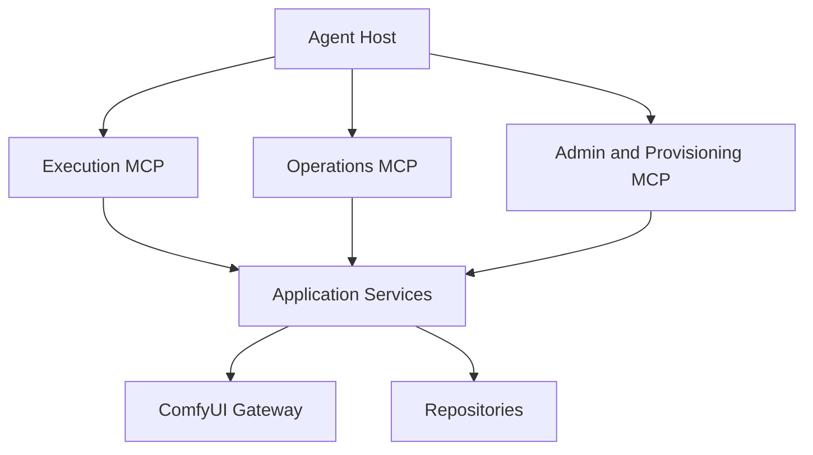

# ComfyUI MCP Skills：Agent 原生超级控制平面设计与开发路线

> 状态：待开发
> 基线：`comfyui-skill-cli` 0.2.13、ComfyUI MCP Skills 1.1.0 本地工作区
> 目标读者：项目维护者、后续开发 Agent、安全审查者
> 更新日期：2026-07-30

## 1. 产品定位

ComfyUI MCP Skills 的目标不是把 `comfyui-skill` CLI 命令改写成 MCP Tool，也不只是补齐一个执行型 MVP。

正确定位是：

> **以 MCP 为 Agent 原生控制平面，在保留 CLI 全部有效能力的基础上，提供工作流理解、图级编辑、版本管理、执行规划、批量实验、跨服务器调度、资产血缘、自动诊断、依赖修复和安全自治。**

CLI 功能只定义最低兼容线。MCP 版本必须形成严格超集：

```text
MCP 完整能力
  = CLI 现有有效能力
  + MCP 原生结构化交互
  + Agent 所需的组合操作
  + 可恢复的长任务和事件流
  + 安全策略、审批和审计
  + CLI 难以表达的图、资产与执行智能
```

当前实现已经完成可靠的工作流执行链，包括动态工作流 Tool、媒体上传、持久化 Job、幂等、进度、恢复查询和输出 Resource。但它仍是超级控制平面的执行内核，不是最终产品。

后续开发不能再以“一条 CLI 命令对应一个 MCP Tool”为主线，也不能把 CLI 没有的能力视为非必要范围。应从 Agent 完成目标所需的信息、决策和闭环出发设计能力。

---

## 2. 目标定义与设计原则

### 2.1 不是协议翻译层

CLI 面向人类终端，受限于单次进程、字符串参数、当前目录、stdout/stderr 和退出码。MCP 面向持续连接的 Agent，可以原生提供结构化 schema、Resource、订阅、进度、身份、能力发现和多轮恢复。

因此，MCP 不应复制 CLI 的交互限制。它应让 Agent 直接操作领域对象：

- Workflow、Workflow Revision 和 Graph Patch。
- Node、Model、Dependency Plan 和 Capability。
- Asset、Artifact、Lineage 和 Collection。
- Execution Plan、Job、Batch、Queue 和 Event。
- Server、Policy、Approval、Audit 和 Diagnostic Report。

### 2.2 目标体验

完成后，Agent 应能从自然语言目标出发完成以下闭环，而不需要拼接 Shell 命令或手工修改工作流 JSON：


### 2.3 Agent-first 设计原则

1. **目标优先，不以命令优先。** Tool 对应稳定意图，不对应终端语法。
2. **读操作可组合，写操作可计划。** 所有复杂变更先返回 plan、diff 和风险，再提交。
3. **领域对象可寻址。** Workflow、Revision、Asset、Job 和 Plan 都有稳定 ID 与 Resource URI。
4. **长任务可恢复。** 连接断开后可以按 ID 恢复，不把网络请求生命周期等同于 GPU 作业生命周期。
5. **让 Agent 看见足够上下文。** 节点定义、模型能力、图连接、参数约束和失败节点必须结构化返回。
6. **减少工具歧义，而不是减少能力。** 相同意图合并；不同风险和事务语义保持独立。
7. **输出可以直接成为下一次输入。** 优先传递 Resource URI 和资产引用，不下载后再上传。
8. **确定性留给代码，选择留给 Agent。** 校验、转换、diff、拓扑和摘要由服务计算；风格与策略选择由 Agent 决策。
9. **默认最小权限，授权后能力完整。** 安全隔离不能演变成功能删除。
10. **每次自治都有边界。** 配额、预算、审批、并发和影响范围必须显式。

### 2.4 完整管理边界

“完整管理”覆盖 ComfyUI HTTP API、已配置的 ComfyUI Manager API、本项目工作流与服务器配置，以及 Agent 原生的图、资产、执行、策略和审计对象。

### 2.5 默认不提供的能力

以下能力不能通过通用 MCP Tool 默认开放：

- 任意 Shell 命令执行。
- 任意文件系统读写。
- GPU 驱动、CUDA、Python 或操作系统软件安装。
- 导出服务器密码、API Key 或 Bearer Token。
- 无确认地终止其他主体的运行中作业。
- 无审计地安装任意 Git 仓库代码。
- 无适配器地启动、停止或重启宿主机上的 ComfyUI 进程。

如果需要管理 ComfyUI 进程，应增加可选 `RuntimeController` 端口，并按部署方式实现 Docker、systemd、Windows Service 等适配器。默认实现只报告 `restart_required`，不执行宿主机命令。

---

## 3. 当前能力基线

### 3.1 默认执行 MCP

固定工具：

| Tool | 当前能力 |
|---|---|
| `comfyui.asset.upload` | 从授权目录上传图像、蒙版、音频或视频 |
| `comfyui.job.get` | 按 `server_id + prompt_id` 查询当前主体作业 |
| `comfyui.job.cancel` | 取消当前主体拥有的排队作业 |
| `comfyui.server.list` | 列出已启用服务器，不泄露凭据和私有 URL |
| `comfyui.server.health` | 查询健康状态和运行设备信息 |
| `comfyui.node.list` | 分页搜索节点 |
| `comfyui.node.describe` | 获取节点完整定义 |
| `comfyui.model.list` | 列出模型目录或分页搜索模型 |

动态工具：

```text
comfyui.run.<server>.<workflow>
```

动态工作流工具支持结构化参数、幂等键、最长 300 秒单次等待、进度通知和持久化 Job。

### 3.2 当前 Resources

```text
comfyui://workflows/{server_id}/{workflow_id}
comfyui://assets/{server_id}/{asset_id}
comfyui://jobs/{server_id}/{prompt_id}
comfyui://outputs/{server_id}/{prompt_id}/{index}
```

### 3.3 当前 Admin MCP

| Tool | 当前能力 |
|---|---|
| `comfyui.admin.workflow.set_enabled` | 启用或停用工作流 |
| `comfyui.admin.workflow.delete` | 精确确认后永久删除工作流 |
| `comfyui.admin.audit.get` | 查询管理操作审计状态 |
| `comfyui.admin.audit.retry` | 只重试待完成的审计写入 |

### 3.4 当前权限限制

Streamable HTTP 当前只接受静态 Bearer Token，且只允许：

```text
comfyui:execute
```

因此现有 HTTP 服务没有表达观察、运维、配置和供应链权限的能力。

---

## 4. CLI 到 MCP 能力矩阵

### 4.1 已等价迁移

| CLI | MCP | 结论 |
|---|---|---|
| `list` | `tools/list`、`resources/list` | 已替代 |
| `info` | 动态 Tool `inputSchema`、workflow Resource | 已替代 |
| `run` | 动态 `comfyui.run.*`，`wait=true` | 已替代 |
| `submit` | 动态 `comfyui.run.*`，`wait=false` | 已替代 |
| `status` | `comfyui.job.get` | 已替代 |
| `upload` | `comfyui.asset.upload` | 已替代 |
| `cancel` | `comfyui.job.cancel` | 部分替代，仅支持安全的排队取消 |
| `server list` | `comfyui.server.list` | 已替代 |
| `server status/stats` | `comfyui.server.health` | 已替代 |
| `nodes list/search` | `comfyui.node.list` | 已合并 |
| `nodes info` | `comfyui.node.describe` | 已替代 |
| `models list` | `comfyui.model.list` | 已替代 |
| `workflow enable/disable` | Admin `workflow.set_enabled` | 已替代 |
| `workflow delete` | Admin `workflow.delete` | 已替代且更安全 |

### 4.2 尚未迁移

| CLI 能力 | 当前状态 | 缺失影响 | 优先级 |
|---|---|---|---|
| `history list` | 无 Job 列表工具 | Agent 必须预先知道 `prompt_id` | P0 |
| `history show` | 已知 Job 可查 | 缺少跨本地记录与服务器历史的统一读取 | P1 |
| `queue list` | 无 | 无法判断拥塞和排队顺序 | P0 |
| `queue delete` | 仅能取消自有单任务 | 无批量、管理员和跨主体管理 | P1 |
| `queue clear` | 无 | 无法执行受控队列清理 | P1 |
| `logs show` | 无 | 无法诊断节点加载和运行异常 | P0 |
| `free` | 无 | 无法卸载模型或释放显存 | P0 |
| `templates list` | 无 | 无法发现可复用模板 | P1 |
| `templates subgraphs` | 无 | 无法发现服务器子图 | P1 |
| `workflow import` | 无 | 无法通过 MCP 接入新工作流 | P0 |
| Editor → API 转换 | 无 | Agent 必须在 MCP 外预处理工作流 | P0 |
| 自动生成参数 schema | 无 | 新工作流无法自动成为动态 Tool | P0 |
| 废弃节点检查 | 无 | 导入后可能直接运行失败 | P1 |
| `deps check` | 无 | 无法在运行前判断工作流是否就绪 | P0 |
| `deps install` | 无 | 无法安装缺失节点和模型 | P2 |
| `server add` | 无 | 无法注册新 ComfyUI 实例 | P1 |
| `server enable/disable` | 无 | 无法维护服务器可用集合 | P1 |
| `server remove` | 无 | 无法移除失效配置 | P1 |
| 默认服务器设置 | 无 | 无法完整维护配置 | P2 |
| `config export` | 无 | 无法生成可迁移配置包 | P2 |
| `config import` | 无 | 无法批量恢复环境 | P2 |
| Manager 安装队列状态 | 无 | 依赖安装不可恢复查询 | P2 |

### 4.3 新增目标能力

完整管理不能只复制旧 CLI。还应增加：

- 所有列表接口使用 cursor 分页，不使用不稳定 offset 作为唯一游标。
- 所有变更操作支持调用方提供的 `request_id`。
- 危险操作支持 `dry_run`、精确确认和持久化审计。
- 配置写入支持版本检查和原子替换。
- 依赖安装返回持久化 Provisioning Job。
- 服务能力探测明确报告 ComfyUI Manager、Jobs API、模板 API 等可选端点。
- Tool 变更后发送 `notifications/tools/list_changed`。
- Resource 变更后发送对应订阅通知。

---

## 5. 目标 MCP 工具面

不要机械创建 35 个 CLI 同名工具。应按 Agent 意图合并重复命令，同时保留清晰的安全边界。

### 5.1 执行面：默认开放

保留现有工具，并新增：

#### `comfyui.job.list`

用途：分页列出当前主体的持久化作业。

建议输入：

```json
{
  "server_id": "local",
  "workflow_id": "txt2img",
  "status": ["queued", "running", "completed"],
  "created_after": "2026-07-30T00:00:00Z",
  "limit": 50,
  "cursor": "opaque-cursor"
}
```

要求：

- 默认只能列出当前 `principal_id` 的作业。
- `limit` 范围为 1–200。
- 返回不透明 `next_cursor`。
- 不返回其他主体的参数、路径或输出。

### 5.2 观察面：只读运维

建议独立 scope：

```text
comfyui:observe
```

新增工具：

| Tool | 用途 |
|---|---|
| `comfyui.queue.list` | 查看运行中和等待中的 ComfyUI 队列 |
| `comfyui.log.read` | 读取经过脱敏、限制行数的服务日志 |
| `comfyui.template.list` | 分页列出工作流模板 |
| `comfyui.template.subgraph.list` | 分页列出全局子图 |
| `comfyui.workflow.dependencies.check` | 检查工作流所需节点和模型 |
| `comfyui.server.capabilities` | 探测可选 API、Manager 和版本能力 |

日志要求：

- 默认最多 100 行，硬上限 1000 行。
- 支持 `cursor`，不接受任意文件路径。
- 对 Authorization、API Key、Token、Cookie 和配置凭据脱敏。
- 远程模式默认不返回完整本地路径。

### 5.3 运维面：影响运行状态

建议独立 scope：

```text
comfyui:operate
```

新增工具：

| Tool | 用途 | 风险控制 |
|---|---|---|
| `comfyui.server.free` | 卸载模型、释放显存 | 参数必须至少选择一项 |
| `comfyui.queue.remove` | 删除指定排队任务 | 验证所有权或管理员权限 |
| `comfyui.queue.clear` | 清空等待队列 | `dry_run` + 精确确认 + 审计 |
| `comfyui.server.interrupt` | 调用全局 `/interrupt` | 明确标记为全局操作，禁止伪装成单 Job 取消 |

ComfyUI 的 `/interrupt` 是全局操作。除非上游提供可靠的按 Job 中断语义，否则不能把它实现成 `job.cancel` 的隐式降级。

### 5.4 工作流管理面

建议 scope：

```text
comfyui:configure
```

新增工具：

#### `comfyui.admin.workflow.import`

统一处理本地授权文件、服务器 userdata 和内联 JSON：

```json
{
  "server_id": "local",
  "source": {
    "kind": "server_userdata",
    "path": "workflows/example.json"
  },
  "workflow_id": "example",
  "media_type": "image",
  "dry_run": true,
  "overwrite": false,
  "request_id": "caller-generated-id"
}
```

`source.kind` 建议限定为：

- `authorized_local_file`
- `server_userdata`
- `inline_json`

导入流程必须：

1. 校验来源权限和大小。
2. 识别 API 或 Editor 格式。
3. 使用服务器 `object_info` 转换 Editor 格式。
4. 生成参数 schema。
5. 检查路径和标识符。
6. 检查废弃节点。
7. 生成依赖报告。
8. `dry_run=true` 时不落盘。
9. 提交时原子写入 `workflow.json` 和 `schema.json`。
10. 发布 Tool 与 Resource 变更通知。

补充工具：

| Tool | 用途 |
|---|---|
| `comfyui.admin.workflow.set_enabled` | 已实现，继续保留 |
| `comfyui.admin.workflow.delete` | 已实现，继续保留 |
| `comfyui.admin.workflow.schema.update` | 更新描述、参数映射、枚举和范围 |
| `comfyui.admin.workflow.validate` | 验证 workflow、schema、节点和模型，不执行 |

不建议提供一个带任意 `action` 字符串的万能 `workflow.manage`。导入、schema 更新和删除的风险及输入契约不同，应保持独立。

### 5.5 服务器与配置管理面

继续使用 `comfyui:configure`，新增：

| Tool | 用途 |
|---|---|
| `comfyui.admin.server.upsert` | 新增或更新服务器配置 |
| `comfyui.admin.server.set_enabled` | 启用或停用服务器 |
| `comfyui.admin.server.set_default` | 设置默认服务器 |
| `comfyui.admin.server.delete` | 删除服务器配置 |
| `comfyui.admin.config.export` | 导出不含密钥的可迁移 Bundle |
| `comfyui.admin.config.import` | 预览或导入 Bundle |

服务器配置要求：

- `server_id` 使用统一标识符校验。
- URL 只允许 `http` 或 `https`。
- 保存前执行 SSRF 与回环地址策略校验。
- 凭据优先引用环境变量或 Secret Provider，不直接返回明文。
- 所有写入使用临时文件、`fsync` 和原子替换。
- 更新要求可选 `expected_revision`，防止并发覆盖。
- 删除服务器前列出关联工作流和未终态 Job。

配置导出要求：

- 默认永远不导出凭据。
- 只导出 Secret 引用名称，不导出 Secret 值。
- Bundle 必须包含版本号和内容摘要。
- 导入必须先生成 merge plan，再显式提交。

### 5.6 依赖供应链管理面

建议最高风险 scope：

```text
comfyui:provision
```

新增工具：

| Tool | 用途 |
|---|---|
| `comfyui.admin.dependency.plan` | 生成缺失节点和模型安装计划 |
| `comfyui.admin.dependency.install` | 提交已确认的安装计划 |
| `comfyui.admin.provisioning.get` | 查询持久化安装任务 |
| `comfyui.admin.provisioning.cancel` | 在 Manager 支持时取消未执行安装项 |

安装不能直接接受未经约束的 Git URL 后立即执行。推荐两阶段协议：

1. `dependency.plan` 返回规范化计划和 `plan_digest`。
2. 调用方审查来源、版本、大小和许可证信息。
3. `dependency.install` 提交 `plan_digest`、`request_id` 和精确确认短语。
4. 服务端再次解析计划并核对摘要。
5. 安装结果写入持久化 Provisioning Job。

供应链最低要求：

- Git 仓库允许列表或可信 registry。
- 禁止 URL 中携带凭据。
- 固定 commit/tag，禁止只记录浮动默认分支。
- 模型记录下载 URL、目标目录、大小和校验和。
- 下载限制协议、重定向次数、域名、IP 和文件大小。
- 安装过程不得阻塞 MCP 请求生命周期。
- 明确返回 `restart_required`，不自动执行任意宿主机重启命令。
- 每个安装步骤写审计记录。

---

## 6. 目标 Resources

继续保留现有 Resource，并补充：

```text
comfyui://servers/{server_id}/capabilities
comfyui://workflows/{server_id}/{workflow_id}/dependencies
comfyui://provisioning/{server_id}/{request_id}
comfyui://config/export/{bundle_id}
```

以下数据适合 Tool，不适合静态 Resource：

- Job 列表。
- 队列列表。
- 日志分页。
- 模板搜索。

原因是这些读取都需要筛选、分页、权限判断或短 TTL。

---

## 7. 权限模型

### 7.1 建议 scopes

| Scope | 能力 |
|---|---|
| `comfyui:execute` | 动态工作流、资产上传、自有 Job 查询与取消 |
| `comfyui:observe` | 队列、日志、模板、依赖报告和服务器能力 |
| `comfyui:operate` | 显存释放、队列删除和全局中断 |
| `comfyui:configure` | 工作流、服务器和配置变更 |
| `comfyui:provision` | 自定义节点和模型安装 |
| `comfyui:audit` | 跨请求审计读取与审计重试 |

不要将全部管理能力塞入 `comfyui:execute`。

### 7.2 部署面拆分

建议保留三个独立进程，而不是一个进程注册全部工具：



| 进程 | 默认状态 | 典型 scopes |
|---|---|---|
| Execution MCP | 开启 | `execute` |
| Operations MCP | 显式开启 | `observe`、`operate` |
| Admin/Provisioning MCP | 默认关闭 | `configure`、`provision`、`audit` |

Agent 要“完整管理”时可以同时注册三个 MCP Server，但权限、端口和 Token 必须分离。

---

## 8. 应用层与基础设施改造

### 8.1 当前依赖关系

```text
MCP Adapter
  ├─ WorkflowCatalog
  ├─ ExecutionService
  ├─ JobService
  ├─ AssetService
  ├─ DiscoveryService
  └─ WorkflowAdmin
       ↓
Repositories / ComfyUIGateway
       ↓
ComfyUI HTTP / WebSocket / Local Files
```

### 8.2 目标依赖关系

```text
MCP Adapters
  ├─ Execution
  ├─ Operations
  └─ Admin / Provisioning
       ↓
Application Services
  ├─ WorkflowImportService
  ├─ WorkflowValidationService
  ├─ DependencyService
  ├─ ProvisioningService
  ├─ QueueService
  ├─ HistoryQueryService
  ├─ RuntimeMaintenanceService
  ├─ TemplateService
  ├─ LogService
  ├─ ServerAdministrationService
  ├─ ConfigurationTransferService
  └─ AuditService
       ↓
Ports
  ├─ ComfyUIGateway
  ├─ ComfyUIManagerGateway
  ├─ WorkflowRepository
  ├─ ServerConfigRepository
  ├─ RunRepository
  ├─ ProvisioningRepository
  ├─ SecretProvider
  └─ RuntimeController（可选）
       ↓
Infrastructure Adapters
```

### 8.3 必须新增的端口

```python
class QueueGateway(Protocol): ...
class TemplateGateway(Protocol): ...
class LogGateway(Protocol): ...
class ComfyUIManagerGateway(Protocol): ...
class ServerConfigRepository(Protocol): ...
class ProvisioningRepository(Protocol): ...
class SecretProvider(Protocol): ...
class RuntimeController(Protocol): ...
```

不要让 Application Service 直接导入 `requests`、Typer、MCP 类型或本地文件实现。

### 8.4 工作流导入代码迁移

旧 CLI `workflow.py` 中的以下逻辑应移入领域或应用层：

- API workflow 与 Editor workflow 格式识别。
- Editor → API 转换。
- 参数自动检测和 schema 生成。
- control-after-generate 字段处理。
- workflow ID 建议。
- 废弃节点替换检查。
- 媒体类型参数预设。

CLI 和 MCP 只负责解析输入与映射结果，不再各自实现一套转换逻辑。

---

## 9. 一致性、安全和审计约束

### 9.1 所有变更操作

必须满足：

- 调用方可提供稳定 `request_id`。
- 重试不会重复执行副作用。
- 返回 `committed` 与 `audit_status`。
- 审计失败不谎报操作失败，操作失败也不写成成功。
- 可恢复的 pending audit 可以独立重试。
- 错误返回稳定 `code`、`message`、`retryable` 和 `details`。

### 9.2 配置和工作流文件

必须满足：

- 写入前完整校验。
- 使用同目录临时文件。
- `flush + fsync` 后原子替换。
- 多文件提交使用 manifest 或事务日志。
- 崩溃恢复不会留下半个 workflow。
- 路径不能逃逸项目根目录。
- Windows 和 POSIX 路径均有回归测试。

### 9.3 全局 ComfyUI 操作

以下操作影响其他主体，必须明确标注：

- `/interrupt`
- `/queue` clear
- `/free`
- Manager 安装队列
- ComfyUI 重启

默认执行 MCP 不得暴露这些操作。管理工具必须返回影响范围，并要求精确确认。

---

## 10. 分阶段开发路线

每一阶段必须可以独立测试、提交和回滚。

### 阶段 G：能力基线与权限框架（P0）

交付：

- 将本文能力矩阵转成测试清单。
- 扩展 scopes：`observe`、`operate`、`configure`、`provision`、`audit`。
- 增加 Tool 级 scope 映射。
- 增加独立 Operations MCP 入口。
- 保持现有 `comfyui:execute` 客户端兼容。

验收：

- 缺少 scope 的调用在进入业务层前被拒绝。
- stdio、HTTP 和多 Token 配置行为一致。
- 默认执行 MCP 的工具列表不增加危险工具。

### 阶段 H：可观测性和基础运维（P0）

交付：

- `comfyui.job.list`
- `comfyui.queue.list`
- `comfyui.log.read`
- `comfyui.server.free`
- `comfyui.server.capabilities`
- `comfyui.template.list`
- `comfyui.template.subgraph.list`

验收：

- Agent 可以解释当前排队、运行和历史状态。
- 日志输出已脱敏并受分页限制。
- 显存释放操作有权限、审计和参数约束。
- ComfyUI 不支持的可选 API 以 capability 返回，不伪装成服务器故障。

### 阶段 I：工作流完整生命周期（P0）

交付：

- `WorkflowImportService`
- `WorkflowValidationService`
- `comfyui.admin.workflow.import`
- `comfyui.admin.workflow.validate`
- `comfyui.admin.workflow.schema.update`
- Tool/Resource 变更通知

验收：

- API workflow 可 preview、导入并立即成为动态 Tool。
- Editor workflow 可在线转换并导入。
- 非法节点、非法 schema 和路径逃逸在写文件前被拒绝。
- 多文件写入中断后可以恢复或完整回滚。
- 已连接客户端能收到工具列表变更通知。

### 阶段 J：服务器与配置管理（P1）

交付：

- `ServerAdministrationService`
- `ConfigurationTransferService`
- Server upsert、启停、默认设置和删除工具
- 安全配置导入导出

验收：

- Agent 可以从空项目目录创建第一台服务器配置。
- 配置变更不会回显凭据。
- 删除有关联资源的服务器时必须先 dry-run。
- Bundle 可在另一目录导入，并保持工作流内容一致。
- 并发 revision 冲突不会静默覆盖。

### 阶段 K：依赖检查与供应链安装（P1/P2）

先实现只读检查，再实现安装。

交付：

- `DependencyService`
- `ProvisioningService`
- `comfyui.workflow.dependencies.check`
- `comfyui.admin.dependency.plan`
- `comfyui.admin.dependency.install`
- `comfyui.admin.provisioning.get`
- `comfyui.admin.provisioning.cancel`
- Provisioning Job 和 Resource
- ComfyUI Manager Gateway

验收：

- 正确识别缺失自定义节点和模型。
- 不可解析的节点只报告，不猜测仓库。
- 安装计划与实际提交通过摘要绑定。
- 重试不会重复安装。
- 安装超时后可恢复查询。
- 返回准确的 `restart_required`。
- SSRF、恶意重定向、超大模型和未知校验和策略都有拒绝测试。

### 阶段 L：高级队列和运行时控制（P2）

交付：

- `comfyui.queue.remove`
- `comfyui.queue.clear`
- 显式全局 `comfyui.server.interrupt`
- 可选 `RuntimeController`

验收：

- 单 Job 取消和全局中断不会混淆。
- 跨主体操作必须具有管理 scope。
- 所有全局操作返回受影响 Job 列表。
- 没有 RuntimeController 时只返回可操作提示，不执行 Shell。

### 阶段 M：远程认证与生产加固（P2）

交付：

- 按部署需求选择 OAuth 2.1、JWT/JWKS 或 Token Introspection。
- scope 与主体映射。
- 外部全局限流实现。
- 管理面独立端口和部署示例。
- 审计导出与保留策略。

验收：

- Token 轮换不改变 `principal_id` 所有权。
- 多 worker 下限流和审计一致。
- Admin/Provisioning 不能通过执行面 Token 调用。
- 生产模式拒绝匿名、弱配置和明文管理端口。

---

## 11. 端到端完成标准

只有满足以下场景，才能声明“Agent 可以完整管理 ComfyUI”。

### 场景 1：从空项目接入服务器

1. 添加服务器。
2. 验证健康和 capabilities。
3. 设置默认服务器。
4. 不泄露凭据。

### 场景 2：导入并运行新工作流

1. 发现服务器 userdata workflow。
2. preview Editor → API 转换。
3. 导入并生成 schema。
4. 收到动态 Tool 变更。
5. 检查依赖。
6. 执行并读取输出 Resource。

### 场景 3：修复缺失依赖

1. 检查并列出缺失节点和模型。
2. 生成安装计划。
3. 审查来源和摘要。
4. 提交安装。
5. 恢复查询安装状态。
6. 处理 `restart_required`。
7. 重新验证依赖。

### 场景 4：运行故障诊断

1. 查看队列和 Job 历史。
2. 读取脱敏日志。
3. 识别失败节点。
4. 释放显存或移除排队任务。
5. 不影响无关主体的 Job。

### 场景 5：环境迁移

1. 导出无密钥 Bundle。
2. 在新目录 dry-run 导入。
3. 处理冲突。
4. 验证工作流摘要。
5. 重新绑定 Secret 引用。
6. 在新服务器执行同一工作流。

### 场景 6：危险操作防护

1. 普通执行 Token 无法清队列、改配置或安装依赖。
2. 管理操作缺少确认时被拒绝。
3. 相同 `request_id` 重试不重复执行。
4. 审计 pending 可以独立恢复。
5. 路径逃逸、SSRF 和凭据导出请求被拒绝。

---

## 12. 开发顺序建议

回家后继续开发时，建议按以下顺序开始：

1. **先做 `job.list`、`queue.list`、`log.read`、`server.free`。**
   这些能力实现成本较低，能立即提升 Agent 的诊断和运维能力。
2. **再提取旧 CLI 的工作流导入和转换逻辑。**
   这是从“只能运行已有工作流”升级到“能管理工作流”的关键。
3. **随后实现依赖只读检查。**
   不要一开始就开放安装。
4. **再完成服务器和配置管理。**
   所有写操作先实现 dry-run、revision 和审计。
5. **最后实现依赖安装和运行时控制。**
   这两类风险最高，需要独立 scope、持久化任务和供应链限制。

第一批建议交付范围：

```text
comfyui.job.list
comfyui.queue.list
comfyui.log.read
comfyui.server.free
comfyui.server.capabilities
comfyui.admin.workflow.import（先支持 dry_run 和 API workflow）
comfyui.admin.workflow.validate
```

第一批完成后，Agent 已能完成“观察 → 导入 → 验证 → 执行 → 诊断 → 释放资源”的核心闭环。

---

## 13. 发布与版本定义

在完整管理能力完成前，README 和版本说明应明确使用：

> ComfyUI workflow execution and controlled administration over MCP

不要宣称：

> Complete ComfyUI management over MCP

达到本文六个端到端场景后，再将产品定位更新为完整管理工具。

建议下一版本不要仅按代码量判断完成度。发布门槛应绑定本文能力矩阵和端到端场景。每个缺口必须标记为：

```text
not_started | in_progress | implemented | verified | deferred
```

其中 `implemented` 只表示代码完成；只有真实 ComfyUI 场景通过后才能标记为 `verified`。
