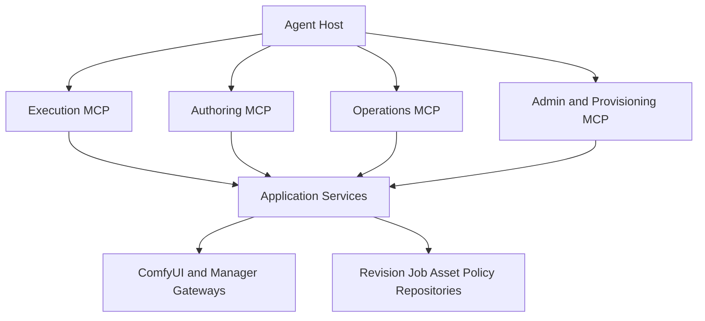
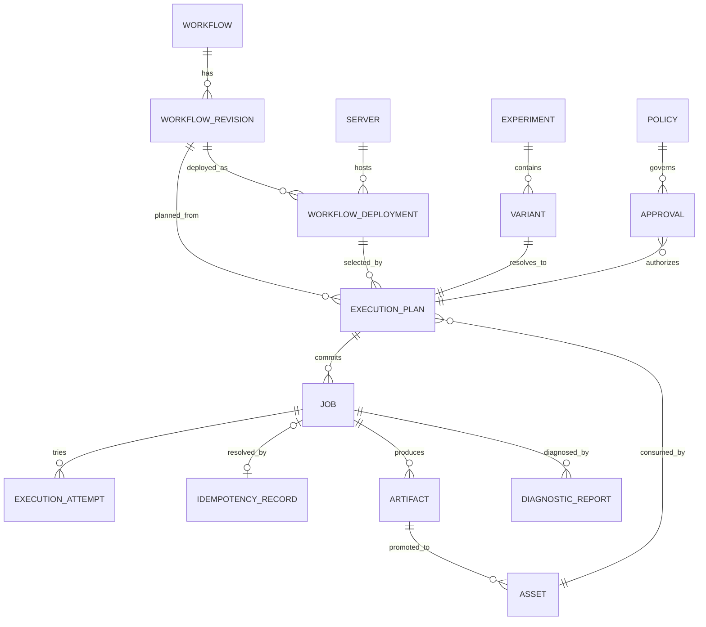

# ComfyUI MCP Skills：Agent 原生超级控制平面设计与开发路线

> 状态：G0–G6、H–Q 已完成当前定义的后端纵向切片；高级宿主集成仍有明确边界
> 基线：`comfyui-skill-cli` 0.2.13、ComfyUI MCP Skills 1.1.0
> 目标读者：项目维护者、后续开发 Agent、安全审查者
> 更新日期：2026-08-06

## 目录

1. 产品定位
2. 目标定义与设计原则
3. 当前能力基线
4. CLI 到 MCP 能力矩阵与超级增强能力地图
5. 目标 MCP 工具面
6. 目标 Resources
7. 权限模型
8. 应用层与基础设施改造
9. 一致性、安全和审计约束
10. 分阶段开发路线
11. 端到端完成标准
12. 开发顺序建议
13. 发布与版本定义
14. 技术可行性审查
15. 同类工具与可借鉴模式
16. Agent 操作压力与上下文控制
17. 审查后的产品裁剪结论

## 1. 产品定位

ComfyUI MCP Skills 的目标不是把 `comfyui-skill` CLI 命令改写成 MCP Tool，也不只是补齐一个执行型 MVP。

正确定位是：

> **以 MCP 为 Agent 原生控制平面，在保留 CLI 全部有效能力的基础上，提供工作流理解、图级编辑、版本管理、执行规划、批量实验、跨服务器调度、资产血缘、自动诊断、依赖修复和安全自治；协议适配以 MCP `2026-07-28` 的无状态请求模型为目标。**

CLI 功能只定义最低兼容线。MCP 版本必须形成严格超集：

```text
MCP 完整能力
  = CLI 现有有效能力
  + MCP 原生结构化交互
  + Agent 所需的组合操作
  + 可恢复的长任务和事件流
  + 安全策略、审批和审计
  + CLI 难以表达的图、资产与执行智能
```

当前实现已经完成 G0–G6 与 H–Q 的当前后端纵向切片：可靠执行与观察内核、语义导入和边界化图级变更（含节点生命周期与 subgraph 提取/复用闭环）、资产血缘、Experiment、结构化诊断、服务器/配置/依赖供应链、多服务器路由、显式运行时控制（含可选 systemd/Docker 重启控制器）、静态 Bearer Token 与 RFC 7662 Token Introspection、基于 SQLite 的同主机多 worker 共享限流，以及 MCP Apps 只读 Job 查看器。仍未交付的是多副本 SubscriptionBus、跨主机租约、MCP Tasks、Elicitation 和完整 App 图库；高层分支 recipe（upscale/save/lora/controlnet）、Windows Service RuntimeController 与 OpenTelemetry logs 已交付；因此“超级控制平面”定位已具备主体能力，但不能把这些宿主与多副本扩展描述为现有功能。

后续开发不能再以“一条 CLI 命令对应一个 MCP Tool”为主线，也不能把 CLI 没有的能力视为非必要范围。应从 Agent 完成目标所需的信息、决策和闭环出发设计能力。

---

## 2. 目标定义与设计原则

### 2.1 不是协议翻译层

CLI 面向人类终端，受限于单次进程、字符串参数、当前目录、stdout/stderr 和退出码。MCP 面向 Agent，可原生提供结构化 schema、Resource、订阅、进度、身份和能力发现；`2026-07-28` 起普通请求是无状态的，只有 `subscriptions/listen` 等显式流保持长连接，领域状态不能依赖 MCP 连接或会话。

因此，MCP 不应复制 CLI 的交互限制。它应让 Agent 直接操作领域对象：

- Workflow、Workflow Revision 和 Graph Patch。
- Node、Model、Dependency Plan 和 Capability。
- Asset、Artifact、Lineage 和 Collection。
- Execution Plan、Job、Batch、Queue 和 Event。
- Server、Policy、Approval、Audit 和 Diagnostic Report。

### 2.2 目标体验

完成后，Agent 应能从自然语言目标出发完成以下闭环，而不需要拼接 Shell 命令或手工修改工作流 JSON：


### 2.3 Agent-first 设计原则

1. **目标优先，不以命令优先。** Tool 对应稳定意图，不对应终端语法。
2. **读操作可组合，写操作可计划。** 所有复杂变更先返回 plan、diff 和风险，再提交。
3. **领域对象可寻址。** Workflow、Revision、Asset、Job 和 Plan 都有稳定 ID 与 Resource URI。
4. **长任务可恢复。** 连接断开后可以按 ID 恢复，不把网络请求生命周期等同于 GPU 作业生命周期。
5. **让 Agent 看见足够上下文。** 节点定义、模型能力、图连接、参数约束和失败节点必须结构化返回。
6. **减少工具歧义，而不是减少能力。** 相同意图合并；不同风险和事务语义保持独立。
7. **输出可以直接成为下一次输入。** 优先传递 Resource URI 和资产引用，不下载后再上传。
8. **确定性留给代码，选择留给 Agent。** 校验、转换、diff、拓扑和摘要由服务计算；风格与策略选择由 Agent 决策。
9. **默认最小权限，授权后能力完整。** 安全隔离不能演变成功能删除。
10. **每次自治都有边界。** 配额、预算、审批、并发和影响范围必须显式。
11. **协议投影不拥有业务状态。** MCP Task、Progress、Subscription 和 Elicitation 只投影领域对象；Plan、Job、Experiment、Approval 和事件事实由 Repository 与后台编排器持久化。

### 2.4 完整管理边界

“完整管理”覆盖 ComfyUI HTTP API、已配置的 ComfyUI Manager API、本项目工作流与服务器配置，以及 Agent 原生的图、资产、执行、策略和审计对象。

### 2.5 默认不提供的能力

以下能力不能通过通用 MCP Tool 默认开放：

- 任意 Shell 命令执行。
- 任意文件系统读写。
- GPU 驱动、CUDA、Python 或操作系统软件安装。
- 导出服务器密码、API Key 或 Bearer Token。
- 无确认地终止其他主体的运行中作业。
- 无审计地安装任意 Git 仓库代码。
- 无适配器地启动、停止或重启宿主机上的 ComfyUI 进程。

如果需要管理 ComfyUI 进程，应增加可选 `RuntimeController` 端口，并按部署方式实现 Docker、systemd、Windows Service 等适配器。默认实现只报告 `restart_required`，不执行宿主机命令。

### 2.6 实施状态说明

本文同时承担产品蓝图、目标架构和当前实现记录。阅读第 3 章和第 4 章时，必须区分：

1. **默认执行面**：新项目即可使用的 execution Toolset。
2. **显式授权面**：配置 Toolset、Scope 和高风险开关后才会出现在 `tools/list` 的能力。
3. **SQLite 切换面**：对应 aggregate 完成生产 cutover 后才启用 Revision、Artifact、Plan、Experiment、诊断、路由和工作流语义/编辑等持久化闭环；独立 Admin 的 Provisioning 不依赖该 cutover，但需要来源白名单和受信任 catalog。
4. **未交付面**：代码、测试或路线图尚未提供的功能，不得按已实现能力使用。

G0 的 schema、Unit of Work、Manifest、备份和 contract harness 证据已完成；这不等于全新项目已经完成 G1/G3/G4 的生产数据切换。`comfyui-mcp-migration-dry-run` 仍是只读演练；生产切换由 `comfyui-mcp-migrate` 在显式确认短语与冻结备份下执行，并在部分失败时如实报告已切换组与恢复证据。

---

## 3. 当前能力基线

### 3.1 默认执行 MCP

默认 stdio 身份为 `local-stdio`，Toolset 为 `execution`，Scope 为 `comfyui:execute`。它提供基础执行、资产上传、Job 查询/取消，以及当前已完成切片中不依赖未切换 aggregate 的执行能力。服务器健康、节点与模型查询属于显式授权的 Operations 面。

动态工作流工具：

```text
comfyui.run.<server>.<workflow>
```

每个已启用工作流参与动态目录。单个端点默认投影排序后的前 8 个动态工具；`COMFYUI_MCP_MAX_DYNAMIC_TOOLS` 可在 1–128 范围内调整预算。该配置只扩展已授权动态工作流数量，不改变 Toolset、Scope 或 aggregate cutover 边界。

### 3.2 显式授权面

| Toolset | 配置要求 | 能力范围 |
|---|---|---|
| `execution` | 默认 `comfyui:execute` | 执行、Job、Asset、Experiment、Routing |
| `authoring` | `comfyui:observe,comfyui:author` + 高风险开关 | Workflow、Revision、diff、依赖检查 |
| `operations` | `comfyui:observe,comfyui:operate` + 高风险开关 | Server、Queue、Log、Runtime |
| `admin` | `comfyui:observe,comfyui:configure,comfyui:provision,comfyui:audit` + 独立 Admin | 配置、供应、审批、审计、节点/模型/插件只读目录 |

授权不等于存储切换。没有对应 SQLite cutover 时，工具可能不出现在工具面，或明确返回 backend unavailable。

### 3.3 当前 Resources

Canonical URI 与旧兼容 URI 都由当前 MCP Resource handler 投影；高级对象的可读性仍受其 aggregate cutover 与 owner scope 约束。

### 3.4 Streamable HTTP

当前支持静态 Bearer Token 和 RFC 7662 Token Introspection；HTTP 当前只接受 `execution` 或 `operations` Toolset，`authoring` 与 `admin` 仅允许隔离的本地服务。远程部署仍必须显式配置 Host、Origin、Public URL 和认证参数。

---

## 4. CLI 到 MCP 能力矩阵

### 4.1 已实现但不一定默认可见

下表表示代码中已有实现，不表示新项目默认已经切换或每个 Agent 都能看到：

| 能力 | 实现条件 |
|---|---|
| Job list、Queue、Log、Template、Subgraph | `job.list` 属 Execution Toolset 且需 G1 run SQLite cutover（文件仓库下不挂载）；Queue/Log/Template/Subgraph 属 Operations Toolset |
| Workflow describe、Revision、diff、依赖检查 | Authoring Toolset + G3 Workflow SQLite cutover |
| Asset/Artifact/Lineage | Execution Toolset + G1 Asset/Job 与相关 Artifact cutover |
| Plan、Route、Experiment、Diagnostic、Retry | Execution Toolset + 对应 SQLite aggregate cutover |
| Server/Config/Dependency/Provisioning | 独立 Admin + 配置、来源白名单和依赖 catalog |
| Runtime queue/remove/clear/interrupt + restart plan/approve/commit/get | Operations Toolset；重启执行闭环已交付（SQLite run store 门控；文件后端 plan 只读预览） |

### 4.2 尚未交付

以下不是当前可用功能：

| 能力 | 状态 |
|---|---|
| Redis/NATS 多副本订阅与事件 fan-out | 未交付 |
| 跨主机共享租约与全局配额（同主机 SQLite 共享限流已可用） | 未交付 |
| MCP Tasks 扩展映射 | 未交付 |
| MCP Elicitation 审批 | 未交付 |
| MCP App 完整界面 | 已交付只读 Job 查看器；图库/实验对比 UI 未交付 |

旧 CLI 尚未迁移的条目保留在后续路线中，不能按当前 MCP Tool 使用。

---

### 4.4 超越 CLI 的能力地图

#### 4.4.1 工作流语义理解

Agent 不应只能读取整份原始 workflow JSON。服务需要提供经过确定性解析的语义视图：

- 节点、连接、输入、输出和拓扑顺序。
- Loader、Sampler、Conditioning、Control、Upscale、Save 等节点角色。
- 当前模型、LoRA、VAE、ControlNet 和后处理链。
- 可暴露参数、固定参数、默认值和约束来源。
- 未连接输入、悬空输出、不可达节点和循环引用。
- 工作流需要的节点类、模型、显存特征和可选能力。
- 输出节点、媒体类型、尺寸变化和资产流向。

语义解析必须由确定性代码完成。不要在 MCP 服务内部调用隐藏 LLM 猜测工作流结构。

#### 4.4.2 图级创建和编辑

CLI 通常要求用户整体替换 JSON。MCP 应提供 revision-aware 的图操作：

- 从空图、模板或现有 Revision 创建工作流。
- 添加、删除、替换和配置节点。
- 连接或断开节点端口。
- 暴露、隐藏、重命名和约束工作流参数。
- 插入 LoRA、ControlNet、Upscaler、Preview 或 Save 分支。
- 克隆工作流并保留来源关系。
- 生成 diff，预览影响后再提交。
- 使用 `expected_revision` 防止并发覆盖。
- 回滚到已提交 Revision。

图修改不能让 Agent 直接发送任意 JSON Patch。应定义受 schema 约束的领域操作，并在服务端解析节点端口和类型兼容性。

#### 4.4.3 工作流组合和复用

应支持将已有能力组合成新流程：

- 把一个工作流输出绑定为另一个工作流输入。
- 从模板或 subgraph 实例化节点组。
- 提取当前图的一部分为可复用 subgraph。
- 保存参数 preset，并允许继承和覆盖。
- 声明工作流输入输出契约，使工作流可安全串联。
- 检测图间媒体类型、尺寸、mask 和 latent 兼容性。

组合结果应持久化为 Workflow Revision 或 Execution Plan，而不是只存在于一次 Agent 对话中。

#### 4.4.4 执行前规划

执行不应只有“提交或失败”。Agent 需要可检查的 preflight plan：

- 解析最终参数和默认值。
- 显示将使用的 workflow revision、模型和服务器。
- 验证节点、模型、输入资产和输出目录。
- 计算图的静态尺寸变化、批次数和预期产物数量。
- 检查策略限制：像素、steps、batch、并发、输出数量和超时。
- 给出候选服务器及选择依据。
- 返回确定性的 `plan_digest`，执行时绑定该摘要。

不能承诺无法可靠计算的 GPU 时间或显存精确值。可以返回基于历史数据的估计，但必须标记数据来源、样本量和置信区间。

#### 4.4.5 批量、参数扫描和实验

Agent 常需要比较 seed、prompt、sampler、steps 或模型组合。逐次调用单工作流 Tool 成本高且难恢复。

应增加持久化 Experiment：

- 参数矩阵、zip、随机采样和显式 variants。
- 全局最大运行数和预算上限。
- 并发度、服务器亲和性和失败策略。
- 单个 Variant 的稳定 ID、参数摘要和 Job 关联。
- 部分失败后只恢复未完成项。
- 按元数据、耗时、错误和 Agent 评分汇总结果。
- 将选中 Variant 固化为 preset 或新 Revision。

实验编排不能把所有变体展开后一次性塞入 ToolResult。大结果使用 Resource 和 cursor 分页。

Experiment 的 `concurrency` 表示实际执行槽，不是预提交队列深度。ComfyUI Core 默认只有一个 `prompt_worker`，单实例按一个执行槽计算；有效并发上限是候选服务器 `execution_slots` 之和。若调用方显式允许预排队，另用 `submission_window` 限制已提交但未执行的 Variant，不能把队列长度标成并发，也不能无界挤占其他主体。

#### 4.4.6 多服务器能力路由

当配置多台 ComfyUI 时，Agent 不应手工猜测运行位置。路由器可根据以下事实生成候选：

- 服务器在线状态、设备和可用显存。
- 当前队列长度和并发策略。
- 必需节点、模型和 Manager capability。
- 输入资产所在服务器和传输成本。
- 工作流 server affinity、用户策略和数据边界。
- 历史成功率与耗时统计。

默认仍允许调用方锁定 `server_id`。自动路由必须返回选择理由，不能静默换服务器或复制敏感资产。

#### 4.4.7 资产库、血缘和条件化复用

现有上传只解决一次输入。超级控制平面需要完整 Asset/Artifact 模型：

- 分页列出、筛选和读取资产元数据。
- 使用标签、集合、媒体类型、尺寸和来源组织资产。
- 记录输入资产 → Workflow Revision → Job → 输出 Artifact 的血缘。
- 从 PNG metadata 恢复 prompt、workflow 和生成参数。
- 将输出 Resource URI 直接绑定到后续 image、mask、audio 或 video 输入。
- 检测跨服务器复用，生成显式传输计划。
- 提供保留、归档和删除策略。
- 删除前返回引用计数和影响范围。

Resource URI 是稳定引用，不应暴露为宿主机绝对路径。

“同服务器零复制”必须由 ExecutionPlanningService 根据消费节点和存储可达性判定，不能只看 `server_id`：

- Core `LoadImageOutput` 使用 output 目录，可直接绑定同一 ComfyUI 实例的 output 引用。
- Core `LoadImage` 使用 input 目录；MCP 与 ComfyUI 共享受控文件系统时可在服务端复制或硬链接到 input，远程实例必须下载并通过上传端点写入 input。
- 自定义加载节点只有在 Compatibility Matrix 中声明其目录语义并通过版本测试后才可走零复制；未知节点返回 `reuse_mode=unsupported`。
- Plan 必须返回 `reuse_mode`（`direct_output_reference`、`server_side_copy`、`download_upload`、`unsupported`）、预计字节数和副本策略；“不经过客户端”不等于“不发生复制”。

上游依据：[ComfyUI `LoadImage` / `LoadImageOutput`](https://github.com/Comfy-Org/ComfyUI/blob/master/nodes.py)、[ComfyUI 单 `prompt_worker`](https://github.com/Comfy-Org/ComfyUI/blob/master/main.py)。这些属于版本化 Compatibility Matrix 事实，不应硬编码为永恒行为。

#### 4.4.8 结构化诊断和恢复建议

日志文本只是证据，不是最终接口。服务应把多来源信息整理为 Diagnostic Report：

- Job 状态、ComfyUI history、执行事件和失败节点。
- 相关日志窗口，而不是整个日志文件。
- 缺失节点、缺失模型、类型不匹配、OOM、输入不存在等稳定错误分类。
- 可重试性、影响范围和建议的下一操作。
- 生成 remediation plan，但不未经确认执行高风险修复。
- 修复后从原 Job 参数创建新的 retry Job，并保留 `retry_of` 血缘。

诊断分类必须是确定性的。自然语言解释可以由 Agent 基于结构化报告生成。

#### 4.4.9 版本、变更和可回滚性

工作流、schema、服务器配置、policy 和 preset 都必须版本化：

- 每次提交产生不可变 Revision 和内容摘要。
- 保存父 Revision、作者主体、request ID、时间和变更摘要。
- 支持结构化 diff，而不是只返回文本 diff。
- 支持 fork、tag、publish、archive 和 rollback。
- 动态 Tool 绑定已发布 Revision；草稿不污染生产工具列表。
- Job 永久记录实际执行的 Revision，不跟随 later update 漂移。

#### 4.4.10 策略、预算和审批

Agent 自治必须由 Policy 控制：

- 每主体允许的服务器、工作流和模型。
- 最大 width、height、batch、steps、运行数和并发数。
- 每小时或每日 GPU 作业额度。
- 可否安装依赖、跨服务器传输、清队列或中断。
- 哪些操作需要人工批准。
- 审批有效期、一次性使用和 plan digest 绑定。

策略拒绝必须返回具体违反项和允许范围，便于 Agent 自动调整方案。

#### 4.4.11 Agent 上下文效率

完整能力不等于把所有数据塞进上下文。接口应支持渐进式发现：

- 列表返回摘要和稳定 ID。
- describe 返回单个对象完整信息。
- 大图提供 summary、nodes、edges、parameters 等分层 Resource。
- 错误返回建议的下一 Tool 和所需参数，但不自动执行。
- Tool 描述说明使用时机、返回结构和恢复方式。
- 使用 cursor、field selection 或 detail level 控制响应体。
- 动态工作流 Tool 只暴露已发布且当前主体可见的工作流。

#### 4.4.12 MCP `2026-07-28` 原生交互

除 Tools 外，应使用新协议已经提供的原语，但不得让协议对象取代领域对象：

- Resources 与 Resource Links：寻址图、Revision、Plan、Asset、Artifact、Job、Experiment、Diagnostic 和 Policy；输出及大型报告不内联。
- `outputSchema` + `structuredContent`：所有稳定 Tool 结果使用 JSON Schema 2020-12，并保留兼容文本块。
- `subscriptions/listen`：只承担列表失效通知和 Resource 更新提示；断线后重新 listen 并 refetch 当前 Resource。领域 Event Resource 仅服务审计、诊断和可选历史查询，不伪装成协议 replay。
- Progress：只投影当前请求可见的即时进度；不是可靠事件总线。
- Prompts：提供“构建工作流”“诊断失败”“比较实验结果”等公开 Tool 编排流程。
- MRTR Elicitation：`tools/call` 返回 `InputRequiredResult`，客户端携带 `inputResponses` 和完整性保护的 `requestState` 重试；不再使用旧式服务端反向请求。
- Tasks：作为 `io.modelcontextprotocol/tasks` 可选扩展映射长任务句柄；领域 Job 仍是真相来源。
- MCP Apps：仅作为支持该扩展的 Host 中的可选图库、实验对比和运行监视 UI；无 App 时所有核心能力仍可通过 Tool 与 Resource 完成。
- 缓存与分页：`tools/list`、`resources/list/read` 等返回确定性顺序、`ttlMs`、正确的 `cacheScope` 和不透明 cursor。
- Tool metadata：统一提供 `title`、`icons` 和 `ToolAnnotations`，让 Host 展示只读、破坏性、幂等和开放世界提示；这些只是 UI/模型提示，不参与授权或 Policy 判定。
- Resource templates：通过 `resources/templates/list` 宣告所有规范 `comfyui://` 模式，不要求 Agent 从文档猜 URI。
- Completion：只用于协议允许的 Prompt 参数和 Resource Template 参数；`completion/complete` 不支持任意 Tool 参数，Tool 中的 `server_id`、`workflow_id` 和模型名仍通过小枚举或 list/describe 发现。

MCP `2026-07-28` 移除了协议会话、HTTP GET 事件流和 SSE 重放。即使客户端断线、请求被重试或由另一 worker 接手，Job、Experiment、Provisioning、Approval 和事件状态仍必须存在。

协议依据：[MCP `2026-07-28` 变更](https://modelcontextprotocol.io/specification/2026-07-28/changelog)、[MRTR](https://modelcontextprotocol.io/specification/2026-07-28/basic/patterns/mrtr)、[`subscriptions/listen`](https://modelcontextprotocol.io/specification/2026-07-28/basic/patterns/subscriptions)、[Tasks 扩展](https://modelcontextprotocol.io/extensions/tasks/overview)、[MCP Apps](https://modelcontextprotocol.io/extensions/apps/overview)。

### 4.5 明确反模式

禁止以下实现方式：

- 在 MCP handler 中调用 `comfyui-skill` 子进程。
- 提供通用 Shell、Python eval 或任意 HTTP 请求工具。
- 用一个带任意 `action` 字符串的超级 Tool 包含所有操作。
- 要求 Agent 每次上传完整 workflow JSON 才能修改一个节点。
- 服务端隐藏调用 LLM 并把猜测包装成确定性结果。
- 自动安装未知 Git 仓库、自动全局 interrupt 或自动清队列。
- 把详细日志、完整模型列表或大图 JSON 默认塞入上下文。
- 用当前连接状态保存唯一 Job 或事务状态。
- 将安全边界实现为删除功能，而不是 scopes、policy 和审批。
- 通过连接内 profile、session pin 或一次 Tool 调用的副作用改变 `tools/list`；`2026-07-28` 的列表不得按连接状态漂移。
- 把 `subscriptions/listen` 当作可重放事件日志；断线期间的变化必须从领域 Event Repository 补齐。

---

## 5. 目标 MCP 工具面

不要机械创建 35 个 CLI 同名工具。应按 Agent 意图合并重复命令，同时保留清晰的安全边界。

### 5.1 执行面：默认开放

保留现有工具，并新增：

#### `comfyui.job.list`

用途：分页列出当前主体的持久化作业。

建议输入：

```json
{
  "server_id": "local",
  "workflow_id": "txt2img",
  "status": ["queued", "running", "completed", "error", "lost"],
  "created_after": "2026-07-30T00:00:00Z",
  "limit": 50,
  "cursor": "opaque-cursor"
}
```

要求：

- 默认只能列出当前 `principal_id` 的作业。
- `limit` 范围为 1–200。
- 返回不透明 `next_cursor`。
- 不返回其他主体的参数、路径或输出。
- `server_id` 只匹配 Job 最新 ExecutionAttempt 的 `server_id`；完整 Attempt 历史通过 Job Resource 读取，不能因历史 Attempt 命中而重复返回 Job。

`comfyui.job.list` 不得扫描 `FileRunRepository` 的摘要文件实现筛选。阶段 G1 先交付 SQLite/PostgreSQL 的 JobRepository list 查询：至少建立 `(owner_id, created_at DESC, job_id)`、`(owner_id, status, created_at DESC, job_id)`、`(owner_id, workflow_id, created_at DESC, job_id)` 复合索引，并使用 `(created_at, job_id)` keyset cursor；阶段 H 再开放 MCP Tool。原子文件后端只保留限时只读回滚和迁移诊断，不新增脆弱的二级索引文件。

### 5.2 观察面：只读运维

建议独立 scope：

```text
comfyui:observe
```

新增工具：

| Tool | 用途 |
|---|---|
| `comfyui.workflow.list` | 按标签、媒体类型、节点、模型和发布状态搜索工作流 |
| `comfyui.queue.list` | 查看运行中和等待中的 ComfyUI 队列 |
| `comfyui.log.read` | 读取经过脱敏、限制行数的服务日志 |
| `comfyui.template.list` | 分页列出工作流模板 |
| `comfyui.template.subgraph.list` | 分页列出全局子图 |
| `comfyui.workflow.dependencies.check` | 检查工作流所需节点和模型 |
| `comfyui.model.describe` | 读取模型元数据、引用工作流、哈希和可用服务器 |
| `comfyui.node.compatibility` | 检查节点端口、版本和替换关系 |
| `comfyui.server.capabilities` | 探测可选 API、Manager 和版本能力 |
| `comfyui.engine.history` | 只读引擎历史（8 MiB 有界 + 扁平投影） |
| `comfyui.node.blueprint` | 目标驱动节点投影（≤10 节点 × ≤8 字段 + 枚举） |
| `comfyui.model.guidance` | 模型家族静态起点（sampler/steps/CFG/resolution） |
| `comfyui.job.history.suggest` | 本地运行历史证据建议（SQLite run store 门控） |
| `comfyui.workflow.visualize` | 已发布工作流有界 Mermaid 渲染（≤50 节点，SQLite 门控） |
| `comfyui.local.plugins` | 本地 custom_nodes 插件清单（server 条目 `local_root`；云端降级 `available:false`） |

> 未交付（设计蓝图表）：`comfyui.template.subgraph.list`、`comfyui.model.describe`、`comfyui.node.compatibility` 未实现。`comfyui.workflow.list` 已实现（分页 + `query`/`include_disabled` 过滤，`describe` 附加部署事实）。子图/节点/模型信息由 `comfyui.subgraph.list`、`comfyui.node.list/describe`、`comfyui.model.list` 提供。

日志要求：

- 默认最多 100 行，硬上限 1000 行。
- 支持 `cursor`，不接受任意文件路径。
- 对 Authorization、API Key、Token、Cookie 和配置凭据脱敏。
- 远程模式默认不返回完整本地路径。

### 5.3 运维面：影响运行状态

建议独立 scope：

```text
comfyui:operate
```

新增工具：

| Tool | 用途 | 风险控制 |
|---|---|---|
| `comfyui.server.free` | 卸载模型、释放显存 | 参数必须至少选择一项（已实现：intent-first 审计 + `request_id` 幂等，`free_output` 返回审计状态） |
| `comfyui.queue.remove` | 删除指定排队任务 | 验证所有权或管理员权限 |
| `comfyui.queue.clear` | 清空等待队列 | `dry_run` + 精确确认 + 审计 |
| `comfyui.server.interrupt` | 调用全局 `/interrupt` | 明确标记为全局操作，禁止伪装成单 Job 取消 |

若 Compatibility Matrix 探测到新版 ComfyUI 的 `/api/jobs/{upstream_job_id}/cancel`，`job.cancel` 可以使用其原子定向取消语义；否则运行中 Job 返回 `UNSAFE_CANCEL`，并在 `next_actions` 中指向需要 `comfyui:operate`、影响预览和审批的 `comfyui.server.interrupt`。旧 `/interrupt` 始终是全局操作，不能根据一次 404 静默降级调用。

### 5.4 工作流管理面

建议 scope：

```text
comfyui:author
```

新增工具：

#### `comfyui.admin.workflow.import`

统一处理本地授权文件、服务器 userdata 和内联 JSON：

```json
{
  "server_id": "local",
  "source": {
    "kind": "server_userdata",
    "path": "workflows/example.json"
  },
  "workflow_id": "example",
  "media_type": "image",
  "dry_run": true,
  "overwrite": false,
  "request_id": "caller-generated-id"
}
```

`source.kind` 建议限定为：

- `authorized_local_file`
- `server_userdata`
- `inline_json`

导入流程必须：

1. 校验来源权限和大小。
2. 识别 API 或 Editor 格式。
3. 使用服务器 `object_info` 转换 Editor 格式。
4. 生成参数 schema。
5. 检查路径和标识符。
6. 检查废弃节点。
7. 生成依赖报告。
8. `dry_run=true` 时不落盘。
9. 提交时原子写入 `workflow.json` 和 `schema.json`。
10. 发布 Tool 与 Resource 变更通知。

补充工具：

| Tool | 用途 |
|---|---|
| `comfyui.admin.workflow.set_enabled` | 已实现；**workflow aggregate cutover 后隐藏**（file-backed 仓库被封存，工具不再挂载，调用返回不可用） |
| `comfyui.admin.workflow.delete` | 已实现；**workflow aggregate cutover 后隐藏**（同上） |
| `comfyui.admin.workflow.validate` | 验证 workflow、schema、节点和模型，不执行（已实现：图校验 + 语义校验 + 参数目标校验 + 缺失模型清单，库存不可读时如实报告 `is_ready=false`） |

不建议提供一个带任意 `action` 字符串的万能 `workflow.manage`。导入、图变更和删除的风险及输入契约不同，应保持独立。

### 5.5 服务器与配置管理面

继续使用 `comfyui:configure`，新增：

> Admin 面还挂载只读目录工具（`comfyui:observe` 可见）：`comfyui.node.list`、`comfyui.node.describe`、`comfyui.model.list`、`comfyui.local.plugins`——供改工作流时查询节点/模型/插件知识。

| Tool | 用途 |
|---|---|
| `comfyui.admin.server.upsert` | 新增或更新服务器配置 |
| `comfyui.admin.server.set_enabled` | 启用或停用服务器 |
| `comfyui.admin.server.set_default` | 设置默认服务器 |
| `comfyui.admin.server.delete` | 删除服务器配置 |
| `comfyui.admin.config.export` | 导出不含密钥的可迁移 Bundle |
| `comfyui.admin.config.import` | 预览或导入 Bundle |

服务器配置要求：

- `server_id` 使用统一标识符校验。
- URL 只允许 `http` 或 `https`。
- 保存前执行 SSRF 与回环地址策略校验。
- 凭据优先引用环境变量或 Secret Provider，不直接返回明文。
- 所有写入使用临时文件、`fsync` 和原子替换。
- 更新要求可选 `expected_revision`，防止并发覆盖。
- 删除服务器前列出关联工作流和未终态 Job。

配置导出要求：

- 默认永远不导出凭据。
- 只导出 Secret 引用名称，不导出 Secret 值。
- Bundle 必须包含版本号和内容摘要。
- 导入必须先生成 merge plan，再显式提交。

### 5.6 依赖供应链管理面

建议最高风险 scope：

```text
comfyui:provision
```

新增工具：

| Tool | 用途 |
|---|---|
| `comfyui.admin.dependency.plan` | 生成缺失节点和模型安装计划 |
| `comfyui.admin.dependency.install` | 提交已确认的安装计划 |
| `comfyui.admin.provisioning.get` | 查询持久化安装任务 |
| `comfyui.admin.provisioning.cancel` | 在 Manager 支持时取消未执行安装项 |

安装不能直接接受未经约束的 Git URL 后立即执行。推荐两阶段协议：

1. `comfyui.admin.dependency.plan` 返回规范化计划和 `plan_digest`。
2. 调用方审查来源、版本、大小和许可证信息。
3. `comfyui.admin.dependency.install` 提交 `plan_digest`、`request_id` 和精确确认短语。
4. 服务端再次解析计划并核对摘要。
5. 安装结果写入持久化 Provisioning Job。

供应链最低要求：

- 版本化、人工维护并经过来源验证的允许列表；“registry 命中”本身不等于可信。
- 禁止 URL 中携带凭据。
- 固定 commit/tag，禁止只记录浮动默认分支。
- 模型记录下载 URL、目标目录、大小和校验和。
- 下载限制协议、重定向次数、域名、IP 和文件大小。
- 安装过程不得阻塞 MCP 请求生命周期。
- 明确返回 `restart_required`，不自动执行任意宿主机重启命令。
- 每个安装步骤写审计记录。


### 5.7 图与 Revision 工具

图编辑采用“计划 → 提交”双阶段，不直接覆盖 workflow 文件。

| Tool | 用途 |
|---|---|
| `comfyui.workflow.describe` | 返回语义摘要、拓扑、参数、依赖和输出契约 |
| `comfyui.admin.workflow.change.plan` | 解析领域图操作，返回 diff、验证结果和 plan digest；校验失败消息带 `node <id> field <field>` 定位 + describe hint（已知类带 class_type 指向 `comfyui.node.describe`，未知类指向 `comfyui.node.list`） |
| `comfyui.admin.workflow.change.commit` | 提交未过期且 revision 未冲突的 change plan |
| `comfyui.revision.list` | 分页列出 Revision |
| `comfyui.revision.diff` | 返回两个 Revision 的结构化差异；输出含 mermaid 视图（added 节点高亮）；`change.plan` 的 diff 不含 mermaid |
| `comfyui.admin.workflow.publish` | 将草稿 Revision 发布为动态 Tool 当前版本 |
| `comfyui.admin.workflow.rollback` | 基于历史 Revision 创建新的回滚提交 |
| `comfyui.workflow.visualize` | 已发布工作流有界 Mermaid 渲染（≤50 节点、节点别名防注入；SQLite workflow store 门控） |
| `comfyui.workflow.preset.list` | 分页列出参数 preset 及继承关系（未交付） |
| `comfyui.admin.workflow.preset.upsert` | 创建或更新版本化 preset（未交付；preset 固化经 `experiment.variant.promote` 交付） |

`change.plan` 输入示例：

```json
{
  "server_id": "local",
  "workflow_id": "portrait",
  "base_revision": "revision_aaaaaaaaaaaaaaaaaaaaaaaaaaaaaaaa",
  "operations": [
    {
      "op": "set_input",
      "node_id": "19",
      "input": "steps",
      "value": 30
    },
    {
      "op": "insert_role",
      "role": "upscaler",
      "after_node_id": "52",
      "configuration": {
        "model": "4x-UltraSharp.pth",
        "scale": 2
      }
    },
    {
      "op": "expose_parameter",
      "node_id": "19",
      "input": "cfg",
      "parameter_name": "guidance_scale"
    }
  ]
}
```

建议领域操作集合：

```text
add_node
remove_node
replace_node
set_input
unset_input
connect
disconnect
expose_parameter
hide_parameter
set_parameter_constraint
insert_subgraph
extract_subgraph
set_output_contract
set_metadata
```

每个操作都必须经过节点存在性、端口存在性、类型兼容、拓扑和 schema 校验。`insert_role` 之类的高层操作只能使用已注册、可解释的 recipe，不能由服务猜测任意节点链。

### 5.8 执行规划与自动路由工具

简单执行继续保留动态 `comfyui.run.*` 的单次调用体验（通用 `comfyui.workflow.execute` 未实现，不属于当前工具面）。该快速路径必须在服务端物化不可变 Execution Plan 并自动 commit：只有单服务器、低风险、依赖与 Policy 已通过且无需审批的计划才能自动提交。需要自动路由、审批、预算或批量时，显式使用计划型接口：

| Tool | 用途 |
|---|---|
| `comfyui.execution.plan` | 解析 Revision、参数、资产、策略和候选服务器 |
| `comfyui.execution.commit` | 按 `plan_digest` 提交已经验证的执行计划 |
| `comfyui.route.explain` | 解释候选服务器排序及排除原因 |

`execution.plan` 返回至少包含：

```json
{
  "plan_id": "plan_bbbbbbbbbbbbbbbbbbbbbbbbbbbbbbbb",
  "plan_digest": "sha256:...",
  "workflow_revision": "revision_aaaaaaaaaaaaaaaaaaaaaaaaaaaaaaaa",
  "resolved_parameters": {},
  "resolved_assets": [],
  "candidate_servers": [],
  "selected_server": "gpu-a",
  "selection_reasons": [],
  "policy_checks": [],
  "dependency_status": "ready",
  "expected_outputs": [],
  "estimates": {
    "source": "historical",
    "sample_count": 12,
    "duration_seconds_p50": 42,
    "duration_seconds_p90": 61
  },
  "expires_at": "2026-07-30T22:00:00Z",
  "approval_required": false
}
```

`execution.commit` 只能接受 `plan_id`、`plan_digest`、幂等键和必要审批引用，不能允许调用方在提交阶段悄悄修改参数。

无论显式 `execution.plan → commit` 还是快速 `run`，都先持久化同一 Plan 形态，再创建 Job。快速路径只是 UX 合并，不产生“无 Plan Job”；返回结果必须包含 `plan_id`、`plan_digest`、`revision_id`、`job_uri` 和规范 Artifact Resource Link。

### 5.9 Experiment 与批量执行工具

| Tool | 用途 |
|---|---|
| `comfyui.experiment.plan` | 规范化参数矩阵并计算 Variant 数量和预算 |
| `comfyui.experiment.commit` | 提交已验证实验计划 |
| `comfyui.experiment.get` | 查询实验汇总状态 |
| `comfyui.experiment.cancel` | 停止提交新 Variant，并按策略处理已排队项 |
| `comfyui.experiment.variant.list` | 分页读取 Variant 与关联 Job |
| `comfyui.experiment.select` | 将选中 Variant 固化为 preset 或 Revision（未交付；实际为 `experiment.variant.promote`） |
| `comfyui.experiment.variant.rate` | 回写外部 Agent 或人工评分，不由服务端隐藏调用 LLM |

失败策略必须是枚举：

```text
continue
stop_new
cancel_queued
```

禁止使用模糊的 `best_effort=true`。调用方必须知道部分失败时系统会做什么。

Variant 评分必须记录 `rater_principal_id`、`rubric_id`、`rubric_revision`、结构化分项、可选备注和时间；同一评分者重试使用幂等键覆盖同一逻辑评分。系统耗时、错误率、VRAM 等测量存入独立字段，不能与主观评分混成单一 `quality`。

### 5.10 资产和 Artifact 工具

| Tool | 用途 |
|---|---|
| `comfyui.asset.list` | 分页筛选当前主体可见资产 |
| `comfyui.asset.describe` | 读取媒体元数据、来源、引用和保留状态 |
| `comfyui.asset.import_output` | 按消费节点和存储可达性选择 output 直引、服务端复制或下载上传，并保留血缘 |
| `comfyui.asset.metadata.extract` | 解析 PNG 等媒体中的工作流和生成信息 |
| `comfyui.asset.collection.update` | 管理标签和集合成员关系 |
| `comfyui.asset.delete.plan` | 返回引用、血缘和删除影响 |
| `comfyui.asset.delete.commit` | 提交通过摘要绑定的删除计划 |

跨服务器资产复制使用独立 transfer plan：

```text
comfyui.asset.transfer.plan
comfyui.asset.transfer.commit
comfyui.asset.transfer.get
```

传输计划必须说明源、目标、字节数、媒体摘要、网络策略和是否产生临时副本。

### 5.11 诊断和恢复工具

| Tool | 用途 |
|---|---|
| `comfyui.job.diagnose` | 生成结构化 Diagnostic Report |
| `comfyui.job.retry.plan` | 基于原 Job 创建可审查的重试或修复计划 |
| `comfyui.job.retry.commit` | 按摘要提交重试，记录 `retry_of` |
| `comfyui.server.diagnose` | 汇总健康、队列、节点加载、Manager 和日志异常 |

稳定诊断代码至少覆盖：

```text
SERVER_OFFLINE
NODE_MISSING
MODEL_MISSING
INPUT_MISSING
INPUT_TYPE_MISMATCH
WORKFLOW_INVALID
OUT_OF_MEMORY
EXECUTION_INTERRUPTED
OUTPUT_UNAVAILABLE
MANAGER_UNAVAILABLE
UPSTREAM_STATE_LOST
POLICY_DENIED
```

报告应提供 `evidence`、`retryable`、`safe_actions`、`approval_actions` 和 `related_resources`。不要只返回一段“可能是显存不足”的文本。

### 5.12 Policy 与 Approval 工具

| Tool | 用途 |
|---|---|
| `comfyui.policy.evaluate` | 在不执行的情况下评估计划或操作 |
| `comfyui.policy.describe` | 读取当前主体的有效限制，不泄露其他主体策略（未交付） |
| `comfyui.admin.policy.upsert` | 创建或更新版本化 Policy（未交付） |
| `comfyui.approval.get` | 查询审批状态（实际为 Admin 面 `comfyui.admin.approval.get`） |
| `comfyui.approval.cancel` | 撤销未使用审批（未交付） |

审批对象必须绑定：

- `principal_id`
- `operation`
- `plan_digest`
- `impact_summary`
- `expires_at`
- `single_use`

宿主支持 MCP Elicitation 时，可以请求用户批准；不支持时返回持久化 Approval Resource，交由外部审批流程处理。

### 5.13 Tool 数量与暴露策略

超级增强不等于让每个 Agent 同时看到几十个工具。MCP `2026-07-28` 已取消协议级会话，`tools/list` 不得因连接内 profile、session pin 或先前 Tool 调用而变化；它可以按每次请求携带的授权上下文过滤，也可以因底层发布目录真实变化发送 `tools/list_changed`。

| 部署 Toolset | 主要工具 | 单端点活动面目标 |
|---|---|---|
| Execute | 动态 run、Job、Asset、Execution Plan（`workflow.execute` 未实现） | 固定工具 ≤ 硬上限 32（`HARD_FIXED_LIMIT`）；动态工作流默认 8 个，可配置 1–128 |
| Observe/Ops | Queue、Log、Diagnostic、Runtime、节点感知/建议工具 | base surface ≤ 25（预算测试断言）；全量装配 29–30；固定工具默认预算 `DEFAULT_FIXED_LIMIT=24`、硬上限 `HARD_FIXED_LIMIT=32` |
| Authoring | Workflow、Graph、Revision、Template | 8–16 个 |
| Admin/Provision | Server、Config、Dependency、Policy、Audit | 8–16 个 |

活动面通过**独立逻辑 MCP 端点、启动配置和授权 scope** 固定，而不是在连接中切换。每个端点的 Tool 顺序保持确定，返回 `ttlMs` 和正确的 `cacheScope`，便于 Host 缓存和提高 prompt cache 命中率。

Capability Catalog 仍保留：

```text
comfyui.capability.search
comfyui.capability.describe
```

它只搜索当前主体有权知道的后端能力，并返回应连接的 Toolset 或应调用的现有 Tool；不能靠搜索副作用把新 Tool 注入当前连接。小模型 Host 可显式部署 compact Toolset；`capability.invoke` 未实现（设计建议），若未来启用仍须执行目标能力的原 schema、scope、Policy、幂等和审计，不能成为类型系统后门。

### 5.14 通用计划与提交契约

所有复杂或危险操作复用统一外层契约，但领域输入保持独立 schema：

```json
{
  "plan_id": "plan_bbbbbbbbbbbbbbbbbbbbbbbbbbbbbbbb",
  "plan_digest": "sha256:...",
  "status": "ready",
  "revision": 7,
  "impact": {},
  "warnings": [],
  "policy_checks": [],
  "approval_required": false,
  "expires_at": "2026-07-30T22:00:00Z"
}
```

提交结果统一包含：

```json
{
  "request_id": "caller-id",
  "committed": true,
  "resource_uri": "comfyui://...",
  "audit_status": "recorded",
  "result_revision": 8
}
```

统一外层只解决幂等、审批、版本和审计；不能用它掩盖不同领域操作的输入差异。

### 5.15 Tool 元数据与宿主提示

所有 Tool 使用同一元数据策略：

| Tool 类型 | `readOnlyHint` | `destructiveHint` | `idempotentHint` | `openWorldHint` |
|---|---:|---:|---:|---:|
| list、get、describe 等纯读取 | `true` | `false` | 省略（只读时无意义） | 访问 ComfyUI/Manager 时 `true` |
| diagnose、plan 等持久化本地对象 | `false` | `false` | 只有强制 `request_id` 并完成去重时为 `true` | 按网关访问情况 |
| upsert、commit、rate 等非破坏写入 | `false` | `false` | 只有强制 `request_id` 并完成去重时为 `true` | 按网关访问情况 |
| delete、clear、interrupt、install、restart | `false` | `true` | 仅在协议明确保证重复调用无额外副作用时为 `true` | `true` |

标准 annotations 只是 Host 和模型可见的提示，不能替代 scope、Policy、Approval、摘要绑定或服务端校验。每个 Toolset 使用一致的项目图标族；图标来自项目自有静态资源或内嵌数据，不使用携带 Token 的 URL，也不因图标加载泄露私有 ComfyUI 地址。

---

## 6. 目标 Resources

每个长期领域对象都应可寻址、可订阅、可恢复。目标 URI：

```text
comfyui://servers/{server_id}/capabilities
comfyui://workflows/{workflow_id}
comfyui://workflows/{workflow_id}/graph
comfyui://workflows/{workflow_id}/revisions/{revision_id}
comfyui://workflows/{workflow_id}/revisions/{revision_id}/dependencies
comfyui://deployments/{deployment_id}
comfyui://plans/{plan_id}
comfyui://jobs/{job_id}
comfyui://experiments/{experiment_id}
comfyui://experiments/{experiment_id}/variants/{variant_id}
comfyui://assets/{asset_id}
comfyui://artifacts/{artifact_id}
comfyui://lineage/{artifact_id}
comfyui://diagnostics/{diagnostic_id}
comfyui://provisioning/{request_id}
comfyui://approvals/{approval_id}
comfyui://policies/{policy_id}/revisions/{revision_id}
comfyui://config/export/{bundle_id}
comfyui://events/{subject_kind}/{subject_id}{?after_sequence,limit}
```

规范 URI 只使用项目领域 ID，不包含 `server_id`、ComfyUI `prompt_id` 或输出枚举位置。已发布的 `comfyui://workflows/{server_id}/{workflow_id}`、`comfyui://assets/{server_id}/{asset_id}`、`comfyui://jobs/{server_id}/{prompt_id}` 与 `comfyui://outputs/{server_id}/{prompt_id}/{index}` 只作为只读别名；解析后返回 `canonical_uri`，至少跨一个主版本保留并记录使用量。别名不得创建第二个领域对象、复制媒体或生成第二份血缘。

Resource 设计规则：

- URI 稳定，不包含宿主机绝对路径或 Token。
- Revision、Plan 和 Job 内容不可因后续配置变更而漂移。
- 大对象分层：summary、graph、nodes、edges、parameters、events。
- 私有 Resource 始终按 `principal_id` 和 scope 校验，并使用 `cacheScope=private`。
- Job、Experiment、Provisioning 和 Revision 通过 `subscriptions/listen` 发更新提示；通知只使缓存失效，不承载历史。
- 输出媒体使用 Resource Link；必要时可提供受鉴权、短 TTL 的 HTTPS 下载 URI，不内联到普通 JSON 结果。

`resources/templates/list` 已按可用后端和授权范围声明 canonical Workflow、Revision、Deployment、Asset、Job、Artifact/Lineage、Experiment、Diagnostic 等模板及旧只读别名；独立 Admin 还声明 Server、Config、Dependency、Approval 和 Provisioning 模板。Plan、Policy、Event 等仍属于目标 URI，不能按当前已投影模板使用。

以下数据仍适合 Tool 查询，而不是静态 Resource 列表：

- Job、Experiment 和 Variant 的筛选分页。
- 队列、日志和模板搜索。
- Workflow、Asset 和 Revision 的条件检索。
- 路由候选和 Policy evaluate。

原因是这些读取需要筛选、分页、权限判断或短 TTL；Tool 返回稳定 ID，再通过 Resource 深入读取。

---

## 7. 权限模型

### 7.1 建议 scopes

| Scope | 能力 |
|---|---|
| `comfyui:execute` | 动态工作流、执行计划、自有 Job、Experiment 和基础资产上传 |
| `comfyui:observe` | 队列、日志、模板、诊断、依赖报告和服务器能力 |
| `comfyui:author` | 工作流草稿、图变更计划、Revision、preset 和 publish |
| `comfyui:operate` | 显存释放、资产管理、队列删除和全局中断 |
| `comfyui:configure` | 服务器、配置、Policy 和授权变更 |
| `comfyui:provision` | 自定义节点、模型安装和运行时适配器 |
| `comfyui:audit` | 跨请求审计读取、审批查询和审计重试 |

不要将全部能力塞入 `comfyui:execute`。同一主体可以组合 scopes，但 Tool 列表、Resource 和订阅必须执行相同授权规则。

### 7.2 部署面拆分

建议保留四个逻辑 Toolset。它们优先部署为独立端点或由启动配置固定；同一进程可复用业务核心，但不得在 MCP 连接内切换 Toolset：



| Toolset 端点 | 默认状态 | 典型 scopes | 重点对象 |
|---|---|---|---|
| Execution MCP | 开启 | `execute` | Plan、Job、Experiment、Artifact |
| Authoring MCP | 显式开启 | `observe`、`author` | Workflow、Graph、Revision、Preset |
| Operations MCP | 显式开启 | `observe`、`operate` | Queue、Log、Diagnostic、Runtime |
| Admin/Provisioning MCP | 默认关闭 | `configure`、`provision`、`audit` | Server、Dependency、Policy、Approval |

Agent 要完整管理时可同时注册多个隔离端点。当前 Streamable HTTP 只允许 Execution 与 Operations；Authoring 和 Admin/Provisioning 必须使用隔离的本地服务。远程端点必须分离高风险端口和 Token；`tools/list` 可按每次请求的授权 scope 过滤，但 Tool 调用和 Resource 读取仍需再次授权。

### 7.3 HTTP 与 stdio 身份契约

HTTP 端点和 stdio 必须在进程启动时固定 Toolset，不能通过 Tool 调用、连接历史或运行时 profile 改变。scope 之间默认没有继承关系。

- HTTP Execution 端点接受 `execute`；Operations 接受 `observe` 或 `operate`。HTTP factory 明确拒绝 Authoring 与 Admin。
- 本地 stdio 可显式配置 Execution、Authoring 或 Operations；Admin 使用独立 `comfyui-mcp-admin` 进程。高风险能力还需对应 enable 开关。
- Resource 与 `subscriptions/listen` 使用创建/读取目标对象所需的同一 scope 和 `principal_id` 所有权规则；订阅不能绕过 Toolset 边界。
- stdio 在启动时读取固定的 `COMFYUI_MCP_PRINCIPAL_ID`、`COMFYUI_MCP_SCOPES` 和 `COMFYUI_MCP_TOOLSET`。未配置时只允许兼容的本地 Execution Toolset，主体为 `local-stdio`，scope 仅为 `comfyui:execute`。
- stdio 的 Authoring、Operations、Admin/Provisioning 必须显式配置主体、scope、Toolset，并设置独立高风险 enable 开关；不能因“本地进程”自动获得管理员权限。
- Token 轮换可以保持 `principal_id`，但不得扩大原对象所有权或缓存中的可见 Tool/Resource 集。

固定启动配置必须进入审计启动记录；请求期间只消费不可变授权上下文。

---

## 8. 应用层与基础设施改造

### 8.1 当前依赖关系

```text
MCP Adapters
  ├─ Execution / Experiment / Routing
  ├─ Authoring / Workflow inspection and change
  ├─ Observe / Operations / Diagnostic / Retry
  └─ Admin / Provisioning / Approval / Audit
       ↓
Application Services
       ↓
Domain Ports
       ↓
SQLite or compatibility file repositories
ComfyUI HTTP / WebSocket / Manager gateways
OperationOrchestrator / SubscriptionBus
```

当前装配已经覆盖 Planning、Routing、Experiment、Workflow inspection/change、Diagnostic/Retry、Orchestrator、同主机多 worker 的 SQLite 共享限流，以及可选 systemd/Docker/Windows Service RuntimeController、审批式重启执行闭环（runtime.restart plan→approve→commit→get，SQLite 门控）、高层 recipe 注册表；是否实例化由 Toolset、Scope、后端 cutover、配置绑定与可选 gateway 决定。共享多副本事件总线和跨主机租约仍未交付。

### 8.2 依赖方向

依赖方向始终是 Adapter → Application → Domain Port → Infrastructure。Graph、Plan、Policy 和 Revision 不得依赖 MCP 类型或 ComfyUI HTTP 响应格式。

### 8.3 必须新增的端口

```python
class QueueGateway(Protocol): ...
class TemplateGateway(Protocol): ...
class LogGateway(Protocol): ...
class ComfyUIManagerGateway(Protocol): ...
class WorkflowRevisionRepository(Protocol): ...
class WorkflowDeploymentRepository(Protocol): ...
class PlanRepository(Protocol): ...
class JobRepository(Protocol): ...
class ExperimentRepository(Protocol): ...
class LineageRepository(Protocol): ...
class ArtifactRepository(Protocol): ...
class ProvisioningRepository(Protocol): ...
class TransferRepository(Protocol): ...
class EventRepository(Protocol): ...
class OutboxRepository(Protocol): ...
class WorkItemRepository(Protocol): ...
class WorkLeaseRepository(Protocol): ...
class PolicyRepository(Protocol): ...
class ApprovalRepository(Protocol): ...
class ServerConfigRepository(Protocol): ...
class ControlPlaneUnitOfWork(Protocol): ...
class SecretProvider(Protocol): ...
class RuntimeController(Protocol): ...
```

不要让 Application Service 直接导入 `requests`、Typer、MCP 类型或本地文件实现。ComfyUI 原始 JSON 必须在 Gateway 边界转换为领域模型。

### 8.4 老 CLI 领域资产迁移清单

旧 CLI 不是待逐条翻译的命令集合。以下确定性资产必须连同测试和失败语义迁入 Application/Domain，CLI 与 MCP 只负责输入输出映射：

1. **Editor → API 转换器。** 保留 connected widget 对 `widgets_values` 下标的消费、`control_after_generate` 占位字符串跳过、两种 COMBO 表示、递归 Reroute 解析和未知节点拒绝。当前工作区直接收集到的转换回归用例必须全部迁移；现有 Reroute 逻辑缺少直接回归用例，阶段 I 必须补齐。不要在计划中写未经当前测试收集验证的固定用例数量。
2. **参数暴露注册表。** 迁移 `_AUTO_EXPOSE_FIELDS`、audio/video `_MEDIA_TYPE_FIELDS` 和媒体加载节点识别。目标实现是版本化 `ParameterRoleRegistry`，允许经过测试的项目覆盖，并记录规则来源；Core `LoadImageOutput` 必须识别为带 `storage_type=output` 的 image 参数，LoadVideo/LoadAudio 类按实时 `object_info` 与 Compatibility Matrix 注册，不能靠名称猜测。
3. **模型依赖提取表。** 以 `MODEL_LOADER_MAP` 的 13 个已知 loader/字段/目录映射冷启动 `DependencyExtractorRegistry`。未知或字段不匹配的 loader 返回 `coverage=partial` 与 `unverified_loaders`，不能输出虚假的“依赖完整”。
4. **诊断模式。** 以 `error_hints.py` 当前 14 条按优先级匹配的确定性模式冷启动 DiagnosticService，升级为 `{code, evidence, safe_actions}`；禁止把带 CLI 命令的 hint 字符串原样搬进领域层。
5. **既有交互语义。** COMBO 摘要最多预览 8 项并返回 `total/options_resource`；deprecated 节点只报告 replacement，不自动改图；批量 `--from-server` 导入逐项隔离失败并返回完整结果集合。

迁移完成前不得删除这些 CLI 常量、转换函数或测试。新实现与旧实现使用同一组 fixture 做差分验证，通过后再切换 CLI/MCP 调用方；写入路径同时改为 Revision 原子提交，不能继承旧 CLI 直接写两份 JSON 的方式。


### 8.5 核心领域对象关系



对象不变量：

- Workflow 是项目级逻辑身份，不属于某台服务器；Revision 是不可变、可移植内容。
- Deployment 是 Revision 在服务器上的部署记录，绑定 `workflow_id + revision_id + server_id`，持有 `enabled`、`validation_status` 和 `published` 布尔状态；数据库保证同一 `workflow_id + server_id` 最多一个 Deployment 为 `published=true`。publish 在同一事务中撤销旧 Deployment 并发布新 Deployment；Routing 只能从兼容、启用且已发布的 Deployment 中选择。
- Plan 是解析后的不可变快照，必须绑定 Revision、Deployment、输入对象摘要和固定服务器。
- 快速动态 run 必须先物化并自动提交最小低风险 Plan；自阶段 G4 切换起所有新 Job 的 `plan_id`、`revision_id` 和 `deployment_id` 非空。G1 导入且无法证明历史 Revision 的旧 Job 保留可空绑定并标记 `legacy_migrated=true`，不得伪造历史关联；诊断、重试和列表必须显式处理该兼容状态。
- Experiment Variant 绑定自己的 Plan，不能共享可变参数字典。
- Artifact 是执行输出；Asset 是可复用输入。Artifact promote 后仍保留来源。
- Artifact 使用独立 `artifact_id`；保存 `job_id`、server、上游节点、输出索引及 `filename/subfolder/type`，归档、复制或重新索引不改变规范身份。
- IdempotencyRecord 是独立持久化对象，以 `owner_id + scope + key` 唯一约束绑定请求摘要和可空 `job_id`；提交结果未知时它可以先于上游 ID 存在，不能通过扫描 Job 猜测幂等状态。
- Policy Revision 不可变；Approval 绑定确切 Policy 和 Plan digest。
- Diagnostic Report 只引用证据，不修改原 Job。
- Audit 记录事实，不作为业务状态的唯一存储。

最小字段契约：

```text
Workflow
  workflow_id

WorkflowRevision
  revision_id, workflow_id, graph, parameter_schema, dependency_contract

WorkflowDeployment
  deployment_id, workflow_id, revision_id, server_id
  enabled, validation_status, published

Job
  job_id, plan_id?, revision_id?, deployment_id?, owner_id, status
  retry_of, created_at, legacy_migrated

ExecutionAttempt
  attempt_id, job_id, attempt, server_id
  upstream_prompt_id, upstream_job_id?, client_id, submission_state

IdempotencyRecord
  owner_id, scope, key, request_digest, state, job_id?
  client_id, claimed_at, expires_at

Artifact
  artifact_id, job_id, server_id, upstream_node_id, upstream_output_index
  filename, subfolder, storage_type, media_type, digest
```

`attempt` 是 Job 内有序的 ExecutionAttempt 序号，不是 `job_id` 的组成部分。一个 Job 是否允许多个 Attempt 由显式 retry plan 决定；无论采用新 Attempt 还是新 Job，旧 Attempt 都不可变且可审计。

### 8.6 统一事件模型

Job、Experiment、Provisioning、Transfer 和 Revision 使用统一事件外层：

```json
{
  "event_id": "evt_01",
  "event_type": "job.progress",
  "subject_uri": "comfyui://jobs/job_01",
  "sequence": 17,
  "occurred_at": "2026-07-30T21:00:00Z",
  "principal_id": "agent-prod",
  "correlation_id": "request-or-plan-id",
  "data": {}
}
```

要求：

- `sequence` 由 Event Repository 对同一 subject 原子分配并单调递增。
- 事件先持久化，再投影为快照、Progress 或 Resource 更新通知。
- `subscriptions/listen` 不提供历史重放，也不接受 sequence resume token。客户端重连时重新 listen，再 `resources/read` 当前 subject 快照以重建状态；`sequence` 仅用于领域事件排序、去重、审计和可选的事件历史查询，不属于 Subscription 恢复契约。
- 事件可至少一次投递，终态不可回退；多 worker 使用 lease/fencing token 防止双推进。
- ToolResult 只返回当前快照和 Resource URI，不重复内联完整事件历史。
- MCP Progress 是请求期即时投影，不是持久化事实来源。

### 8.7 持久化后台编排器

`OperationOrchestrator` 是 Experiment、Provisioning 和 Transfer 的物理推进器，不由 MCP handler 或 Agent 轮询代替：

1. Tool commit 在同一持久化事务中写入领域对象、首个待处理步骤和事件，再返回 Resource URI。
2. worker 启动时扫描全部非终态对象，通过 `WorkLeaseRepository` 获取带 fencing token 的限时租约。
3. 每一步在副作用前后写 checkpoint、幂等键和事件；崩溃后只恢复未完成步骤，不重复 `/prompt`、Manager 安装或跨服务器上传。
4. 短暂故障使用有上限的退避；等待审批进入 `input_required` 领域状态；取消只阻止尚未开始的步骤，已提交 ComfyUI 作业遵守上游取消语义。
5. 多 worker 只能由租约持有者推进；过期 worker 的写入因 fencing token 不匹配被拒绝。
6. `JobReconciler` 周期性对账全部非终态 Job。只有服务器健康在线、Job 连续多次不在 `/queue` 与 `/history/{prompt_id}`，并且观察到服务器重启/代际变化或超过可配置宽限期时，才标记为终态 `lost` 并写入 `UPSTREAM_STATE_LOST` 事件；服务器离线或单次查询失败保持未知状态，不能记成失败或自动重提。

HTTP 常驻服务可以内置 worker，也可以部署独立 `comfyui-mcp-worker`。stdio 进程退出后只能在下次启动时恢复，不能承诺离线期间继续推进 Experiment 或 Provisioning；要满足“断线后继续执行”，生产部署必须运行常驻 worker。ComfyUI 已接受的单 Job 不受 MCP 进程退出影响。

现有原子文件仓库可以继续服务切换前的单进程恢复，但不能支撑跨主机 lease、递增 sequence 与多对象事务。阶段 G0 定义 SQLite/PostgreSQL schema 和 Unit of Work，G1 完成干净切换，G5 才引入 Event/Lease/Orchestrator。不能用共享目录上的 `FileLock` 冒充分布式协调。

### 8.8 Unit of Work、Outbox 与存储切换

多 Repository 原子性由显式事务端口保证，不能依赖 Application Service 按顺序调用若干各自原子的 Repository：

```python
from types import TracebackType
from typing import Protocol


class ControlPlaneUnitOfWork(Protocol):
    workflows: WorkflowRepository
    revisions: WorkflowRevisionRepository
    deployments: WorkflowDeploymentRepository
    plans: PlanRepository
    jobs: JobRepository
    work_items: WorkItemRepository
    events: EventRepository
    outbox: OutboxRepository

    def __enter__(self) -> "ControlPlaneUnitOfWork": ...
    def __exit__(
        self,
        exc_type: type[BaseException] | None,
        exc: BaseException | None,
        traceback: TracebackType | None,
    ) -> bool | None: ...
    def commit(self) -> None: ...
    def rollback(self) -> None: ...
```

同一 commit 必须使用同一数据库连接和事务，原子写入 aggregate、work item、首个领域事件和 Outbox 通知记录；任何一步失败全部 rollback。MCP Resource 更新、WebSocket 或外部消息发布只能由提交后的 Outbox dispatcher 执行，不能在事务提交前发送。SQLite 和 PostgreSQL 实现必须通过相同失败注入契约测试。

未调用 `commit()` 或异常退出时，`__exit__` 必须 rollback，且不得返回 `True` 吞掉异常；commit 后 Unit of Work 进入关闭状态并拒绝继续写入。所有 Repository 必须共享该 Unit of Work 的同一数据库连接和事务。接口使用字符串前向引用，保持 Python 3.10 兼容，不依赖 `typing.Self`。

文件仓库迁移采用干净切换，不长期双写：

事实源切换按 aggregate 域独立进行，不使用一个全局布尔 `store_version`。`store_migrations` 至少记录 `aggregate_kind`、`version`、`status`、`checksum` 和 `switched_at`。G1 只切换 Job、ExecutionAttempt、Asset 和 Artifact；Workflow、Revision、Deployment 到 G3 才切换；管理审计在其独立迁移阶段前继续使用现有持久化，不得被 G1 的成功状态误标为已迁移。

```text
停止写入并取得迁移锁
  -> 备份 data/
  -> 在数据库单事务中幂等导入
  -> 校验对象数、摘要、所有权和引用
  -> 原子更新 schema_migrations 与对应 aggregate 的 store_migrations
  -> 数据库成为该 aggregate 的唯一写入事实源
  -> 该 aggregate 的文件仓库仅提供限时只读回滚/诊断
```

迁移失败时数据库事务回滚，并继续使用该 aggregate 的文件仓库；切换成功后禁止该 aggregate 回退写入旧文件。每个 migration 有版本、checksum、up/down 可行性声明和重复执行测试。`FileLock` 只保护切换前的本地文件，不参与数据库并发控制。

#### 8.8.1 旧数据确定性回填

迁移开始时先生成只读 manifest，记录每个源文件的相对路径、SHA-256、`mtime_ns` 和大小；备份必须保留这些值。所有派生 ID 使用 UTF-8、无空白的 canonical JSON 数组计算完整 SHA-256。数组第一项是对象 kind，第二项是以无前导零正整数 `-vN` 结尾的固定版本 namespace，其余项保持字符串、整数、布尔值和 null 的 JSON 类型。内容摘要和请求摘要可从 raw 64 位小写 hex 或 `sha256:` 前缀形式读入，但进入 tuple 前必须统一去掉前缀，canonical 表示永远是 raw 64hex。tuple 最多 16 个 component，单个字符串最多 4096 字符，整数使用有符号 64 位范围，canonical UTF-8 payload 最多 16384 字节；任何字段语义或预算违规都必须停止该 aggregate 切换并进入冲突报告：

- 旧 Job：`job_` + `sha256(["job", "legacy-job-v1", server_id, prompt_id])`。
- 旧 Artifact：`artifact_` + `sha256(["artifact", "legacy-artifact-v1", job_id, upstream_node_id, output_key, output_index, filename, subfolder, storage_type])`。
- 现有 Asset 保留原 `asset_id`；若记录缺失或冲突则迁移失败，不静默重编号。
- 旧 Job 缺少 `created_at` 时使用 manifest 中源记录的 `mtime_ns`，转换为 UTC 时间并记录 `created_at_source="legacy_file_mtime"`；迁移重试必须复用同一 manifest，不能读取已经变化的当前文件时间。
- 旧 Workflow 先对规范化 graph、parameter schema 和有效元数据计算内容摘要。同名且摘要相同的服务器工作流合并为一个项目级 Workflow 和多个 Deployment；同名但摘要不同的工作流不得合并，其项目级 ID 使用 `workflow_` + `sha256(["workflow", "legacy-workflow-v1", server_id, workflow_id])`，旧 URI 分别映射到对应 canonical URI。若旧 `workflow_id` 本身完整匹配规范 `workflow_<32 或 64 位小写 hex>` 形态，也必须按该冲突公式派生新项目 ID，不能直接占用规范 ID 空间。
- 初始 Revision ID 使用 `revision_` + `sha256(["revision", "legacy-revision-v1", workflow_id, content_digest])`；相同源记录重复迁移必须得到相同 Workflow、Revision、Job 和 Artifact ID。
- 旧幂等记录的 `scope` 固定为 `legacy-execute:{server_id}`，与现有按 server/owner/key 的唯一性一致。已关联 `prompt_id` 的记录指向同一 deterministic Job；`submission_unknown` 且无 `prompt_id` 的记录使用 `job_` + `sha256(["job", "legacy-unknown-v1", owner_id, server_id, idempotency_key, request_digest])` 建立保守的未知状态 Job 与 Attempt，保留 `client_id` 并禁止自动重提。
- manifest 快照时仍处于 `reserved` 且未超过现有 300 秒租约的记录表示写入未静止，必须中止该 aggregate 迁移；已过期 reservation 迁移为 `state="expired"` 的 IdempotencyRecord，不创建 Job，后续 claim 可以原子替换该过期记录，不能让它继续占用有效幂等键。

manifest、ID 版本、canonical JSON 规则和冲突报告属于迁移审计证据。任何摘要、所有权、输出定位或旧 URI 映射冲突都必须停止该 aggregate 切换，不能选择“最后写入者获胜”。

### 8.9 ComfyUI 终端执行链

所有执行入口最终必须收敛到一条可对账链路：

```text
Published Revision + arguments + Asset URI
  -> 物化/提交 Execution Plan
  -> 持久化 submission intent（内部 job_id、request_id、client_id）
  -> POST /prompt
  -> prompt_id
  -> /ws 即时进度 + /queue、/history/{prompt_id} 权威对账
  -> history outputs
  -> Artifact 元数据与 Resource Link
  -> 经校验的 /view 流式读取或同服务器输入引用
```

标识映射必须保持三个命名空间：`job_id` 是本项目领域 ID；`upstream_prompt_id` 是传统 `/prompt` 返回值；`upstream_job_id` 是新版 `/api/jobs` 标识且可以为空。每次提交生成不可变 ExecutionAttempt，记录 attempt、server 和两个上游 ID；retry 创建新 Attempt 或新 Job（按 retry plan 语义），不得覆盖旧映射。

- `/features`、`/object_info`、模型目录、`/api/jobs` 和 Manager 能力按服务器版本缓存，并在 plan/commit 边界重新验证必要事实；可选端点不存在不是整台服务器离线。
- `/prompt` 返回 `error` 或 `node_errors` 时保存为提交失败证据；网络中断导致结果未知时，按稳定 `client_id` 在 `/queue` 和 `/history` 对账，禁止盲目重提。
- `/ws` 可能断线或丢事件，只用于低延迟 Progress；Job 终态和输出以 `/history/{prompt_id}` 为准，排队/运行状态由 `/queue` 补充。
- Job 曾被接受但在宽限期后同时缺失于 queue/history 时进入 `lost`，由 JobReconciler 生成诊断和显式 retry plan；新提交创建带 `retry_of` 的 Job，不能复用旧 prompt ID。
- 输出引用只接受 ComfyUI 返回的 `filename`、`subfolder`、`type` 组合，并经过路径、所有权、媒体类型和大小上限校验后访问 `/view`。`storage_type=output` 参数只接受同服务器 Output URI；绑定下一工作流时必须按 `LoadImageOutput`、`LoadImage` 或已验证自定义节点选择直接引用、服务端复制或下载上传。
- Artifact 枚举必须覆盖 ComfyUI history 的 `images`、`gifs`、`audio` 和 `video` 键；未知输出键保留节点证据并标记 `unclassified_outputs`，不能静默遗漏。
- 排队 Job 用保存的 `upstream_prompt_id` 调用 `/queue` 定向删除；Capability Matrix 确认后才用 `upstream_job_id` 调用 `/api/jobs/{upstream_job_id}/cancel`。404 只表示该映射或端点结果，不得自动降级到 `/interrupt`，也不得判断整台服务器离线。其他版本的运行中 Job 没有可靠定向取消，`/interrupt`、清队列和 `/free` 必须走独立 Tool、影响预览、scope、Policy 和审计。

### 8.10 统计与估计边界
路由和执行估计需要历史数据，但必须避免伪精确：

- 统计维度至少包含 server、workflow revision、模型、尺寸、steps 和 batch。
- 样本不足时返回 `estimate_available=false`。
- 返回 p50/p90 等统计值，不返回伪造的精确完成时间。
- OOM、取消和服务器离线样本不能混入成功耗时分布。
- 原始 prompt 和敏感参数默认不进入跨主体聚合指标。
- Agent 评分与系统测量分开存储，不能混成同一 quality 字段。
---

## 9. 一致性、安全和审计约束

### 9.1 所有变更操作

必须满足：

- 调用方可提供稳定 `request_id`。
- 重试不会重复执行副作用。
- 返回 `committed` 与 `audit_status`。
- 审计失败不谎报操作失败，操作失败也不写成成功。
- 可恢复的 pending audit 可以独立重试。
- 错误返回稳定 `code`、`message`、`retryable` 和 `details`。

### 9.2 配置和工作流文件

必须满足：

- 写入前完整校验。
- 使用同目录临时文件。
- `flush + fsync` 后原子替换。
- 多文件提交使用 manifest 或事务日志。
- 崩溃恢复不会留下半个 workflow。
- 路径不能逃逸项目根目录。
- Windows 和 POSIX 路径均有回归测试。

### 9.3 全局 ComfyUI 操作

以下操作影响其他主体，必须明确标注：

- `/interrupt`
- `/queue` clear
- `/free`
- Manager 安装队列
- ComfyUI 重启

默认执行 MCP 不得暴露这些操作。管理工具必须返回影响范围，并要求精确确认。

---

## 10. 分阶段开发路线

每一阶段必须形成可独立使用的纵向切片，并且可以单独测试、提交和回滚。不要先建立大量空接口，再等待最后一阶段串联。

### 阶段 G0：身份、事务与持久化决策（P0，实施门禁）

交付：

- Workflow、Revision、Deployment、Plan、Job、ExecutionAttempt、IdempotencyRecord、Asset 和 Artifact 的字段 schema、规范 ID 与 canonical URI。
- 旧 `server_id/workflow_id`、`server_id/asset_id`、`server_id/prompt_id` 和 Output URI 的只读别名解析规则。
- SQLite schema、`schema_migrations`、按 aggregate 记录的 `store_migrations`、索引，以及可运行的 `ControlPlaneUnitOfWork` 最小实现；G0 只用测试 aggregate/work item/event/outbox 验证事务，不启动生产 Outbox dispatcher 或 Orchestrator。
- 文件仓库备份、幂等导入、一致性校验、原子切换和失败回滚演练。
- 最小 Revision → Plan → Job 兼容切片的 ADR 与隔离 contract harness；禁止只交付空接口，也不得在 G0 切换生产 Workflow 或动态执行链。

验收：

- 同一领域对象在重试、归档、复制和上游 ID 变化后保持同一 canonical URI。
- 事务失败注入证明 aggregate、work item、event 和 outbox 要么全部提交，要么全部回滚。
- 迁移可重复执行；失败后对应 aggregate 的文件仓库仍是唯一事实源，成功切换后数据库只成为该 aggregate 的唯一写入源。
- contract harness 证明模型、事务和兼容索引可落地；真实 Workflow 回填与动态 run 切换仍分别由 G3、G4 完成。
- 维护者审查五项前置决策并将文档状态改为“可实施”后，G1 才能开始。

### 阶段 G1：现有 Job 与 Asset 数据迁移（P0）

交付：

- 将 `FileRunRepository`、`FileAssetRepository` 和现有所有权/幂等记录事务导入 SQLite。
- 以领域 `job_id`、`asset_id`、`artifact_id` 回填规范对象，保留上游 prompt/output 映射；旧 reservation 与 `submission_unknown` 按第 8.8.1 节迁移为 IdempotencyRecord 和必要的保守状态 Job。
- JobRepository 提供基于 `(owner_id, created_at DESC, job_id)` 等复合索引的 keyset list 查询；`comfyui.job.list` MCP Tool 到阶段 H 再开放，且仅在 run aggregate cutover 后挂载（文件仓库下不暴露）。
- 旧 Asset、Job 和 Output Resource URI 继续只读可用并返回 `canonical_uri`。

验收：

- 迁移前后对象数、摘要、owner、状态、输出和幂等查询一致。
- 重复迁移不生成重复对象；中途失败不产生半切换状态。
- 旧 Job 的 `created_at` 来源、确定性 ID 和旧输出 Artifact 映射符合第 8.8.1 节；迁移重试复用同一 manifest。
- 无法证明历史 Revision 的旧 Job 保持 `legacy_migrated=true` 且 Plan/Revision/Deployment 绑定为空；迁移不得把当前 Workflow 错当作历史执行快照。
- 迁移完成后，相同 owner/scope/key 与 request digest 返回原 Job 或原未知状态，不重复提交；不同摘要保持幂等冲突。
- 现有动态工作流 Tool 仍能真实生图；本阶段不引入 Orchestrator。

### 阶段 G2：授权与固定 Toolset（P0）

交付：

- 中央 scope 常量和 Tool、Resource、subscription 统一授权矩阵。
- Execution、Authoring、Operations、Admin/Provisioning 四个固定 Toolset factory。
- HTTP any-of 端点准入、逐能力授权和固定 `principal_id` 上下文。
- stdio 的 `COMFYUI_MCP_PRINCIPAL_ID`、`COMFYUI_MCP_SCOPES`、`COMFYUI_MCP_TOOLSET` 与高风险 enable 契约。
- 在扩展认证、上传和 ComfyUI 可选 API 前，先按第 14.6 节拆分两个超过 500 行的热点模块。

验收：

- Authoring-only Token 无需 `execute`；执行 Token 无法读取或调用 author/operate/admin 能力。
- Tool 可见性与实际调用、Resource 读取和订阅权限一致。
- `tools/list` 不因连接历史或 Tool 调用副作用变化。
- stdio 默认仅有本地 execute；高风险 Toolset 缺少显式配置时拒绝启动。

### 阶段 G3：最小 Revision 与 Deployment 切片（P0）

交付：

- 每个旧 `data/{server_id}/{workflow_id}` 工作流回填项目级 Workflow、初始 Revision 和服务器 Deployment。
- 不可变 Revision Repository、Deployment Repository，以及保证同一 Workflow/Server 最多一个 `published=true` Deployment 的原子 publish 协议。
- `revision.list`；`workflow.describe` 在本阶段只返回 Workflow 身份、Revision 摘要和 Deployment validation/published 状态，阶段 I 以向后兼容方式增加语义图、依赖和输出契约。
- 旧动态 Tool 继续按已发布 Deployment 绑定的 Revision 执行。

验收：

- Revision 内容不可变；并发修改返回 conflict，不静默覆盖。
- 同一 Revision 可有多个 Deployment，每个服务器独立记录验证和发布状态。
- 同名旧 Workflow 的合并或冲突拆分、初始 Revision ID 和旧 Workflow URI 映射符合第 8.8.1 节；重复迁移结果稳定。
- rollback 创建新 Revision；旧 Job 和旧 URI 仍能解析原内容。

### 阶段 G4：最小 Plan 与执行身份切换（P0）

交付：

- 单服务器 `ExecutionPlanningService` 最小实现：固定 Revision、Deployment、参数快照、Asset 引用、server 和 digest。
- 动态 run 在同一 `ControlPlaneUnitOfWork` 中自动物化低风险 Plan，再创建规范 Job。
- Job 使用 `job_id` 并绑定非空 `plan_id`；ExecutionAttempt 保存 `upstream_prompt_id` 和可空 `upstream_job_id`。
- 旧 `server_id + prompt_id` 查询只作为兼容索引。

验收：

- 切换后的所有新 Job 都绑定 Plan 和 Revision，不存在临时 nullable `plan_id` 迁移窗口（例外：未启用 planning 后端的局部迁移态，即 `run_store` 已切换而 planning 服务未装配时，新 Job 仍可保持 `plan_id` 为空；全量装配后新 Job 一律非空）。
- 网络结果未知时按 client/request 映射对账，不生成第二个 Job 或重复 `/prompt`。
- retry 保留旧 Job/Attempt 证据并建立明确关联，不覆盖上游 ID。

### 阶段 G5：Event 与 Orchestrator 恢复骨架（P0）

交付：

- Event、WorkItem、WorkLease、Outbox Repository 和 `OperationOrchestrator`。
- Unit of Work 原子提交、lease/fencing、checkpoint 和提交后通知。
- 只实现一个真实 work type：`JobReconciler`，包括服务器代际观测和 `lost` 状态迁移。

验收：

- 服务重启能抢占过期租约；双 worker 不会重复推进同一步。
- aggregate、首个 work item、event 和 outbox 在一个数据库事务中提交。
- Subscription 断线后通过 re-listen + Resource refetch 恢复当前状态，不宣称协议 replay。

### 阶段 G6：Catalog、Eval 与 Compatibility Matrix（P0/P1）

交付：

- Capability Catalog / Tool Inventory、统一 annotations、icons 和风险元数据。
- Agent Eval Harness，记录工具选择、调用数、token 和端到端成功率。
- ComfyUI、Manager、MCP Host、MCP 扩展与可选 API Compatibility Matrix。
- Host 不支持 MRTR Elicitation、subscriptions、Tasks 或 Apps 时的降级路径。

验收：

- 每个固定 Toolset 符合活动面预算；Capability search 不改变当前 `tools/list`。
- 使用 OMP 已配置的 `deepseek-v4-flash` 完成工具选择基线 Eval；后续多模型分层对比不阻塞 G6 纵向交付。
- Matrix 覆盖第 11.14 节的最低、最新、无 Manager、传统 `/prompt` 和新版 Jobs API 组合。
- G6 不阻塞 G1–G5 的首个用户可见纵向交付。

### 阶段 H：可观测性与 CLI 能力下限（P0）

> 实施状态：2026-07-31 已完成。Manager install 仅提供非写入 capability 探测；依赖安装、Policy、Approval、Provisioning worker 等 P2 能力未在本阶段推进。

交付：

- `comfyui.job.list`
- `comfyui.queue.list`
- `comfyui.log.read`
- `comfyui.server.capabilities`
- capability-aware Gateway 探测矩阵：`/api/jobs`、`/v2/userdata`（降级 `/userdata`）、`/node_replacements`、Manager queue/status/install
- `comfyui.template.list`
- `comfyui.subgraph.list` / `comfyui.subgraph.get`
- `comfyui.server.free`（已实现并暴露：intent-first 审计 + `request_id` 幂等，主服务 `operate` 面可调用）
- 统一的 cursor 分页与脱敏组件
- Job Resource 的 `ResourceUpdated` 发布、`subscriptions/listen` 和 `job.get`/Resource refetch 降级
- Workflow、Revision、Deployment、Asset、Job、Artifact 的 canonical Resource templates 与旧 URI 只读别名
- 第一批只读 MCP Prompt：环境观察与 Job 状态检查

验收：

- Agent 可以从零发现服务器、队列、历史、模板和可选 API。
- 日志只返回相关窗口，并对凭据和本地敏感路径脱敏。
- 显存释放需要 `operate`，并返回影响范围和审计状态（`server.free` 已实现：intent-first 审计、`request_id` 幂等，同一请求重复执行被拒绝；验收项成立）。
- ComfyUI 不支持的可选端点表示为 capability，不伪装成服务器离线。
- capability 结果区分 `supported`、`unsupported`、`unauthorized`、`temporarily_unavailable`，不能把 401/403/5xx 都当成端点不存在。
- 支持订阅的 Host 优先接收 Job Resource 更新；断线后 re-listen + refetch，不支持时使用带退避的 `job.get`。
- Resource templates 可被 Host 发现，旧 Output 模板明确标记为 Artifact 兼容别名。

### 阶段 I：导入、语义图与依赖报告（P0）
> 实施状态：2026-07-31 已完成。已交付 API/Editor 导入预览、不可变 Revision 提交、语义图分面 Resources、确定性参数角色、依赖报告与选择/导入 Prompt；图级修改与发布仍属于阶段 J。


交付：

- `WorkflowImportService`
- `WorkflowGraphService`
- `WorkflowValidationService`
- API workflow 与 Editor workflow 导入
- 语义 graph summary、nodes、edges、parameters 和 outputs Resources
- 确定性 schema 生成与参数角色识别
- `comfyui.workflow.describe`
- `comfyui.workflow.dependencies.check`
- MCP Prompt：选择或导入工作流
- 从 `_AUTO_EXPOSE_FIELDS`、audio/video `_MEDIA_TYPE_FIELDS` 和媒体加载节点表迁移的 `ParameterRoleRegistry`
- 从 13 项 `MODEL_LOADER_MAP` 冷启动的 `DependencyExtractorRegistry`
- connected widget、control marker、COMBO、递归 Reroute 和未知节点转换 fixture 的差分测试
- deprecated 只报告、批量导入逐项失败隔离、COMBO 摘要截断契约

验收：

- Agent 无需读取原始 JSON 即可解释模型、采样、控制和输出链。
- Editor workflow 转换返回 `source_format`、`unsupported_nodes`、`dropped_fields` 和 `requires_manual_review`；只有完整保真且验证通过时才允许提交。
- 导入 preview 返回语义摘要、依赖、废弃节点和结构问题。
- 非法节点、端口、schema 和路径在写文件前被拒绝。
- 导入提交产生不可变 Revision，但不会自动发布未经验证的 Tool。
- 未知模型 loader 返回 `coverage=partial` 和 `unverified_loaders`；依赖报告不得假装完整。
- Core `LoadImageOutput` 暴露为 `storage_type=output` 的 image 参数，只接受同服务器 Output URI；其他媒体加载节点只有经 `object_info` 和版本化 registry 验证后才暴露对应媒体类型。
- 旧转换 fixture 在新服务上结果等价；Reroute、connected widget 和 control marker 各有直接回归用例。

### 阶段 J：图级编辑、diff 与发布（P0）
> 实施状态：2026-07-31 完成最小闭环；2026-08-06 补齐节点生命周期与 subgraph 提取/复用闭环。已交付十一种领域操作的 plan/commit（`set_input`、`connect`、`disconnect`、`expose_parameter`、`add_node`、`remove_node`、`replace_node`、`insert_subgraph`、`extract_subgraph`、`apply_recipe`、边界化的 recipe 注册表）、结构化 Revision diff、原子 publish、幂等 rollback、动态 Tool schema 切换、Revision 订阅与稳定冲突错误；高层分支 recipe（upscale_image/save_image/lora_model/controlnet_apply.v1）已交付（2026-08-09）。


交付：

- `comfyui.admin.workflow.change.plan`
- `comfyui.admin.workflow.change.commit`
- Revision list、diff、publish 和 rollback
- 领域操作：`set_input`、`connect`、`disconnect`、`expose_parameter`、`add_node`、`remove_node`、`replace_node`
- 子图：`insert_subgraph` 支持显式 `nodes` 或按名引用已提取定义（`subgraph`），提取定义带边界端口契约（`boundary_inputs`/`boundary_outputs`），按名实例化断开外部引用并随 Revision 持久化
- recipe：注册表按 `recipe_id` 分发（当前注册 `set_scalar_input.v1`、`upscale_image.v1`、`save_image.v1`、`lora_model.v1`、`controlnet_apply.v1`）
- Draft Revision 与 Deployment 的 `published` 状态分离
- Tool/Resource list changed 和 Revision subscription

验收：

- Agent 能在不上传整份 JSON 的情况下修改单个节点输入。
- 非法连接在 plan 阶段被拒绝，并指出两端端口类型。
- plan 显示结构化 diff、依赖变化和输出契约变化。
- 过期 plan 或 base revision 变化时 commit 返回冲突。
- Deployment publish 后动态 Tool schema 更新；现有 Job 仍指向原 Revision 和 Deployment 快照。
- rollback 创建新 Revision，不删除历史。
- 提取的子图定义含边界契约，同一 plan 内或跨已发布 Revision 均可按名实例化；未提取名字与 `nodes`/`subgraph` 互斥违规在 plan 阶段被拒绝。

### 阶段 K：高级 Policy 与多服务器路由（P1）
> 实施状态：2026-08-05 已完成当前切片。已交付多 Deployment 候选解析、确定性路由、Policy evaluate、`execution.plan/commit`、`route.explain`、摘要绑定幂等提交、调用方锁定 Server、槽位与 submission window 约束；高级历史耗时估计仍保持显式不可用，不伪造样本。


阶段 G4 已交付单服务器最小 `ExecutionPlanningService`，并保证切换后的新 Job 具有非空 `plan_id`。本阶段只扩展计划能力，不再次迁移 Job 基本形态；可空 `plan_id` 的两个来源——`legacy_migrated=true` 的历史兼容记录与未装配 planning 服务的局部迁移态——都保持可解释。

交付：

- 扩展 `ExecutionPlanningService` 的多 Deployment 候选解析
- `RoutingService`
- `PolicyService` 与只读 Policy evaluate
- 完整 `comfyui.execution.plan` / `comfyui.execution.commit`
- Execution Plan 计算 `execution_slots`、`submission_window` 和资产 `reuse_mode`
- `comfyui.route.explain`
- 参数、资产、Revision、Deployment、服务器、Policy 和预算的完整解析
- 基于历史数据的可选耗时估计（未交付：无可靠样本时显式返回不可用，不伪造数值；本切片不提供估计功能）

验收：

- 同一 plan digest 确定绑定 Revision、参数、资产、Policy 和服务器。
- 自动路由明确列出候选、排除原因和最终选择理由。
- 调用方锁定服务器时不会被静默改写。
- 策略拒绝返回具体违反项和允许范围。
- 估计值包含数据来源、样本数和统计口径；无数据时不伪造数字。
- commit 阶段不能修改计划内容。
- 单个 ComfyUI Core 实例默认一个执行槽；路由并发不超过候选服务器槽位总和，预排队使用独立 `submission_window`。

### 阶段 L：资产库、Artifact 与血缘（P1）
> 实施状态：2026-07-31 已完成。已交付 owner-bound Asset/Artifact 资产库、原子 Job→Artifact 收集、规范化输入与输出血缘、受内容事实约束的 transfer/import plan/commit、固定 direct reuse 兼容注册表、PNG metadata 恢复、删除影响重检，以及 SQLite 保留/归档/清理闭环。

交付：

- Asset list、describe、collection 和 metadata extract
- Artifact 与 Asset 分离
- 输入 → Revision → Plan → Job → Artifact 血缘
- 输出 Resource URI 的条件化复用与显式复制策略
- 删除 plan/commit
- 跨服务器 transfer plan/commit/get
- 保留、归档和清理策略
- 基于消费节点与存储可达性的 direct/copy/upload 复用策略
- `asset.import_output` 复用策略复用旧 CLI `download → 临时文件 → upload input` 作为远程兜底，但改为流式临时文件、摘要校验、大小限制和可靠清理
- Artifact 收集统一覆盖 `images`、`gifs`、`audio`、`video`
- Artifact 收集为惰性一次性回填：Job 首次被查询到 `completed` 时持久化输出与 Artifact 事实，之后严格快照比对；对账先标记完成而尚未收集的 Job 同样允许首次收集

验收：

- 生成输出可直接成为下一工作流输入；只有 `LoadImageOutput` 或已验证的等价节点可接受 `storage_type=output` 并直接引用 output，`LoadImage` 必须复制到 input 或下载上传。
- PNG metadata 可恢复已知生成参数和 Revision 引用。
- 删除被引用资产前返回完整影响，不产生悬空引用。
- 跨服务器复制显式显示字节数、摘要、目标和临时副本策略。
- 不向远程客户端泄露宿主机路径。
- history 仅返回 `video` 键时也能生成类型、MIME 和 Resource URI 正确的 Artifact。

### 阶段 M：Experiment、批量与参数扫描（P1）
> 实施状态：2026-08-03 已完成。已交付持久化 Experiment 计划、批量 Variant、预算与执行槽控制、worker 恢复、评分、preset/Revision 固化及 MCP 投影。


交付：

- `ExperimentService`
- Experiment plan、commit、get、cancel 和 Variant list
- matrix、zip、sample 和 explicit variants
- 运行数、并发、像素、输出和时间预算
- 部分失败恢复与聚合结果 Resource
- Orchestrator 的 Experiment work type、Variant checkpoint 和租约恢复
- `comfyui.experiment.variant.rate` 与版本化评分 rubric
- 选中 Variant 固化为 preset 或 Revision
- Experiment Resource 更新订阅与“比较实验结果”MCP Prompt

验收：

- 计划阶段准确计算 Variant 数，超过预算时不提交。
- 断线后可以恢复 Experiment 和每个 Variant 的状态。
- 重试只提交未完成 Variant，不重复 GPU 计算。
- `stop_new`、`continue`、`cancel_queued` 行为可预测。
- 上千 Variant 不会内联到一个 ToolResult。
- worker 重启或租约转移后只继续未完成 Variant，不重复提交已接受的 ComfyUI prompt。
- `concurrency` 等于执行槽总数；单实例默认 1。只有显式 `submission_window` 允许提前排队，且受主体配额约束。
- ComfyUI 重启导致 Variant Job `lost` 时停止该 Variant 自动推进；只有失败策略和显式 retry plan 允许创建新 Job。

### 阶段 N：结构化诊断与安全恢复（P1）
> 实施状态：2026-08-03 已完成。已交付结构化 Job/Server 诊断、持久化修复计划、受 pin 约束的安全重试、稳定规则注册表及 MCP Prompt/Resources。


交付：

- `DiagnosticService`
- `comfyui.job.diagnose`
- `comfyui.server.diagnose`
- Job retry plan/commit
- 稳定错误分类、证据、可重试性和修复动作
- `retry_of`、`repair_plan` 和结果血缘
- MCP Prompt：诊断失败 Job
- 从 `error_hints.py` 14 条模式迁移的版本化 DiagnosticRule Registry

验收：

- 缺失节点、模型、输入、类型错误、OOM 和中断可以稳定分类。
- Diagnostic Report 关联失败节点、事件和最小日志窗口。
- 安全动作与需要审批的动作分开返回。
- 重试保持原始参数快照，所有变化出现在 diff 中。
- 服务不使用隐藏 LLM 生成确定性诊断结论。
- 14 条旧模式及其优先级全部有结构化回归用例；同一错误命中更具体规则而不是通用文件缺失规则。
- Diagnostic 结果不包含 `comfyui-skill ...` 文本指令，而是可执行的 Tool 名、参数要求和风险分类。

### 阶段 O：服务器、配置与依赖供应链（P1/P2）
> 实施状态：2026-08-03 已完成。已交付 owner-bound Server/Config/Workflow 状态、依赖计划与审批、版本化 Manager secure-fetch 契约、Provisioning worker 恢复和 Resource 订阅。


先完成只读检查和 dry-run，再开放写入和安装。

交付：

- Server upsert、启停、默认设置和删除
- 安全 Config Bundle 导入导出
- Dependency plan/install 与 Provisioning Job
- ComfyUI Manager Gateway
- Policy、Approval 和 Audit 管理
- 精确来源、版本、校验和、重启要求和安装状态
- Orchestrator 的 Provisioning work type、Manager 队列 checkpoint 和租约恢复
- Provisioning 与 Approval Resource 更新订阅

验收：

- Agent 可以从空项目接入第一台服务器并导入工作流。
- Config Bundle 不包含 Secret 值，并支持 revision conflict。
- 不可解析的缺失节点只报告，不猜测仓库。
- 安装 plan 与 commit 通过摘要和审批绑定。
- 重试不会重复安装；超时后可恢复查询。
- worker 重启后从持久化 checkpoint 继续 Manager 队列对账，不把超时当作失败或重复安装。
- SSRF、恶意重定向、浮动 Git 来源、超大模型和未知校验和都有拒绝策略。

### 阶段 P：高级运行时控制与宿主适配器（P2）
> 实施状态：2026-08-06 完成当前切片（owner-safe `queue.remove`、影响预览后的 `queue.clear`、显式全局 `server.interrupt`、`runtime.restart.plan`、重启后 Job 对账边界）；2026-08-08 补齐重启执行闭环（持久化影响快照、单次审批、drain/fence 原子协调与 `runtime.restart.approve/commit/get`，SQLite run store 门控）与 Windows Service 适配器。适配器三平台齐备（systemd/Docker/Windows Service），执行复用审批闭环。文件后端 `restart.plan` 保持只读预览。


交付：

- `comfyui.queue.remove`
- `comfyui.queue.clear`
- 显式全局 `comfyui.server.interrupt`
- `comfyui.runtime.restart.plan`（影响分析）→ `approve`（单次审批，1 小时 TTL）→ `commit`（审批后 drain/fence 执行固定重启命令）→ `get`
- 可选 systemd/Docker/Windows Service `RuntimeController` 适配器：实现并接线，执行复用审批闭环

验收：

- 单 Job 取消和全局中断不会混淆。
- 跨主体操作必须具有管理权限。
- 所有全局操作先返回受影响 Job。
- 没有 RuntimeController 时只返回操作需求，不执行 Shell。
- 重启执行在 SQLite run store 下暴露（approve/commit/get）；文件后端仅返回只读预览；审批、持久化影响快照与 drain/fence 已交付。
- 重启后 JobReconciler 能把上游状态消失的非终态 Job 标记为 `lost`；不会误报完成，也不会自动重复提交。

### 阶段 Q：MCP 原生交互与生产加固（P2）
> 实施状态：2026-08-06 已完成当前后端加固切片。已交付 Prompt/Resource 参数补全、Resources/Prompts/订阅、portable 工具名、RFC 7662 Token Introspection、owner-bound HTTP 边界、保留策略、同主机多 worker SQLite 共享限流、MCP Apps 只读 Job 查看器、审计导出与可选 OpenTelemetry traces/metrics（工具调用 span、计数与耗时直方图，OTLP HTTP 导出）；OpenTelemetry traces/metrics/logs 均已交付（logs：OTLP /v1/logs、CONTEXT_FIELDS 白名单、防导出循环）；Redis/NATS 多副本总线、跨主机租约、MCP Tasks 与 Elicitation 仍未交付。


已交付：

- Prompt 与 Resource Template 参数的 `completion/complete`；不宣称支持 Tool 参数补全
- OAuth 2.1、JWT/JWKS 或 Token Introspection 中至少一种生产认证（本切片交付 RFC 7662 Token Introspection）
- 同主机多 worker SQLite 共享限流、保留策略与审计闭环（append-only 事件存储 + `admin.audit.get/retry/export` 有界过滤导出）
- 节点感知与建议工具：`node.blueprint`（目标驱动投影）、`model.guidance`（模型家族静态起点）、`job.history.suggest`（运行历史证据建议）、`workflow.visualize`（有界 Mermaid）与 `revision.diff` mermaid 视图（added 高亮；`change.plan` 的 diff 不含）；`change.plan` 校验失败带 node/field 定位与 describe hint
- 引擎历史与本地插件：`engine.history`（有界引擎历史）、`local.plugins`（server 条目 `local_root` 本地 custom_nodes 清单，云端降级）
- admin portable 工具名（`COMFYUI_MCP_PORTABLE_TOOL_NAMES=1` 对 comfyui-mcp-admin 同样生效：下划线投影 + 碰撞拒绝 + canonical 分发）；node/model/插件目录工具在 AUTHORING 与 ADMIN 面可见（授权对齐）
- MCP Apps 只读 Job 查看器（可选图库、实验对比与 Job 监视器未交付）

尚未交付（后续计划，不得按现有能力使用）：

- 多副本 `SubscriptionBus`（Redis Pub/Sub 或 NATS）只做即时 fan-out，不提供 replay
- 跨主机租约与全局配额（当前限流仅限同主机多 worker）
- 基于 MRTR `InputRequiredResult` 的 Elicitation 审批及持久化 Approval 后备
- 评估 `io.modelcontextprotocol/tasks` 扩展映射，不替换领域 Job 或 Orchestrator
- 更完整 MCP App 图库（只读 Job 查看器已交付；图库/实验对比 UI 未交付）

验收：

- Subscription 断线后重新 listen 并 refetch 当前 Resource；可选事件历史查询只用于诊断和审计，不伪装成协议 replay。
- MCP Prompt 和 MCP App 只编排公开 Tool，不绕过 scopes 和 approval。
- Token 轮换保持 `principal_id` 和对象所有权。
- 多 worker 下配额、限流、租约、幂等、事件和审计一致。
- 高风险 Toolset 不能通过执行面 Token 调用。

---

## 11. 端到端完成标准

只有同时满足 CLI 能力超集和以下 Agent 原生场景，才能宣称“Agent 可以完整管理并自主编排 ComfyUI”。

### 场景 1：从空项目接入服务器

1. Agent 添加服务器并绑定 Secret 引用。
2. 获取 health、capabilities、节点、模型和 Manager 状态。
3. 设置默认服务器。
4. 全过程不读取明文凭据。

### 场景 2：从用户目标选择或构建工作流

1. 用户只描述目标和输入媒体。
2. Agent 搜索工作流、模板、subgraph、节点和模型能力。
3. Agent 选择现有工作流或创建 Draft。
4. 服务返回语义图，而不是要求 Agent 阅读整份原始 JSON。
5. Agent 暴露用户需要的参数并定义输出契约。

### 场景 3：图级修改与安全发布

1. Agent 在现有 Revision 上添加 LoRA 或 Upscaler 分支。
2. `change.plan` 返回结构化 diff、依赖变化和风险。
3. 非法端口连接在提交前被拒绝。
4. `change.commit` 产生 Draft Revision。
5. 验证通过后 publish，动态 Tool schema 自动更新。
6. 运行中的旧 Job 不受新 Revision 影响。

### 场景 4：执行计划与跨服务器路由

1. Agent 提交工作流目标、参数、资产和策略。
2. 服务解析候选服务器的节点、模型、队列和数据位置。
3. 返回候选排序、排除原因和预算检查。
4. Agent 或审批者确认 plan digest。
5. commit 严格执行同一计划，不静默修改服务器或参数。

### 场景 5：批量实验与结果选择

1. Agent 创建 seed、steps、prompt 或模型参数矩阵。
2. plan 精确返回 Variant 数和预算影响。
3. Experiment 在断线后继续执行。
4. Agent 分页读取结果并查看 Artifact Resource。
5. Agent 或外部视觉评估选择 Variant。
6. 选中结果固化为 preset 或新 Workflow Revision。

### 场景 6：输出直连下一工作流

1. txt2img 生成 Artifact。
2. Execution Plan 检查下游消费节点和存储可达性。
3. `LoadImageOutput` 或已验证等价节点直接引用 output；`LoadImage` 走服务端复制到 input，远程实例走下载上传。
4. Plan 明确返回 `reuse_mode`、字节数和副本策略，不能把“未经过客户端”描述成零复制。
5. 跨服务器时先生成 transfer plan。
6. Lineage 能追溯输入、Revision、参数、Job 和所有衍生产物。

### 场景 7：结构化故障诊断与恢复

1. Job 因缺失模型、OOM 或输入错误失败。
2. Diagnostic Report 关联失败节点、事件和最小日志窗口。
3. 返回稳定错误分类和安全修复选项。
4. Agent 创建 retry plan，并显示与原 Job 的参数 diff。
5. 修复后的 Job 记录 `retry_of`，不覆盖失败历史。

### 场景 8：依赖供应链闭环

1. Agent 检查并列出缺失节点和模型。
2. 服务只从版本化、人工维护并已验证来源的允许列表生成固定版本安装计划；无法唯一解析时只报告缺失项。
3. 审批者检查来源、大小、校验和和许可证信息。
4. 提交后可恢复查询 Provisioning Job。
5. 系统报告 `restart_required` 并按部署能力生成重启计划。
6. 重启后重新验证依赖和 Workflow Revision。

### 场景 9：资产和配置生命周期

1. Agent 列出、标记、归档和筛选资产。
2. 删除前看到引用和血缘影响。
3. 导出无 Secret 的版本化 Bundle。
4. 在新环境 dry-run 导入并解决 revision conflict。
5. 重新绑定 Secret 后复现同一 Revision 的执行。

### 场景 10：Policy、预算与审批

1. 普通执行主体发起超出 batch 或像素上限的计划。
2. Policy evaluate 返回具体违反项和允许范围。
3. Agent 自动缩减无风险参数，或生成审批请求。
4. Approval 绑定主体、操作、plan digest 和有效期。
5. 已使用、过期或摘要不一致的审批不能复用。

### 场景 11：连接中断与多 worker 恢复

1. 在 Job、Experiment、Provisioning 和 transfer 中途断开 MCP。
2. 已提交 ComfyUI Job 继续运行；常驻 Orchestrator 继续推进复合任务，stdio-only 部署则在下次启动时恢复。
3. MCP 重连后重新 listen 并 refetch 当前 Resource；领域事件历史仅用于诊断、审计和去重。
4. ComfyUI 自身重启且 queue/history 丢失时，JobReconciler 将非终态 Job 标记为 `lost`，由显式 retry plan 创建新 Job。
5. 多 worker 下 lease、fencing token、幂等、配额、所有权和审计一致。

### 场景 12：Agent 上下文效率

1. Agent 先获取摘要列表，不加载所有工作流和节点定义。
2. 只对候选对象调用 describe 或读取细分 Resource。
3. 大图、大日志、Experiment 结果都使用分页或 Resource Link。
4. 错误返回明确下一步和所需参数。
5. 完成常见任务时不存在多个语义重叠、无法选择的 Tool。

### 场景 13：危险操作防护

1. 执行 Token 无法改图、清队列、改配置或安装依赖。
2. 管理操作缺少 plan、确认或审批时被拒绝。
3. 相同 `request_id` 重试不重复执行。
4. 审计 pending 可以独立恢复。
5. 路径逃逸、SSRF、任意 Git 来源和凭据导出请求被拒绝。

### 11.14 三层验证环境与 Compatibility Matrix

功能状态只能按以下三层证据逐级提升：

1. **领域单元测试。** 纯模型、摘要、状态机、授权矩阵、Unit of Work 失败注入和迁移属性测试；不访问网络。
2. **可控 ComfyUI contract server。** 固定 `/prompt`、queue/history、Jobs API、userdata、Manager 与故障响应，用于 CI 验证 capability 降级、超时、401/403/404/5xx、断线和幂等。
3. **门禁式真实集成。** 使用真实 MCP 2026 Client 与真实 ComfyUI，验证上传、执行、Progress、Resource refetch、输出复用、取消和多 worker 恢复。GPU 生成放在发布前专用 Runner 或人工门禁，不要求普通 PR CI 下载完整模型。

Compatibility Matrix 至少固定以下组合：

- 当前最低支持 ComfyUI 与最新 ComfyUI。
- 无 Manager 与一个明确受支持的 Manager 版本。
- 仅传统 `/prompt` 与支持 `/api/jobs` 的实例。
- 支持 `subscriptions/listen` / MRTR 的 2026 MCP Client 与不支持这些可选能力的降级 Client。
- SQLite 单进程、PostgreSQL 双 worker 和 stdio-only 恢复边界。

每个矩阵单元记录版本、能力探测结果、测试场景、最后验证提交和状态。`implemented` 不能替代第三层 `verified`。

---

## 12. 开发顺序建议

在阶段 G0 门禁完成前，唯一正式开发任务是：定义并验证控制平面规范身份、SQLite Unit of Work、旧文件数据迁移，以及最小 Revision/Plan 模型的隔离 contract harness。G0 不切换生产事实源或执行链；之后按可独立回滚的纵向切片推进：

1. **G1 迁移现有 Job/Asset，为这两个 aggregate 建立数据库单一事实源。**
   保持旧 URI 和动态执行兼容，不同时引入 Orchestrator。
2. **G2 固定 Toolset 与身份授权，并先拆分热点模块。**
   Tool、Resource、Subscription 和 stdio 使用同一能力矩阵。
3. **G3 建立 Workflow、Revision、Deployment 最小闭环。**
   旧工作流回填初始 Revision/Deployment，保留动态 Tool。
4. **G4 让动态 run 自动物化单服务器 Plan。**
   从切换点开始所有新 Job 使用规范 `job_id`、非空 `plan_id` 和独立上游 ID；历史兼容 Job 保留 `legacy_migrated` 标记。
5. **G5 用 JobReconciler 证明 Event、UoW、lease 和崩溃恢复。**
   先证明一个真实 work type，再扩展 Experiment、Provisioning 和 Transfer。
6. **G6 建立 Catalog、Eval 和 Compatibility Matrix。**
   它们校准工具面，但不阻塞 G1–G5 的用户可见交付。
7. **再推进 H–J 的观察、语义图和图修改。**
   第一项明显超越 CLI 的交付是 `workflow.describe`。
8. **阶段 K 扩展多服务器路由和 Policy。**
   不重新定义 Plan/Job 基本不变量。
9. **最后补资产血缘、Experiment、供应链安装和高级运行时控制。**
   资产复用必须识别加载节点目录语义和存储可达性，不能把同服务器等同于零复制。

第一个“超级增强里程碑”建议交付：

```text
comfyui.job.list
comfyui.queue.list
comfyui.log.read
comfyui.server.capabilities
comfyui.admin.workflow.import
comfyui.workflow.describe
comfyui.revision.list
comfyui.admin.workflow.change.plan
comfyui.admin.workflow.change.commit
comfyui.admin.workflow.publish
comfyui.execution.plan
comfyui.execution.commit
```

对应 Resources：

```text
comfyui://workflows/{workflow_id}/graph
comfyui://workflows/{workflow_id}/revisions/{revision_id}
comfyui://deployments/{deployment_id}
comfyui://plans/{plan_id}
```

这个里程碑完成后，Agent 不仅能执行和管理已有工作流，还能理解、修改、验证、版本化并按计划执行工作流，首次形成相对 CLI 的实质性增强。

---

## 13. 发布与版本定义

在 L2 Agent 增强完成前，README 和版本说明应明确使用：

> Agent-native ComfyUI workflow execution and controlled administration over MCP

只有语义图、Revision、图级 plan/commit 和执行计划完成真实验证后，才可以使用：

> Agent-native ComfyUI control plane

达到本文 13 个端到端场景后，才可以宣称：

> Complete autonomous ComfyUI management and orchestration over MCP

发布门槛必须绑定能力层级和端到端场景，不按文件数或 Tool 数量判断。每项能力标记为：

```text
not_started | in_progress | implemented | verified | deferred
```

`implemented` 只表示代码存在。只有在真实 ComfyUI、真实 MCP Client 和对应权限配置下完成场景验证，才能标记为 `verified`。

---

## 14. 技术可行性审查

### 14.1 总体判断

本文目标在工程上可行，但不能按一个版本一次性交付。核心领域模型、图编辑、Revision、Experiment、Policy 和持久化 Job 都可以在现有 Python 架构上实现。真正的限制来自 ComfyUI 上游语义、第三方节点不一致、客户端 MCP 能力差异和 Agent 上下文，而不是 MCP 协议本身。

建议把能力分成三类：

- **绿色：可直接实现。** 上游 API 和本地持久化足够稳定。
- **黄色：可实现，但必须降级承诺。** 依赖启发式、可选插件、客户端支持或外部适配器。
- **红色：不能承诺为通用能力。** 上游没有可靠语义，或安全风险大于收益。

### 14.2 绿色能力

| 能力 | 可行性依据 | 实现约束 |
|---|---|---|
| Job、History、Queue、Log、Free | ComfyUI 已提供对应 HTTP API | 所有权、脱敏、分页和全局影响控制 |
| Workflow 导入和 API 格式校验 | 旧 CLI 已有实现 | 逻辑下沉到 Application Service |
| Revision、diff、publish、rollback | 项目自身可持久化 | 不可变 Revision、原子写入、并发控制 |
| `set_input`、connect、disconnect | workflow graph 是结构化 JSON | 必须查询节点端口和类型 |
| Experiment 与参数矩阵 | 可编排现有执行服务 | Variant 上限、预算、幂等和恢复 |
| Asset、Artifact 和同服务器复用 | 已有上传、输出 Resource 和所有者模型 | 引用计数、保留和血缘持久化 |
| Policy、plan/commit、Approval | 属于本项目应用层 | 摘要绑定、过期和一次性使用 |
| 结构化 Diagnostic 基础分类 | Job、history、事件和日志已有数据 | 只输出有证据支持的分类 |
| 固定 Toolset、scope 过滤 | MCP `tools/list` 可按每次请求的授权上下文过滤；独立端点可固定工具面 | 禁止连接内 Toolset 切换；调用和 Resource 权限必须再次校验 |
| MCP Prompts、`subscriptions/listen` 与 Resource refetch | 协议和 SDK 已支持核心能力 | Subscription 不重放；客户端支持不一致，必须提供查询降级 |

### 14.3 黄色能力

| 能力 | 主要难点 | 正确降级方式 |
|---|---|---|
| Editor → API 通用转换 | 自定义节点、前端 widget 和版本差异 | 返回 unsupported nodes，不静默丢字段 |
| 节点角色语义识别 | `class_type` 没有统一业务角色标准 | 返回 `source` 与 `confidence`，允许 registry 覆盖 |
| 高层 `insert_role` recipe | 不同模型家族拓扑不同 | 只开放版本化、测试过的 recipe |
| 自动 schema 生成 | 默认值和控件语义可能不完整 | 生成 Draft schema，发布前验证或人工确认 |
| 多服务器自动路由 | 模型、节点、资产和负载状态会变化 | Plan 短 TTL；commit 前重新校验但不静默改选 |
| 历史耗时和显存估计 | 样本稀疏，工作流差异大 | 只返回统计分布、样本数和置信信息 |
| 跨服务器 Asset transfer | 需要下载、上传、存储和网络策略 | 显式 transfer plan；不称为零复制 |
| 依赖自动解析 | 缺失节点不一定能唯一映射仓库 | 不能解析就报告，不猜 repo |
| 自定义节点和模型安装 | 供应链、重启和 Manager 版本差异 | 版本化来源允许列表、固定版本、审批、Provisioning Job |
| ComfyUI 进程启停重启 | 部署方式跨平台且不属于标准 API | 可选 RuntimeController，无适配器时只报告需求 |
| MRTR Elicitation 审批 | MCP Host 支持程度不同 | 持久化 Approval Resource 作为通用后备 |
| MCP Tasks | `io.modelcontextprotocol/tasks` 是可选扩展；当前 Python SDK 2.0.0 有扩展挂载点但未提供新版 Tasks 完整服务实现 | 领域 Job 与 Orchestrator 为真相；Tasks 仅作可选投影 |

### 14.4 红色或必须延后的承诺

以下能力不应写成产品保证：

- 精确预测任意工作流的 VRAM 峰值和完成时间。
- 对任意未知自定义节点进行正确的业务角色理解。
- 自动修复任意 ComfyUI 执行错误。
- 在没有上游支持时实现真正的按 Job 中断；`/interrupt` 仍是全局操作。
- 自动安装任意 Git URL 并认为安全。
- 自动跨服务器复制敏感输入而不向 Agent 或用户说明。
- 由服务端隐藏 LLM 自动判断美学质量并作为确定性事实。
- 在没有部署适配器时通用启动、停止或重启所有 ComfyUI 环境。
- 一次自然语言请求生成任意复杂工作流且无需验证。

这些场景可以由外部 Agent 提出建议，但确定性服务必须清楚表达“不知道”“不支持”或“需要审批”。

### 14.5 对现有架构的影响

当前 `ExecutionService`、`JobService`、`AssetService`、Repository 和 Gateway 分层可以继续使用，不需要推倒重写。主要新增工作是：

1. 将服务器绑定的旧 Workflow 拆为项目级 Workflow、不可变 Revision 和服务器 Deployment。
2. 将旧 CLI 的导入、转换和 schema 逻辑提取为纯业务服务。
3. 通过 `ControlPlaneUnitOfWork` 管理 Plan、Job、WorkItem、Event 和 Outbox，不让独立 Repository 形成伪事务。
4. 将 ComfyUI 可选端点隔离到 capability-aware Gateway，并区分领域 ID 与上游 ID。
5. 在 MCP Adapter 前增加按主体和固定 Toolset 过滤的 Tool Inventory。

最大工程风险不是代码量，而是同时推进过多领域对象。第一阶段严格按 G0–G5 证明身份、迁移、Revision/Deployment、最小 Plan 和一个真实恢复 work type；Experiment、跨服务器和 Provisioning 后置。

### 14.6 热点模块拆分状态

HTTP 与 ComfyUI Client 热点拆分已经完成：`adapters/http/server.py` 仅保留兼容 facade，认证、限流、上传和 app factory 分属独立模块；`infrastructure/comfyui/client.py` 组合 `core_client`、`jobs_client`、`userdata_client`、`manager_client` 与 `capabilities`。后续不得把认证、传输、能力探测和业务路由重新集中到单一模块。

---

## 15. 同类工具与可借鉴模式

### 15.1 ComfyUI 官方 Agent Tools 和 Local MCP

ComfyUI 官方已经提供 Cloud MCP，并在私测 Local MCP。Local MCP 当前是 `comfy-cli` 的薄包装，核心路径是：

```text
server_info → run_workflow → fetch_outputs
```

同时提供 job status/wait/watch、模板搜索、节点和模型查询、workflow validation、launch/stop。

可借鉴：

- 把“验证后执行”作为标准体验。
- 直接检查用户真实安装中的节点和模型。
- 简单任务保持很短的调用链。
- 本地执行、Cloud MCP 和 CLI 继续并存，而不是强制只有一种入口。

不应照搬：

- 官方 Local MCP 明确通过 Shell 调用 `comfy-cli`；本项目已有独立业务层，不应退回子进程桥接。
- 要求 Agent 每次先手工调用 `server_info` 会增加固定步骤。服务可以内部做轻量 preflight，仅在失败时返回健康证据。

参考：<https://docs.comfy.org/agent-tools>、<https://docs.comfy.org/agent-tools/local>

### 15.2 artokun/comfyui-mcp

这是目前最接近“ComfyUI Agent 控制平面”定位的社区项目。它覆盖工作流构建和运行、实时图编辑、模型和自定义节点管理、Skills、Panel Agent、批处理和诊断。

其 README 同时暴露了关键风险：完整模式约有 181 个 MCP Tools。项目为小模型增加 compact mode，只注册 3 个 meta-tools：

```text
list_tools → describe_tool → call_tool
```

可借鉴：

- live graph 编辑和 ComfyUI 内嵌 Panel 的即时反馈。
- Skills 保存模型家族、sampler、CFG、分辨率和安装知识。
- compact/full 双模式。
- 对批量、诊断、模型管理和自定义节点管理的完整产品闭环。
- 用真实任务轨迹评估不同模型能否操作工具。

需要避免：

- 默认向所有 Agent 注入约 181 个 schema。
- 把 `call_tool(name, args)` 作为唯一接口会丢失原生 schema 选择优势，并使权限和参数错误更晚暴露。
- Skills、Hooks、Panel、Agents 和 MCP Tools 同时存在时，必须明确哪个层负责状态和副作用。

建议：借鉴 compact catalog，但保留原生 Tool 作为主路径。compact 模式只作为小模型或不支持动态工具刷新的 Host 后备。

参考：<https://github.com/artokun/comfyui-mcp>

### 15.3 ComfyPilot

ComfyPilot 展示了另一条“功能广度优先”的路线：88 个工具，覆盖六阶段 workflow validation、Snapshot/diff/restore、Technique Memory、VRAM Guard、蓝图、PNG metadata、参数 sweep、依赖修复和生命周期管理。

最值得借鉴：

- 先 snapshot，再修改；修改后 validate。
- schema、catalog、graph、anti-cycle、environment、execution-risk 多层验证。
- Technique/Blueprint 让 Agent 优先复用，而不是每次从零构图。
- Sweep 有组合数上限。
- destructive tool 使用 Elicitation。
- `summary_only`、分页 Resource 和 typed result 控制输出。

需要避免：

- 88 个工具如果全部常驻，选择和 schema token 压力仍然很大。
- 大量工具返回 JSON 字符串，弱于完整 `structuredContent/outputSchema`。
- 内存 Snapshot 不能作为生产 Revision 的唯一实现。
- `emergency_stop` 将 interrupt、clear queue、free VRAM 合并，影响范围过大，只适合明确的紧急管理路径。

参考：<https://github.com/dreamrec/ComfyPilot>、<https://github.com/dreamrec/ComfyPilot/blob/main/docs/MANUAL.md>

### 15.4 n8n MCP

n8n 是最值得参考的非图像类工作流系统。官方工具参考已经包含 workflow search/details、Draft/Published Version、执行、测试、publish/unpublish 和权限信息。社区 n8n-MCP 进一步提供 2000 级节点目录、模板检索、多层 validation 和 autofix。

最值得借鉴：

- **Template first。** 先搜索模板，再决定是否从零创建。
- **渐进细节。** Node 支持 minimal、standard、full 和 property search，而不是每次返回几千 token。
- **分层验证。** 先校验 Node，再校验连接和完整 Workflow。
- **Draft 与 Published 分离。** 测试当前版本，生产执行已发布版本。
- **测试数据。** n8n 的 pin data 能让部分工作流在不触发外部副作用时验证。
- 搜索结果只返回 preview，详细图按 ID 读取。

ComfyUI 不具备通用 pin data 执行语义，但可以借鉴为“静态 preflight + 小尺寸/低 steps 可选测试策略”，并明确它仍会消耗 GPU、不是纯模拟。

参考：<https://github.com/n8n-io/n8n-docs/blob/main/docs/connect/connect-to-n8n-mcp-server/mcp-server-tools-reference.md>、<https://github.com/czlonkowski/n8n-mcp>

### 15.5 Blender MCP

Blender 和 ComfyUI 都是复杂图形应用，且都有节点图和长任务。ageless-h/blender-mcp 使用约 29 个工具，分为：

```text
Perception
Declarative Write
Imperative Write
Fallback
```

其中 `blender_edit_nodes` 在一个工具中支持 add/remove/connect/disconnect/set_value，所有写操作进入 Blender undo stack，长任务使用 progress。

可借鉴：

- 读层与写层分离。
- 图编辑采用一个批量、声明式、强 schema 工具，而不是每个动作一个 Tool。
- 写操作有统一 undo/revision。
- 长任务使用 progress。
- include 选项控制感知深度。

不应照搬：

- 任意 Python script 和 operator fallback 不适合默认 ComfyUI MCP。
- ComfyUI 的 workflow 文件和远程服务器没有 Blender 原生 undo stack，必须自行实现 Revision。

参考：<https://github.com/ageless-h/blender-mcp>

### 15.6 GitHub MCP 与 Kubernetes MCP

GitHub 官方 MCP 将相关工具分成 toolsets，并能按 PAT/OAuth scopes 隐藏无权限工具。Kubernetes MCP 同样支持 `--toolsets`，其文档明确说明：只启用需要的 toolset 可以减少上下文并提高工具选择准确率。

可借鉴：

- toolset 是部署和产品配置，不只是代码目录。
- Tool 可见性跟随权限。
- 默认只启用高频 toolset。
- 高风险和专业能力按需开启。
- 多服务器场景把 `server_id` 作为一致参数，而不是复制一套工具名。

参考：<https://github.com/github/github-mcp-server/blob/main/docs/toolsets-and-icons.md>、<https://github.com/github/github-mcp-server/blob/main/docs/scope-filtering.md>、<https://github.com/containers/kubernetes-mcp-server>

### 15.7 Playwright MCP

Playwright MCP 使用结构化 accessibility snapshot，而不是默认依赖截图，让模型操作稳定的语义对象。这与 ComfyUI 应返回语义图而不是整份 JSON 的方向一致。

更重要的是，Playwright 官方明确指出：对高吞吐 coding agent，CLI + Skills 有时比 MCP 更省 token；MCP 更适合持久状态、丰富 introspection 和长时间自主循环。

可借鉴结论：

- 保留 CLI，不把 MCP 视为所有 Agent 场景的唯一入口。
- MCP 用于持久状态、语义图、订阅、Resource 和复杂迭代。
- CLI 用于 CI、脚本、一次性批处理和上下文紧张的 coding agent。
- 两者共享业务核心，而不是互相调用。

参考：<https://github.com/microsoft/playwright-mcp>

### 15.8 Anthropic Code Execution 与 MCP-Zero

Anthropic 指出，工具定义和中间结果会形成显著上下文成本。其示例通过按需读取工具定义，将工具相关 token 从约 150,000 降到约 2,000。MCP-Zero 的研究也报告在其评测中，主动工具发现可减少约 98% token，同时保持工具选择能力。

本项目不应因此提供任意代码执行，但应借鉴核心模式：

- 按需发现 Tool，而不是全部预注入。
- 先检索能力摘要，再加载完整 schema。
- 让大规模过滤、diff、拓扑、矩阵展开在服务端确定性完成。
- 中间大对象通过 Resource URI 流转，不反复经过模型上下文。
- 允许 Agent 在任务中途再次发现能力，而不是只在第一轮固定工具集。

参考：<https://www.anthropic.com/engineering/code-execution-with-mcp>、<https://arxiv.org/html/2506.01056v3>

---

## 16. Agent 操作压力与上下文控制

### 16.1 直接回答

**如果把本文所有工具和动态工作流一次性暴露给 Agent，压力一定过大。**

当前蓝图正文已经出现 81 个唯一 `comfyui.*` 契约名称，尚未计算每个工作流生成的动态 Tool。这进一步说明：81 项是后端能力目录，不应等同于单次 `tools/list` 返回值。

问题不是 Agent 是否“足够聪明”，而是：

- Schema 会永久占用上下文。
- 相似 Tool 增加选择歧义。
- 每个 plan/commit 都增加调用轮次。
- 完整 graph、日志、模型和实验结果会挤压推理上下文。
- 长任务状态如果只靠对话记忆，迟早丢失。
- 不同 MCP Host 对动态工具、订阅、Elicitation 和 Tasks 支持不一致。

**如果采用固定窄 Toolset、Capability Catalog、summary/detail Resource、领域级组合操作和持久化状态，压力可控。** 后端能力可以很大，但任一 MCP 端点的 Agent 可见面必须很小。

### 16.2 核心原则：能力宽，端点窄

```text
完整后端能力：数十项领域能力
             ↓ 独立 Toolset 端点 + 启动配置 + authorization scope
单端点 Tool 面：8–16 个高相关工具
             ↓ capability.search / describe + Resource
本次任务实际调用：3–8 个工具
```

这里的数量是初始设计目标，不是协议硬限制；最终应由 Agent Eval 校准。`2026-07-28` 的无状态模型不允许通过连接内 profile 或 session pin 改变列表。

### 16.3 三级能力发现

#### 一级：每个 Toolset 始终可见的核心工具

Execution Toolset 建议默认只提供：

```text
comfyui.capability.search
comfyui.server.list
comfyui.server.health
comfyui.workflow.list
comfyui.workflow.execute
comfyui.asset.upload
comfyui.job.get
comfyui.job.list
comfyui.job.cancel
```

小型、稳定的已发布工作流目录可以附加少量动态 run Tool；大目录不再为每个工作流注册一个 Tool。

#### 二级：按固定 Toolset 分端点

```text
execute
author
observe-operate
admin-provision
```

Toolset 由端点、启动配置和授权 scope 固定。Agent 可同时连接多个端点；`tools/list_changed` 只反映发布目录等底层事实变化，不用于切换连接内 profile。

#### 三级：按需读取能力与对象 schema

`comfyui.capability.search` 返回摘要、风险、所需 scope、所属 Toolset 和可调用 Tool 名；`comfyui.capability.describe` 返回完整领域 schema 或 Resource URI。它们不改变当前 `tools/list`。

对于只适合极窄工具面的 Host，可以显式部署 compact Toolset：

```text
capability.search
capability.describe
capability.invoke
```

`capability.invoke` 不是默认路径，且必须复用目标能力的输入/输出 schema、scope、Policy、幂等和审计。优先使用已注册原生 Tool；不能将 invoke 变成任意 action 超级工具。

### 16.4 动态工作流 Tool 的数量控制

当前“每个已启用工作流都是一个 Tool”在几十或几百工作流时会失控。建议：

- 小型且稳定的发布目录可保留动态 Tool，获得最佳输入 schema 体验。
- 大型目录默认只注册强 schema 的 `comfyui.workflow.execute`；Agent 先用 `workflow.list/describe` 获取该 Revision 的参数 schema，服务端再次验证 arguments。
- 动态 Tool 集合只因 publish、unpublish、schema Revision 或授权目录变化而改变，并发送 `tools/list_changed`；不得通过 favorite、recent、pin 或 Tool 调用副作用改变连接内列表。
- Tool 名绑定当前已发布 Deployment 的 Revision schema；执行时仍物化并保存 Deployment、Revision 和 Plan 快照，防止后续 publish 导致漂移。
- `tools/list` 分页、缓存和确定性排序降低传输与 prompt cache 成本，但不能假设所有 Host 都会按需加载页面，因此服务端仍需保持单端点窄工具面。

### 16.5 响应细节分级

所有大型查询统一支持：

```text
summary
standard
full
```

建议语义：

| 级别 | 返回内容 | 使用场景 |
|---|---|---|
| `summary` | ID、名称、状态、关键计数和风险 | 搜索、筛选、确认 |
| `standard` | 完成下一决策所需字段 | 默认 |
| `full` | 完整图、schema、事件或诊断证据 | 深入分析 |

可进一步支持 `include` 白名单，例如：

```json
{
  "detail": "standard",
  "include": ["parameters", "outputs", "dependencies"]
}
```

这直接借鉴 n8n 的分级节点信息和 Blender MCP 的 include 感知层。

### 16.6 简单路径不能被安全流程拖慢

plan/commit 不能增加简单任务的 Agent 调用轮次，但所有 Job 必须保持同一领域形态：

| 场景 | 推荐调用链 |
|---|---|
| 已知工作流直接生图 | `workflow.execute` 或动态 run（内部物化并自动 commit Plan）→ Artifact Resource |
| 未知工作流生图 | workflow.list → describe → execute → Artifact |
| 修改普通参数 | change.plan → commit；可选 publish |
| 修改图结构 | describe → change.plan → commit → validate → publish |
| 危险操作 | plan → Approval/MRTR Elicitation → commit |
| 参数实验 | experiment.plan → commit → Experiment Resource |
| 失败恢复 | job.diagnose → retry.plan → retry.commit |

低风险、可逆、参数已完整校验的执行使用服务端自动 plan/commit 快速路径。复杂变更、跨服务器、批量、删除、安装和全局操作强制显式 plan/commit。

### 16.7 服务端承担确定性步骤

不要让 Agent 手工完成以下工作：

- 展开参数矩阵。
- 计算 graph diff。
- 拓扑排序和端口类型校验。
- 在完整模型列表中逐项过滤。
- 手工轮询 Job、Provisioning 或 Experiment；支持订阅时由 Resource 更新驱动，不支持时由服务端返回建议退避并通过 refetch 查询。
- 拼接输出文件路径。
- 从日志中手工定位 Job 相关时间窗口。
- 在多个 Tool 结果间复制完整 workflow 或媒体字节。

这些步骤由服务端完成，Agent 只做目标、候选和风险决策。

### 16.8 持久化代替对话记忆

Agent 不应在对话中记住：

- 当前 Revision。
- 哪些 Variant 已完成。
- 哪个依赖安装到一半。
- Approval 是否使用。
- Asset 从哪个 Job 产生。

这些状态必须通过 Resource URI 和 Repository 恢复。ToolResult 返回 `next_actions` 时使用稳定 URI 和 ID，不依赖“如上所述”的上下文位置。

### 16.9 Agent 压力评测

在扩展 Tool 前建立 Eval，不以“模型看起来会用”作为验收。

测试维度：

| 维度 | 取值 |
|---|---|
| 模型层级 | 小型本地、中型工具模型、前沿模型 |
| Tool 模式 | 分端点 Toolset、small-catalog dynamic、universal execute、compact |
| 任务类型 | 生成、发现、图编辑、批量、诊断、管理 |
| 工作流规模 | 10、50、200+ |
| 故障类型 | 参数、依赖、OOM、断线、权限、并发冲突 |

指标：

- 任务成功率。
- 首次 Tool 选择正确率。
- 参数一次通过率。
- 平均 Tool 调用数。
- 无效重试和 Tool 往返次数。
- Tool schema token 和 ToolResult token。
- 从请求到首个有效副作用的延迟。
- 断线恢复成功率。
- 危险操作误触发率。

初始预算建议，必须用实测校准：

- 默认活动固定 Tool 不超过 16 个。
- 单个 Toolset 端点不超过 20 个固定 Tool。
- 默认动态工作流 Tool 不超过 8 个；大上下文部署可显式提高到 128 个。
- 列表默认最多 50 项，并提供 cursor。
- 普通生成中位调用数不超过 4。
- 图级修改中位调用数不超过 7。
- 无审批的危险操作误触发率必须为 0。

如果增加功能后成功率下降，优先收窄活动 Tool 面、合并重叠工具和改进摘要，不应仅依赖更大模型。

---

## 17. 审查后的产品裁剪结论

### 17.1 保留的核心方向

以下方向可行且有同类实现验证，应继续保留：

- 语义图，而不是原始 JSON 优先。
- Workflow Revision、diff、publish 和 rollback。
- 声明式批量 graph edit。
- 多层 workflow validation。
- Job、Experiment 和 Provisioning 持久化。
- Asset/Artifact 分离和输出直连。
- 结构化诊断。
- Policy、plan/commit 和 Approval。
- 固定 Toolset、scope 和渐进能力发现。

### 17.2 需要降级或后置的方向

- 自动多服务器路由：先实现候选解释，再开放自动选择。
- 依赖自动安装：先做检查和 plan，再做可信来源安装。
- 跨服务器资产：先做显式 transfer，不承诺透明零复制。
- RuntimeController：作为可选插件，不作为核心 MCP 前置条件。
- 精确 VRAM/耗时预测：改为有来源的历史统计。
- 任意自然语言构图：先做模板、recipe 和声明式 graph operations。
- MCP Tasks、Elicitation 和 Apps：作为可选增强，保留领域与纯 Tool/Resource 后备，不依赖 Host 必须支持。

### 17.3 必须新增到主路线的基础设施

实施主路线包含七项基础设施，并明确落入不同子阶段：

1. **ControlPlane Unit of Work + Outbox（G0/G5）**：保证 aggregate、work item、event 和通知意图共享事务。
2. **数据库迁移与分域单一事实源（G0/G1/G3）**：版本化 schema、确定性幂等导入、校验和按 aggregate 原子切换，禁止长期双写；G1 切换 Job/Asset，G3 切换 Workflow/Revision/Deployment。
3. **Operation Orchestrator（G5）**：通过持久化 work item、lease、fencing token 和 checkpoint 推进并恢复复合任务。
4. **Event Repository（G5）**：原子分配 subject sequence，支撑审计、诊断、状态迁移证据和多 worker 去重；不承担 MCP Subscription replay。
5. **Capability Catalog / Tool Inventory（G6）**：负责固定 Toolset、scope、搜索和按需 schema，不改变连接内 `tools/list`。
6. **Agent Eval Harness（G6）**：持续测量工具选择、上下文和任务成功率。
7. **Compatibility Matrix（G6）**：记录 ComfyUI、Manager、MCP Host、MCP 扩展和可选 API 支持情况。

阶段 M/O 只增加各自 work type，阶段 Q 只做 MCP 协议投影，不能到验收时再补身份、事务或持久化语义。

### 17.4 最终决策

本文的产品愿景可行，但实现策略必须从“注册所有能力”改成：

> **领域能力做宽，默认 Toolset 做窄；复杂状态持久化，细节按需加载；简单执行由服务端自动物化 Plan，危险操作才显式计划和审批。**

在这个约束下，完整功能不会必然增加 Agent 压力。相反，语义图、组合操作、Resource URI、持久化 Orchestrator 和服务端确定性处理会显著减少 Agent 手工解析 JSON、复制大对象、轮询和拼接命令的负担。

如果不实现固定 Toolset、Event Repository、Orchestrator、细节分级和 Eval，本文规划的完整工具面会超过多数 Agent 的稳定选择能力，Experiment 与 Provisioning 的恢复承诺也无法成立，不应直接发布。

在 G0 五项实施前置决策通过前，不得下达笼统的“实现阶段 G”任务。第一条可执行任务固定为：

> **定义并验证控制平面规范身份、SQLite Unit of Work、旧文件数据迁移，以及最小 Revision/Plan 模型的隔离 contract harness；不得在 G0 切换生产 Workflow 或执行链。**
