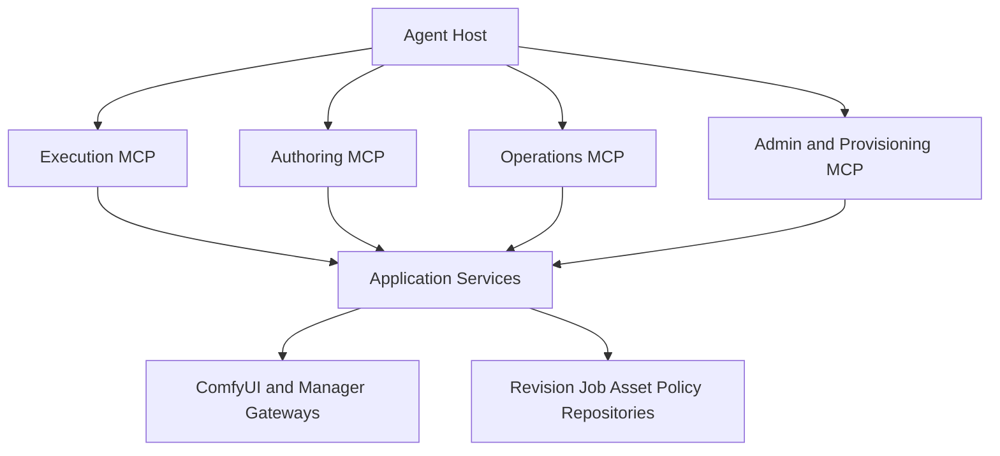
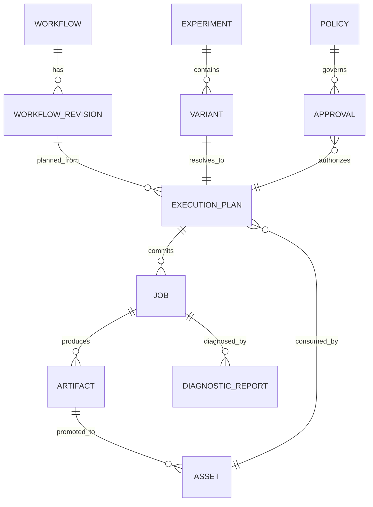

# ComfyUI MCP Skills：Agent 原生超级控制平面设计与开发路线

> 状态：待开发
> 基线：`comfyui-skill-cli` 0.2.13、ComfyUI MCP Skills 1.1.0 本地工作区
> 目标读者：项目维护者、后续开发 Agent、安全审查者
> 更新日期：2026-07-30

## 目录

1. 产品定位
2. 目标定义与设计原则
3. 当前能力基线
4. CLI 到 MCP 能力矩阵与超级增强能力地图
5. 目标 MCP 工具面
6. 目标 Resources
7. 权限模型
8. 应用层与基础设施改造
9. 一致性、安全和审计约束
10. 分阶段开发路线
11. 端到端完成标准
12. 开发顺序建议
13. 发布与版本定义
14. 技术可行性审查
15. 同类工具与可借鉴模式
16. Agent 操作压力与上下文控制
17. 审查后的产品裁剪结论

## 1. 产品定位

ComfyUI MCP Skills 的目标不是把 `comfyui-skill` CLI 命令改写成 MCP Tool，也不只是补齐一个执行型 MVP。

正确定位是：

> **以 MCP 为 Agent 原生控制平面，在保留 CLI 全部有效能力的基础上，提供工作流理解、图级编辑、版本管理、执行规划、批量实验、跨服务器调度、资产血缘、自动诊断、依赖修复和安全自治。**

CLI 功能只定义最低兼容线。MCP 版本必须形成严格超集：

```text
MCP 完整能力
  = CLI 现有有效能力
  + MCP 原生结构化交互
  + Agent 所需的组合操作
  + 可恢复的长任务和事件流
  + 安全策略、审批和审计
  + CLI 难以表达的图、资产与执行智能
```

当前实现已经完成可靠的工作流执行链，包括动态工作流 Tool、媒体上传、持久化 Job、幂等、进度、恢复查询和输出 Resource。但它仍是超级控制平面的执行内核，不是最终产品。

后续开发不能再以“一条 CLI 命令对应一个 MCP Tool”为主线，也不能把 CLI 没有的能力视为非必要范围。应从 Agent 完成目标所需的信息、决策和闭环出发设计能力。

---

## 2. 目标定义与设计原则

### 2.1 不是协议翻译层

CLI 面向人类终端，受限于单次进程、字符串参数、当前目录、stdout/stderr 和退出码。MCP 面向持续连接的 Agent，可以原生提供结构化 schema、Resource、订阅、进度、身份、能力发现和多轮恢复。

因此，MCP 不应复制 CLI 的交互限制。它应让 Agent 直接操作领域对象：

- Workflow、Workflow Revision 和 Graph Patch。
- Node、Model、Dependency Plan 和 Capability。
- Asset、Artifact、Lineage 和 Collection。
- Execution Plan、Job、Batch、Queue 和 Event。
- Server、Policy、Approval、Audit 和 Diagnostic Report。

### 2.2 目标体验

完成后，Agent 应能从自然语言目标出发完成以下闭环，而不需要拼接 Shell 命令或手工修改工作流 JSON：


### 2.3 Agent-first 设计原则

1. **目标优先，不以命令优先。** Tool 对应稳定意图，不对应终端语法。
2. **读操作可组合，写操作可计划。** 所有复杂变更先返回 plan、diff 和风险，再提交。
3. **领域对象可寻址。** Workflow、Revision、Asset、Job 和 Plan 都有稳定 ID 与 Resource URI。
4. **长任务可恢复。** 连接断开后可以按 ID 恢复，不把网络请求生命周期等同于 GPU 作业生命周期。
5. **让 Agent 看见足够上下文。** 节点定义、模型能力、图连接、参数约束和失败节点必须结构化返回。
6. **减少工具歧义，而不是减少能力。** 相同意图合并；不同风险和事务语义保持独立。
7. **输出可以直接成为下一次输入。** 优先传递 Resource URI 和资产引用，不下载后再上传。
8. **确定性留给代码，选择留给 Agent。** 校验、转换、diff、拓扑和摘要由服务计算；风格与策略选择由 Agent 决策。
9. **默认最小权限，授权后能力完整。** 安全隔离不能演变成功能删除。
10. **每次自治都有边界。** 配额、预算、审批、并发和影响范围必须显式。

### 2.4 完整管理边界

“完整管理”覆盖 ComfyUI HTTP API、已配置的 ComfyUI Manager API、本项目工作流与服务器配置，以及 Agent 原生的图、资产、执行、策略和审计对象。

### 2.5 默认不提供的能力

以下能力不能通过通用 MCP Tool 默认开放：

- 任意 Shell 命令执行。
- 任意文件系统读写。
- GPU 驱动、CUDA、Python 或操作系统软件安装。
- 导出服务器密码、API Key 或 Bearer Token。
- 无确认地终止其他主体的运行中作业。
- 无审计地安装任意 Git 仓库代码。
- 无适配器地启动、停止或重启宿主机上的 ComfyUI 进程。

如果需要管理 ComfyUI 进程，应增加可选 `RuntimeController` 端口，并按部署方式实现 Docker、systemd、Windows Service 等适配器。默认实现只报告 `restart_required`，不执行宿主机命令。

---

## 3. 当前能力基线

### 3.1 默认执行 MCP

固定工具：

| Tool | 当前能力 |
|---|---|
| `comfyui.asset.upload` | 从授权目录上传图像、蒙版、音频或视频 |
| `comfyui.job.get` | 按 `server_id + prompt_id` 查询当前主体作业 |
| `comfyui.job.cancel` | 取消当前主体拥有的排队作业 |
| `comfyui.server.list` | 列出已启用服务器，不泄露凭据和私有 URL |
| `comfyui.server.health` | 查询健康状态和运行设备信息 |
| `comfyui.node.list` | 分页搜索节点 |
| `comfyui.node.describe` | 获取节点完整定义 |
| `comfyui.model.list` | 列出模型目录或分页搜索模型 |

动态工具：

```text
comfyui.run.<server>.<workflow>
```

动态工作流工具支持结构化参数、幂等键、最长 300 秒单次等待、进度通知和持久化 Job。

### 3.2 当前 Resources

```text
comfyui://workflows/{server_id}/{workflow_id}
comfyui://assets/{server_id}/{asset_id}
comfyui://jobs/{server_id}/{prompt_id}
comfyui://outputs/{server_id}/{prompt_id}/{index}
```

### 3.3 当前 Admin MCP

| Tool | 当前能力 |
|---|---|
| `comfyui.admin.workflow.set_enabled` | 启用或停用工作流 |
| `comfyui.admin.workflow.delete` | 精确确认后永久删除工作流 |
| `comfyui.admin.audit.get` | 查询管理操作审计状态 |
| `comfyui.admin.audit.retry` | 只重试待完成的审计写入 |

### 3.4 当前权限限制

Streamable HTTP 当前只接受静态 Bearer Token，且只允许：

```text
comfyui:execute
```

因此现有 HTTP 服务没有表达观察、运维、配置和供应链权限的能力。

---

## 4. CLI 到 MCP 能力矩阵

### 4.1 已等价迁移

| CLI | MCP | 结论 |
|---|---|---|
| `list` | `tools/list`、`resources/list` | 已替代 |
| `info` | 动态 Tool `inputSchema`、workflow Resource | 已替代 |
| `run` | 动态 `comfyui.run.*`，`wait=true` | 已替代 |
| `submit` | 动态 `comfyui.run.*`，`wait=false` | 已替代 |
| `status` | `comfyui.job.get` | 已替代 |
| `upload` | `comfyui.asset.upload` | 已替代 |
| `cancel` | `comfyui.job.cancel` | 部分替代，仅支持安全的排队取消 |
| `server list` | `comfyui.server.list` | 已替代 |
| `server status/stats` | `comfyui.server.health` | 已替代 |
| `nodes list/search` | `comfyui.node.list` | 已合并 |
| `nodes info` | `comfyui.node.describe` | 已替代 |
| `models list` | `comfyui.model.list` | 已替代 |
| `workflow enable/disable` | Admin `workflow.set_enabled` | 已替代 |
| `workflow delete` | Admin `workflow.delete` | 已替代且更安全 |

### 4.2 尚未迁移

| CLI 能力 | 当前状态 | 缺失影响 | 优先级 |
|---|---|---|---|
| `history list` | 无 Job 列表工具 | Agent 必须预先知道 `prompt_id` | P0 |
| `history show` | 已知 Job 可查 | 缺少跨本地记录与服务器历史的统一读取 | P1 |
| `queue list` | 无 | 无法判断拥塞和排队顺序 | P0 |
| `queue delete` | 仅能取消自有单任务 | 无批量、管理员和跨主体管理 | P1 |
| `queue clear` | 无 | 无法执行受控队列清理 | P1 |
| `logs show` | 无 | 无法诊断节点加载和运行异常 | P0 |
| `free` | 无 | 无法卸载模型或释放显存 | P0 |
| `templates list` | 无 | 无法发现可复用模板 | P1 |
| `templates subgraphs` | 无 | 无法发现服务器子图 | P1 |
| `workflow import` | 无 | 无法通过 MCP 接入新工作流 | P0 |
| Editor → API 转换 | 无 | Agent 必须在 MCP 外预处理工作流 | P0 |
| 自动生成参数 schema | 无 | 新工作流无法自动成为动态 Tool | P0 |
| 废弃节点检查 | 无 | 导入后可能直接运行失败 | P1 |
| `deps check` | 无 | 无法在运行前判断工作流是否就绪 | P0 |
| `deps install` | 无 | 无法安装缺失节点和模型 | P2 |
| `server add` | 无 | 无法注册新 ComfyUI 实例 | P1 |
| `server enable/disable` | 无 | 无法维护服务器可用集合 | P1 |
| `server remove` | 无 | 无法移除失效配置 | P1 |
| 默认服务器设置 | 无 | 无法完整维护配置 | P2 |
| `config export` | 无 | 无法生成可迁移配置包 | P2 |
| `config import` | 无 | 无法批量恢复环境 | P2 |
| Manager 安装队列状态 | 无 | 依赖安装不可恢复查询 | P2 |

### 4.3 CLI 只作为最低兼容基线

CLI 能力必须迁移，但优先级不能只按旧命令数量排序。每项工作都要判断它属于哪一层：

| 层级 | 定义 | 示例 |
|---|---|---|
| L0 协议替代 | 消除 Shell、字符串 JSON 和退出码 | 结构化 run、Job、Resource |
| L1 功能超集 | 覆盖 CLI 全部有效能力 | workflow import、queue、logs、free |
| L2 Agent 增强 | 让 Agent 直接操作领域对象 | graph patch、revision、lineage、plan |
| L3 自治控制 | 在策略内完成规划、执行、诊断和恢复 | routing、batch、remediation、approval |

只有达到 L2，MCP 才不是 CLI 重写；达到 L3，才是 Agent 原生超级控制平面。

### 4.4 超越 CLI 的能力地图

#### 4.4.1 工作流语义理解

Agent 不应只能读取整份原始 workflow JSON。服务需要提供经过确定性解析的语义视图：

- 节点、连接、输入、输出和拓扑顺序。
- Loader、Sampler、Conditioning、Control、Upscale、Save 等节点角色。
- 当前模型、LoRA、VAE、ControlNet 和后处理链。
- 可暴露参数、固定参数、默认值和约束来源。
- 未连接输入、悬空输出、不可达节点和循环引用。
- 工作流需要的节点类、模型、显存特征和可选能力。
- 输出节点、媒体类型、尺寸变化和资产流向。

语义解析必须由确定性代码完成。不要在 MCP 服务内部调用隐藏 LLM 猜测工作流结构。

#### 4.4.2 图级创建和编辑

CLI 通常要求用户整体替换 JSON。MCP 应提供 revision-aware 的图操作：

- 从空图、模板或现有 Revision 创建工作流。
- 添加、删除、替换和配置节点。
- 连接或断开节点端口。
- 暴露、隐藏、重命名和约束工作流参数。
- 插入 LoRA、ControlNet、Upscaler、Preview 或 Save 分支。
- 克隆工作流并保留来源关系。
- 生成 diff，预览影响后再提交。
- 使用 `expected_revision` 防止并发覆盖。
- 回滚到已提交 Revision。

图修改不能让 Agent 直接发送任意 JSON Patch。应定义受 schema 约束的领域操作，并在服务端解析节点端口和类型兼容性。

#### 4.4.3 工作流组合和复用

应支持将已有能力组合成新流程：

- 把一个工作流输出绑定为另一个工作流输入。
- 从模板或 subgraph 实例化节点组。
- 提取当前图的一部分为可复用 subgraph。
- 保存参数 preset，并允许继承和覆盖。
- 声明工作流输入输出契约，使工作流可安全串联。
- 检测图间媒体类型、尺寸、mask 和 latent 兼容性。

组合结果应持久化为 Workflow Revision 或 Execution Plan，而不是只存在于一次 Agent 对话中。

#### 4.4.4 执行前规划

执行不应只有“提交或失败”。Agent 需要可检查的 preflight plan：

- 解析最终参数和默认值。
- 显示将使用的 workflow revision、模型和服务器。
- 验证节点、模型、输入资产和输出目录。
- 计算图的静态尺寸变化、批次数和预期产物数量。
- 检查策略限制：像素、steps、batch、并发、输出数量和超时。
- 给出候选服务器及选择依据。
- 返回确定性的 `plan_digest`，执行时绑定该摘要。

不能承诺无法可靠计算的 GPU 时间或显存精确值。可以返回基于历史数据的估计，但必须标记数据来源、样本量和置信区间。

#### 4.4.5 批量、参数扫描和实验

Agent 常需要比较 seed、prompt、sampler、steps 或模型组合。逐次调用单工作流 Tool 成本高且难恢复。

应增加持久化 Experiment：

- 参数矩阵、zip、随机采样和显式 variants。
- 全局最大运行数和预算上限。
- 并发度、服务器亲和性和失败策略。
- 单个 Variant 的稳定 ID、参数摘要和 Job 关联。
- 部分失败后只恢复未完成项。
- 按元数据、耗时、错误和 Agent 评分汇总结果。
- 将选中 Variant 固化为 preset 或新 Revision。

实验编排不能把所有变体展开后一次性塞入 ToolResult。大结果使用 Resource 和 cursor 分页。

#### 4.4.6 多服务器能力路由

当配置多台 ComfyUI 时，Agent 不应手工猜测运行位置。路由器可根据以下事实生成候选：

- 服务器在线状态、设备和可用显存。
- 当前队列长度和并发策略。
- 必需节点、模型和 Manager capability。
- 输入资产所在服务器和传输成本。
- 工作流 server affinity、用户策略和数据边界。
- 历史成功率与耗时统计。

默认仍允许调用方锁定 `server_id`。自动路由必须返回选择理由，不能静默换服务器或复制敏感资产。

#### 4.4.7 资产库、血缘和零复制复用

现有上传只解决一次输入。超级控制平面需要完整 Asset/Artifact 模型：

- 分页列出、筛选和读取资产元数据。
- 使用标签、集合、媒体类型、尺寸和来源组织资产。
- 记录输入资产 → Workflow Revision → Job → 输出 Artifact 的血缘。
- 从 PNG metadata 恢复 prompt、workflow 和生成参数。
- 将输出 Resource URI 直接绑定到后续 image、mask、audio 或 video 输入。
- 检测跨服务器复用，生成显式传输计划。
- 提供保留、归档和删除策略。
- 删除前返回引用计数和影响范围。

Resource URI 是稳定引用，不应暴露为宿主机绝对路径。

#### 4.4.8 结构化诊断和恢复建议

日志文本只是证据，不是最终接口。服务应把多来源信息整理为 Diagnostic Report：

- Job 状态、ComfyUI history、执行事件和失败节点。
- 相关日志窗口，而不是整个日志文件。
- 缺失节点、缺失模型、类型不匹配、OOM、输入不存在等稳定错误分类。
- 可重试性、影响范围和建议的下一操作。
- 生成 remediation plan，但不未经确认执行高风险修复。
- 修复后从原 Job 参数创建新的 retry Job，并保留 `retry_of` 血缘。

诊断分类必须是确定性的。自然语言解释可以由 Agent 基于结构化报告生成。

#### 4.4.9 版本、变更和可回滚性

工作流、schema、服务器配置、policy 和 preset 都必须版本化：

- 每次提交产生不可变 Revision 和内容摘要。
- 保存父 Revision、作者主体、request ID、时间和变更摘要。
- 支持结构化 diff，而不是只返回文本 diff。
- 支持 fork、tag、publish、archive 和 rollback。
- 动态 Tool 绑定已发布 Revision；草稿不污染生产工具列表。
- Job 永久记录实际执行的 Revision，不跟随 later update 漂移。

#### 4.4.10 策略、预算和审批

Agent 自治必须由 Policy 控制：

- 每主体允许的服务器、工作流和模型。
- 最大 width、height、batch、steps、运行数和并发数。
- 每小时或每日 GPU 作业额度。
- 可否安装依赖、跨服务器传输、清队列或中断。
- 哪些操作需要人工批准。
- 审批有效期、一次性使用和 plan digest 绑定。

策略拒绝必须返回具体违反项和允许范围，便于 Agent 自动调整方案。

#### 4.4.11 Agent 上下文效率

完整能力不等于把所有数据塞进上下文。接口应支持渐进式发现：

- 列表返回摘要和稳定 ID。
- describe 返回单个对象完整信息。
- 大图提供 summary、nodes、edges、parameters 等分层 Resource。
- 错误返回建议的下一 Tool 和所需参数，但不自动执行。
- Tool 描述说明使用时机、返回结构和恢复方式。
- 使用 cursor、field selection 或 detail level 控制响应体。
- 动态工作流 Tool 只暴露已发布且当前主体可见的工作流。

#### 4.4.12 MCP 原生交互

除 Tools 外，应充分使用 MCP 原语：

- Resources：图、Revision、Plan、Asset、Artifact、Job、Experiment、Diagnostic、Policy。
- Resource subscriptions：Job、Experiment、Provisioning 和工作流 Revision 变化。
- Progress：长任务阶段和节点事件。
- Prompts：提供“构建工作流”“诊断失败”“比较实验结果”等可复用操作流程。
- Elicitation：在宿主支持时，请求用户批准危险计划或补充缺失参数。
- Tasks：官方 SDK 稳定支持后映射长任务；在此之前继续使用持久化领域 Job。
- Resource Links：输出和大型报告不内联到 ToolResult。

MCP 原语是交互增强，不应替代领域持久化。即使客户端断线，Job、Experiment 和审批状态仍必须存在。

### 4.5 明确反模式

禁止以下实现方式：

- 在 MCP handler 中调用 `comfyui-skill` 子进程。
- 提供通用 Shell、Python eval 或任意 HTTP 请求工具。
- 用一个带任意 `action` 字符串的超级 Tool 包含所有操作。
- 要求 Agent 每次上传完整 workflow JSON 才能修改一个节点。
- 服务端隐藏调用 LLM 并把猜测包装成确定性结果。
- 自动安装未知 Git 仓库、自动全局 interrupt 或自动清队列。
- 把详细日志、完整模型列表或大图 JSON 默认塞入上下文。
- 用当前连接状态保存唯一 Job 或事务状态。
- 将安全边界实现为删除功能，而不是 scopes、policy 和审批。

---

## 5. 目标 MCP 工具面

不要机械创建 35 个 CLI 同名工具。应按 Agent 意图合并重复命令，同时保留清晰的安全边界。

### 5.1 执行面：默认开放

保留现有工具，并新增：

#### `comfyui.job.list`

用途：分页列出当前主体的持久化作业。

建议输入：

```json
{
  "server_id": "local",
  "workflow_id": "txt2img",
  "status": ["queued", "running", "completed"],
  "created_after": "2026-07-30T00:00:00Z",
  "limit": 50,
  "cursor": "opaque-cursor"
}
```

要求：

- 默认只能列出当前 `principal_id` 的作业。
- `limit` 范围为 1–200。
- 返回不透明 `next_cursor`。
- 不返回其他主体的参数、路径或输出。

### 5.2 观察面：只读运维

建议独立 scope：

```text
comfyui:observe
```

新增工具：

| Tool | 用途 |
|---|---|
| `comfyui.workflow.list` | 按标签、媒体类型、节点、模型和发布状态搜索工作流 |
| `comfyui.queue.list` | 查看运行中和等待中的 ComfyUI 队列 |
| `comfyui.log.read` | 读取经过脱敏、限制行数的服务日志 |
| `comfyui.template.list` | 分页列出工作流模板 |
| `comfyui.template.subgraph.list` | 分页列出全局子图 |
| `comfyui.workflow.dependencies.check` | 检查工作流所需节点和模型 |
| `comfyui.model.describe` | 读取模型元数据、引用工作流、哈希和可用服务器 |
| `comfyui.node.compatibility` | 检查节点端口、版本和替换关系 |
| `comfyui.server.capabilities` | 探测可选 API、Manager 和版本能力 |

日志要求：

- 默认最多 100 行，硬上限 1000 行。
- 支持 `cursor`，不接受任意文件路径。
- 对 Authorization、API Key、Token、Cookie 和配置凭据脱敏。
- 远程模式默认不返回完整本地路径。

### 5.3 运维面：影响运行状态

建议独立 scope：

```text
comfyui:operate
```

新增工具：

| Tool | 用途 | 风险控制 |
|---|---|---|
| `comfyui.server.free` | 卸载模型、释放显存 | 参数必须至少选择一项 |
| `comfyui.queue.remove` | 删除指定排队任务 | 验证所有权或管理员权限 |
| `comfyui.queue.clear` | 清空等待队列 | `dry_run` + 精确确认 + 审计 |
| `comfyui.server.interrupt` | 调用全局 `/interrupt` | 明确标记为全局操作，禁止伪装成单 Job 取消 |

ComfyUI 的 `/interrupt` 是全局操作。除非上游提供可靠的按 Job 中断语义，否则不能把它实现成 `job.cancel` 的隐式降级。

### 5.4 工作流管理面

建议 scope：

```text
comfyui:author
```

新增工具：

#### `comfyui.admin.workflow.import`

统一处理本地授权文件、服务器 userdata 和内联 JSON：

```json
{
  "server_id": "local",
  "source": {
    "kind": "server_userdata",
    "path": "workflows/example.json"
  },
  "workflow_id": "example",
  "media_type": "image",
  "dry_run": true,
  "overwrite": false,
  "request_id": "caller-generated-id"
}
```

`source.kind` 建议限定为：

- `authorized_local_file`
- `server_userdata`
- `inline_json`

导入流程必须：

1. 校验来源权限和大小。
2. 识别 API 或 Editor 格式。
3. 使用服务器 `object_info` 转换 Editor 格式。
4. 生成参数 schema。
5. 检查路径和标识符。
6. 检查废弃节点。
7. 生成依赖报告。
8. `dry_run=true` 时不落盘。
9. 提交时原子写入 `workflow.json` 和 `schema.json`。
10. 发布 Tool 与 Resource 变更通知。

补充工具：

| Tool | 用途 |
|---|---|
| `comfyui.admin.workflow.set_enabled` | 已实现，继续保留 |
| `comfyui.admin.workflow.delete` | 已实现，继续保留 |
| `comfyui.admin.workflow.validate` | 验证 workflow、schema、节点和模型，不执行 |

不建议提供一个带任意 `action` 字符串的万能 `workflow.manage`。导入、图变更和删除的风险及输入契约不同，应保持独立。

### 5.5 服务器与配置管理面

继续使用 `comfyui:configure`，新增：

| Tool | 用途 |
|---|---|
| `comfyui.admin.server.upsert` | 新增或更新服务器配置 |
| `comfyui.admin.server.set_enabled` | 启用或停用服务器 |
| `comfyui.admin.server.set_default` | 设置默认服务器 |
| `comfyui.admin.server.delete` | 删除服务器配置 |
| `comfyui.admin.config.export` | 导出不含密钥的可迁移 Bundle |
| `comfyui.admin.config.import` | 预览或导入 Bundle |

服务器配置要求：

- `server_id` 使用统一标识符校验。
- URL 只允许 `http` 或 `https`。
- 保存前执行 SSRF 与回环地址策略校验。
- 凭据优先引用环境变量或 Secret Provider，不直接返回明文。
- 所有写入使用临时文件、`fsync` 和原子替换。
- 更新要求可选 `expected_revision`，防止并发覆盖。
- 删除服务器前列出关联工作流和未终态 Job。

配置导出要求：

- 默认永远不导出凭据。
- 只导出 Secret 引用名称，不导出 Secret 值。
- Bundle 必须包含版本号和内容摘要。
- 导入必须先生成 merge plan，再显式提交。

### 5.6 依赖供应链管理面

建议最高风险 scope：

```text
comfyui:provision
```

新增工具：

| Tool | 用途 |
|---|---|
| `comfyui.admin.dependency.plan` | 生成缺失节点和模型安装计划 |
| `comfyui.admin.dependency.install` | 提交已确认的安装计划 |
| `comfyui.admin.provisioning.get` | 查询持久化安装任务 |
| `comfyui.admin.provisioning.cancel` | 在 Manager 支持时取消未执行安装项 |

安装不能直接接受未经约束的 Git URL 后立即执行。推荐两阶段协议：

1. `comfyui.admin.dependency.plan` 返回规范化计划和 `plan_digest`。
2. 调用方审查来源、版本、大小和许可证信息。
3. `comfyui.admin.dependency.install` 提交 `plan_digest`、`request_id` 和精确确认短语。
4. 服务端再次解析计划并核对摘要。
5. 安装结果写入持久化 Provisioning Job。

供应链最低要求：

- Git 仓库允许列表或可信 registry。
- 禁止 URL 中携带凭据。
- 固定 commit/tag，禁止只记录浮动默认分支。
- 模型记录下载 URL、目标目录、大小和校验和。
- 下载限制协议、重定向次数、域名、IP 和文件大小。
- 安装过程不得阻塞 MCP 请求生命周期。
- 明确返回 `restart_required`，不自动执行任意宿主机重启命令。
- 每个安装步骤写审计记录。


### 5.7 图与 Revision 工具

图编辑采用“计划 → 提交”双阶段，不直接覆盖 workflow 文件。

| Tool | 用途 |
|---|---|
| `comfyui.workflow.describe` | 返回语义摘要、拓扑、参数、依赖和输出契约 |
| `comfyui.admin.workflow.change.plan` | 解析领域图操作，返回 diff、验证结果和 plan digest |
| `comfyui.admin.workflow.change.commit` | 提交未过期且 revision 未冲突的 change plan |
| `comfyui.workflow.revision.list` | 分页列出 Revision |
| `comfyui.workflow.revision.diff` | 返回两个 Revision 的结构化差异 |
| `comfyui.admin.workflow.revision.publish` | 将草稿 Revision 发布为动态 Tool 当前版本 |
| `comfyui.admin.workflow.revision.rollback` | 基于历史 Revision 创建新的回滚提交 |
| `comfyui.workflow.preset.list` | 分页列出参数 preset 及继承关系 |
| `comfyui.admin.workflow.preset.upsert` | 创建或更新版本化 preset |

`change.plan` 输入示例：

```json
{
  "server_id": "local",
  "workflow_id": "portrait",
  "base_revision": "rev_018",
  "operations": [
    {
      "op": "set_input",
      "node_id": "19",
      "input": "steps",
      "value": 30
    },
    {
      "op": "insert_role",
      "role": "upscaler",
      "after_node_id": "52",
      "configuration": {
        "model": "4x-UltraSharp.pth",
        "scale": 2
      }
    },
    {
      "op": "expose_parameter",
      "node_id": "19",
      "input": "cfg",
      "parameter_name": "guidance_scale"
    }
  ]
}
```

建议领域操作集合：

```text
add_node
remove_node
replace_node
set_input
unset_input
connect
disconnect
expose_parameter
hide_parameter
set_parameter_constraint
insert_subgraph
extract_subgraph
set_output_contract
set_metadata
```

每个操作都必须经过节点存在性、端口存在性、类型兼容、拓扑和 schema 校验。`insert_role` 之类的高层操作只能使用已注册、可解释的 recipe，不能由服务猜测任意节点链。

### 5.8 执行规划与自动路由工具

简单执行继续使用动态 `comfyui.run.*`。需要自动路由、审批、预算或批量时，使用计划型接口：

| Tool | 用途 |
|---|---|
| `comfyui.execution.plan` | 解析 Revision、参数、资产、策略和候选服务器 |
| `comfyui.execution.commit` | 按 `plan_digest` 提交已经验证的执行计划 |
| `comfyui.route.explain` | 解释候选服务器排序及排除原因 |

`execution.plan` 返回至少包含：

```json
{
  "plan_id": "plan_01",
  "plan_digest": "sha256:...",
  "workflow_revision": "rev_018",
  "resolved_parameters": {},
  "resolved_assets": [],
  "candidate_servers": [],
  "selected_server": "gpu-a",
  "selection_reasons": [],
  "policy_checks": [],
  "dependency_status": "ready",
  "expected_outputs": [],
  "estimates": {
    "source": "historical",
    "sample_count": 12,
    "duration_seconds_p50": 42,
    "duration_seconds_p90": 61
  },
  "expires_at": "2026-07-30T22:00:00Z",
  "approval_required": false
}
```

`execution.commit` 只能接受 `plan_id`、`plan_digest`、幂等键和必要审批引用，不能允许调用方在提交阶段悄悄修改参数。

### 5.9 Experiment 与批量执行工具

| Tool | 用途 |
|---|---|
| `comfyui.experiment.plan` | 规范化参数矩阵并计算 Variant 数量和预算 |
| `comfyui.experiment.commit` | 提交已验证实验计划 |
| `comfyui.experiment.get` | 查询实验汇总状态 |
| `comfyui.experiment.cancel` | 停止提交新 Variant，并按策略处理已排队项 |
| `comfyui.experiment.variant.list` | 分页读取 Variant 与关联 Job |
| `comfyui.experiment.select` | 将选中 Variant 固化为 preset 或 Revision |

失败策略必须是枚举：

```text
continue
stop_new
cancel_queued
```

禁止使用模糊的 `best_effort=true`。调用方必须知道部分失败时系统会做什么。

### 5.10 资产和 Artifact 工具

| Tool | 用途 |
|---|---|
| `comfyui.asset.list` | 分页筛选当前主体可见资产 |
| `comfyui.asset.describe` | 读取媒体元数据、来源、引用和保留状态 |
| `comfyui.asset.import_output` | 将输出 Artifact 注册为可复用输入，不重复传输 |
| `comfyui.asset.metadata.extract` | 解析 PNG 等媒体中的工作流和生成信息 |
| `comfyui.asset.collection.update` | 管理标签和集合成员关系 |
| `comfyui.asset.delete.plan` | 返回引用、血缘和删除影响 |
| `comfyui.asset.delete.commit` | 提交通过摘要绑定的删除计划 |

跨服务器资产复制使用独立 transfer plan：

```text
comfyui.asset.transfer.plan
comfyui.asset.transfer.commit
comfyui.asset.transfer.get
```

传输计划必须说明源、目标、字节数、媒体摘要、网络策略和是否产生临时副本。

### 5.11 诊断和恢复工具

| Tool | 用途 |
|---|---|
| `comfyui.job.diagnose` | 生成结构化 Diagnostic Report |
| `comfyui.job.retry.plan` | 基于原 Job 创建可审查的重试或修复计划 |
| `comfyui.job.retry.commit` | 按摘要提交重试，记录 `retry_of` |
| `comfyui.server.diagnose` | 汇总健康、队列、节点加载、Manager 和日志异常 |

稳定诊断代码至少覆盖：

```text
SERVER_OFFLINE
NODE_MISSING
MODEL_MISSING
INPUT_MISSING
INPUT_TYPE_MISMATCH
WORKFLOW_INVALID
OUT_OF_MEMORY
EXECUTION_INTERRUPTED
OUTPUT_UNAVAILABLE
MANAGER_UNAVAILABLE
POLICY_DENIED
```

报告应提供 `evidence`、`retryable`、`safe_actions`、`approval_actions` 和 `related_resources`。不要只返回一段“可能是显存不足”的文本。

### 5.12 Policy 与 Approval 工具

| Tool | 用途 |
|---|---|
| `comfyui.policy.evaluate` | 在不执行的情况下评估计划或操作 |
| `comfyui.policy.describe` | 读取当前主体的有效限制，不泄露其他主体策略 |
| `comfyui.admin.policy.upsert` | 创建或更新版本化 Policy |
| `comfyui.approval.get` | 查询审批状态 |
| `comfyui.approval.cancel` | 撤销未使用审批 |

审批对象必须绑定：

- `principal_id`
- `operation`
- `plan_digest`
- `impact_summary`
- `expires_at`
- `single_use`

宿主支持 MCP Elicitation 时，可以请求用户批准；不支持时返回持久化 Approval Resource，交由外部审批流程处理。

### 5.13 Tool 数量与暴露策略

超级增强不等于让每个 Agent 同时看到几十个工具。后端能力按 profile、scope 和当前任务渐进暴露：

| Profile | 主要工具 | 初始活动面目标 |
|---|---|---|
| Execute | 动态 run、Job、Asset、Execution Plan | 8–16 个固定工具 + 最多 8 个动态工作流 |
| Observe/Ops | Queue、Log、Diagnostic、Runtime | 8–14 个 |
| Authoring | Workflow、Graph、Revision、Template | 8–16 个 |
| Admin/Provision | Server、Config、Dependency、Policy、Audit | 8–16 个 |

默认连接的固定 Tool 目标不超过 16 个，单 profile 不超过 20 个。它们是待 Eval 校准的设计预算，不是协议限制。

增加 Capability Catalog：

```text
comfyui.capability.search
comfyui.capability.describe
```

同一个 MCP Server 可以按 Token scope 过滤工具列表，并按任务启用 profile。也可以部署为多个进程，但不得让无权限客户端通过搜索、描述或错误旁路发现敏感对象。

小模型或不支持动态 `tools/list_changed` 的 Host 可以启用 compact fallback；完整 schema 仍由服务端校验，compact 调用不得绕过原生 Tool 的 scope、Policy 和审计。

### 5.14 通用计划与提交契约

所有复杂或危险操作复用统一外层契约，但领域输入保持独立 schema：

```json
{
  "plan_id": "plan_01",
  "plan_digest": "sha256:...",
  "status": "ready",
  "revision": 7,
  "impact": {},
  "warnings": [],
  "policy_checks": [],
  "approval_required": false,
  "expires_at": "2026-07-30T22:00:00Z"
}
```

提交结果统一包含：

```json
{
  "request_id": "caller-id",
  "committed": true,
  "resource_uri": "comfyui://...",
  "audit_status": "recorded",
  "result_revision": 8
}
```

统一外层只解决幂等、审批、版本和审计；不能用它掩盖不同领域操作的输入差异。

---

## 6. 目标 Resources

继续保留现有 Resource，并把每个长期领域对象变成可寻址、可订阅、可恢复的 URI：

```text
comfyui://servers/{server_id}/capabilities
comfyui://workflows/{server_id}/{workflow_id}
comfyui://workflows/{server_id}/{workflow_id}/graph
comfyui://workflows/{server_id}/{workflow_id}/revisions/{revision_id}
comfyui://workflows/{server_id}/{workflow_id}/revisions/{revision_id}/dependencies
comfyui://plans/{plan_id}
comfyui://jobs/{server_id}/{prompt_id}
comfyui://experiments/{experiment_id}
comfyui://experiments/{experiment_id}/variants/{variant_id}
comfyui://assets/{server_id}/{asset_id}
comfyui://artifacts/{server_id}/{prompt_id}/{index}
comfyui://lineage/{artifact_id}
comfyui://diagnostics/{diagnostic_id}
comfyui://provisioning/{server_id}/{request_id}
comfyui://approvals/{approval_id}
comfyui://policies/{policy_id}/revisions/{revision_id}
comfyui://config/export/{bundle_id}
```

Resource 设计规则：

- URI 稳定，不包含宿主机绝对路径或 Token。
- Revision、Plan 和 Job 内容不可因后续配置变更而漂移。
- 大对象分层：summary、graph、nodes、edges、parameters、events。
- 私有 Resource 始终按 `principal_id` 和 scope 校验。
- Job、Experiment、Provisioning 和 Revision 支持订阅更新。
- 输出媒体使用 Resource Link，不内联到普通 JSON 结果。

以下数据仍适合 Tool 查询，而不是静态 Resource 列表：

- Job、Experiment 和 Variant 的筛选分页。
- 队列、日志和模板搜索。
- Workflow、Asset 和 Revision 的条件检索。
- 路由候选和 Policy evaluate。

原因是这些读取需要筛选、分页、权限判断或短 TTL；Tool 返回稳定 ID，再通过 Resource 深入读取。

---

## 7. 权限模型

### 7.1 建议 scopes

| Scope | 能力 |
|---|---|
| `comfyui:execute` | 动态工作流、执行计划、自有 Job、Experiment 和基础资产上传 |
| `comfyui:observe` | 队列、日志、模板、诊断、依赖报告和服务器能力 |
| `comfyui:author` | 工作流草稿、图变更计划、Revision、preset 和 publish |
| `comfyui:operate` | 显存释放、资产管理、队列删除和全局中断 |
| `comfyui:configure` | 服务器、配置、Policy 和授权变更 |
| `comfyui:provision` | 自定义节点、模型安装和运行时适配器 |
| `comfyui:audit` | 跨请求审计读取、审批查询和审计重试 |

不要将全部能力塞入 `comfyui:execute`。同一主体可以组合 scopes，但 Tool 列表、Resource 和订阅必须执行相同授权规则。

### 7.2 部署面拆分

建议保留四个逻辑 profile。它们可以是独立进程，也可以在可信 stdio 部署中由同一进程按 scope 过滤：



| Profile | 默认状态 | 典型 scopes | 重点对象 |
|---|---|---|---|
| Execution MCP | 开启 | `execute` | Plan、Job、Experiment、Artifact |
| Authoring MCP | 显式开启 | `observe`、`author` | Workflow、Graph、Revision、Preset |
| Operations MCP | 显式开启 | `observe`、`operate` | Queue、Log、Diagnostic、Runtime |
| Admin/Provisioning MCP | 默认关闭 | `configure`、`provision`、`audit` | Server、Dependency、Policy、Approval |

Agent 要完整管理时可以同时注册四个 profile。远程部署必须分离高风险端口和 Token；工具发现本身也必须遵守 scope。

---

## 8. 应用层与基础设施改造

### 8.1 当前依赖关系

```text
MCP Adapter
  ├─ WorkflowCatalog
  ├─ ExecutionService
  ├─ JobService
  ├─ AssetService
  ├─ DiscoveryService
  └─ WorkflowAdmin
       ↓
Repositories / ComfyUIGateway
       ↓
ComfyUI HTTP / WebSocket / Local Files
```

### 8.2 目标依赖关系

```text
MCP Adapters
  ├─ Execution / Experiment
  ├─ Authoring / Graph
  ├─ Observe / Operations
  └─ Admin / Provisioning
       ↓
Application Services
  ├─ WorkflowImportService
  ├─ WorkflowGraphService
  ├─ WorkflowRevisionService
  ├─ WorkflowValidationService
  ├─ ExecutionPlanningService
  ├─ RoutingService
  ├─ ExperimentService
  ├─ JobService / DiagnosticService
  ├─ AssetService / LineageService
  ├─ DependencyService / ProvisioningService
  ├─ QueueService / RuntimeMaintenanceService
  ├─ TemplateService / LogService
  ├─ ServerAdministrationService
  ├─ ConfigurationTransferService
  ├─ PolicyService / ApprovalService
  └─ AuditService
       ↓
Domain Ports
  ├─ ComfyUIGateway / ComfyUIManagerGateway
  ├─ WorkflowRepository / RevisionRepository
  ├─ PlanRepository / RunRepository / ExperimentRepository
  ├─ AssetRepository / LineageRepository
  ├─ ProvisioningRepository
  ├─ PolicyRepository / ApprovalRepository / AuditRepository
  ├─ ServerConfigRepository / SecretProvider
  └─ RuntimeController（可选）
       ↓
Infrastructure Adapters
```

依赖方向始终是 Adapter → Application → Domain Port → Infrastructure。Graph、Plan、Policy 和 Revision 不得依赖 MCP 类型或 ComfyUI HTTP 响应格式。

### 8.3 必须新增的端口

```python
class QueueGateway(Protocol): ...
class TemplateGateway(Protocol): ...
class LogGateway(Protocol): ...
class ComfyUIManagerGateway(Protocol): ...
class WorkflowRevisionRepository(Protocol): ...
class PlanRepository(Protocol): ...
class ExperimentRepository(Protocol): ...
class LineageRepository(Protocol): ...
class ProvisioningRepository(Protocol): ...
class PolicyRepository(Protocol): ...
class ApprovalRepository(Protocol): ...
class ServerConfigRepository(Protocol): ...
class SecretProvider(Protocol): ...
class RuntimeController(Protocol): ...
```

不要让 Application Service 直接导入 `requests`、Typer、MCP 类型或本地文件实现。ComfyUI 原始 JSON 必须在 Gateway 边界转换为领域模型。

### 8.4 工作流导入代码迁移

旧 CLI `workflow.py` 中的以下逻辑应移入领域或应用层：

- API workflow 与 Editor workflow 格式识别。
- Editor → API 转换。
- 参数自动检测和 schema 生成。
- control-after-generate 字段处理。
- workflow ID 建议。
- 废弃节点替换检查。
- 媒体类型参数预设。

CLI 和 MCP 只负责解析输入与映射结果，不再各自实现一套转换逻辑。


### 8.5 核心领域对象关系



对象不变量：

- Workflow 是稳定身份，Revision 是不可变内容。
- Published Revision 只是 Workflow 的一个可变指针。
- Plan 是解析后的不可变快照，必须绑定输入对象摘要。
- Job 绑定实际 Plan 和 Revision，不能只保存当前 workflow ID。
- Experiment Variant 绑定自己的 Plan，不能共享可变参数字典。
- Artifact 是执行输出；Asset 是可复用输入。Artifact promote 后仍保留来源。
- Policy Revision 不可变；Approval 绑定确切 Policy 和 Plan digest。
- Diagnostic Report 只引用证据，不修改原 Job。
- Audit 记录事实，不作为业务状态的唯一存储。

### 8.6 统一事件模型

Job、Experiment、Provisioning、Transfer 和 Revision 使用统一事件外层：

```json
{
  "event_id": "evt_01",
  "event_type": "job.progress",
  "subject_uri": "comfyui://jobs/local/prompt-id",
  "sequence": 17,
  "occurred_at": "2026-07-30T21:00:00Z",
  "principal_id": "agent-prod",
  "correlation_id": "request-or-plan-id",
  "data": {}
}
```

要求：

- `sequence` 对同一 subject 单调递增。
- 重连订阅可以从最后已知 sequence 恢复。
- 事件可重复投递，消费者按 `event_id` 去重。
- ToolResult 只返回当前快照和 Resource URI，不重复内联完整事件历史。
- MCP progress 是事件的即时投影，不是持久化事实来源。

### 8.7 统计与估计边界

路由和执行估计需要历史数据，但必须避免伪精确：

- 统计维度至少包含 server、workflow revision、模型、尺寸、steps 和 batch。
- 样本不足时返回 `estimate_available=false`。
- 返回 p50/p90 等统计值，不返回伪造的精确完成时间。
- OOM、取消和服务器离线样本不能混入成功耗时分布。
- 原始 prompt 和敏感参数默认不进入跨主体聚合指标。
- Agent 评分与系统测量分开存储，不能混成同一 quality 字段。
---

## 9. 一致性、安全和审计约束

### 9.1 所有变更操作

必须满足：

- 调用方可提供稳定 `request_id`。
- 重试不会重复执行副作用。
- 返回 `committed` 与 `audit_status`。
- 审计失败不谎报操作失败，操作失败也不写成成功。
- 可恢复的 pending audit 可以独立重试。
- 错误返回稳定 `code`、`message`、`retryable` 和 `details`。

### 9.2 配置和工作流文件

必须满足：

- 写入前完整校验。
- 使用同目录临时文件。
- `flush + fsync` 后原子替换。
- 多文件提交使用 manifest 或事务日志。
- 崩溃恢复不会留下半个 workflow。
- 路径不能逃逸项目根目录。
- Windows 和 POSIX 路径均有回归测试。

### 9.3 全局 ComfyUI 操作

以下操作影响其他主体，必须明确标注：

- `/interrupt`
- `/queue` clear
- `/free`
- Manager 安装队列
- ComfyUI 重启

默认执行 MCP 不得暴露这些操作。管理工具必须返回影响范围，并要求精确确认。

---

## 10. 分阶段开发路线

每一阶段必须形成可独立使用的纵向切片，并且可以单独测试、提交和回滚。不要先建立大量空接口，再等待最后一阶段串联。

### 阶段 G：领域身份、Revision 与权限骨架（P0）

交付：

- 为 Workflow、Revision、Plan、Job、Experiment、Asset、Artifact 和 Policy 定义稳定 ID。
- 扩展 scopes：`observe`、`author`、`operate`、`configure`、`provision`、`audit`。
- 建立 Tool、Resource、subscription 统一授权矩阵。
- 实现通用 plan digest、request ID、revision 和 audit 外层契约。
- 建立不可变 Revision Repository 和原子提交协议。
- 建立 Capability Catalog / Tool Inventory，支持 profile、scope、搜索和按需 schema。
- 建立 Agent Eval Harness，记录工具选择、调用数、token 和端到端成功率。
- 建立 ComfyUI、Manager、MCP Host 与可选 API Compatibility Matrix。
- 保持现有 `comfyui:execute` 行为兼容。

验收：

- 相同内容产生稳定摘要，不同内容不能碰撞到同一提交。
- 缺少 scope 的请求在进入业务层前被拒绝。
- Tool 可见性与实际调用、Resource 读取和订阅权限一致。
- 并发修改返回 revision conflict，不发生静默覆盖。
- 默认活动 Tool 面符合设计预算，且可以按 profile 收窄。
- 至少使用一个中型模型和一个小型本地模型执行工具选择基线 Eval。
- Host 不支持动态工具、Elicitation 或 subscriptions 时有明确降级路径。
- 旧动态工作流 Tool 仍可完成真实生图。

### 阶段 H：可观测性与 CLI 能力下限（P0）

交付：

- `comfyui.job.list`
- `comfyui.queue.list`
- `comfyui.log.read`
- `comfyui.server.capabilities`
- `comfyui.template.list`
- `comfyui.template.subgraph.list`
- `comfyui.server.free`
- 统一的 cursor 分页与脱敏组件

验收：

- Agent 可以从零发现服务器、队列、历史、模板和可选 API。
- 日志只返回相关窗口，并对凭据和本地敏感路径脱敏。
- 显存释放需要 `operate`，并返回影响范围和审计状态。
- ComfyUI 不支持的可选端点表示为 capability，不伪装成服务器离线。

### 阶段 I：导入、语义图与依赖报告（P0）

交付：

- `WorkflowImportService`
- `WorkflowGraphService`
- `WorkflowValidationService`
- API workflow 与 Editor workflow 导入
- 语义 graph summary、nodes、edges、parameters 和 outputs Resources
- 确定性 schema 生成与参数角色识别
- `comfyui.workflow.describe`
- `comfyui.workflow.dependencies.check`

验收：

- Agent 无需读取原始 JSON 即可解释模型、采样、控制和输出链。
- Editor workflow 可在线转换为 API workflow。
- 导入 preview 返回语义摘要、依赖、废弃节点和结构问题。
- 非法节点、端口、schema 和路径在写文件前被拒绝。
- 导入提交产生不可变 Revision，但不会自动发布未经验证的 Tool。

### 阶段 J：图级编辑、diff 与发布（P0）

交付：

- `comfyui.admin.workflow.change.plan`
- `comfyui.admin.workflow.change.commit`
- Revision list、diff、publish 和 rollback
- 节点 CRUD、连接、参数暴露和 subgraph 领域操作
- Draft 与 Published Revision 分离
- Tool/Resource list changed 和 Revision subscription

验收：

- Agent 能在不上传整份 JSON 的情况下修改单个节点输入。
- 非法连接在 plan 阶段被拒绝，并指出两端端口类型。
- plan 显示结构化 diff、依赖变化和输出契约变化。
- 过期 plan 或 base revision 变化时 commit 返回冲突。
- publish 后动态 Tool schema 更新；现有 Job 仍指向原 Revision。
- rollback 创建新 Revision，不删除历史。

### 阶段 K：执行计划、Policy 与多服务器路由（P1）

交付：

- `ExecutionPlanningService`
- `RoutingService`
- `PolicyService` 与只读 Policy evaluate
- `comfyui.execution.plan`
- `comfyui.execution.commit`
- `comfyui.route.explain`
- 参数、资产、Revision、服务器和预算的完整解析
- 基于历史数据的可选耗时估计

验收：

- 同一 plan digest 确定绑定 Revision、参数、资产、Policy 和服务器。
- 自动路由明确列出候选、排除原因和最终选择理由。
- 调用方锁定服务器时不会被静默改写。
- 策略拒绝返回具体违反项和允许范围。
- 估计值包含数据来源、样本数和统计口径；无数据时不伪造数字。
- commit 阶段不能修改计划内容。

### 阶段 L：资产库、Artifact 与血缘（P1）

交付：

- Asset list、describe、collection 和 metadata extract
- Artifact 与 Asset 分离
- 输入 → Revision → Plan → Job → Artifact 血缘
- 输出 Resource URI 零复制复用
- 删除 plan/commit
- 跨服务器 transfer plan/commit/get
- 保留、归档和清理策略

验收：

- 生成输出可直接作为下一工作流输入，不经过客户端落盘和重传。
- PNG metadata 可恢复已知生成参数和 Revision 引用。
- 删除被引用资产前返回完整影响，不产生悬空引用。
- 跨服务器复制显式显示字节数、摘要、目标和临时副本策略。
- 不向远程客户端泄露宿主机路径。

### 阶段 M：Experiment、批量与参数扫描（P1）

交付：

- `ExperimentService`
- Experiment plan、commit、get、cancel 和 Variant list
- matrix、zip、sample 和 explicit variants
- 运行数、并发、像素、输出和时间预算
- 部分失败恢复与聚合结果 Resource
- 选中 Variant 固化为 preset 或 Revision

验收：

- 计划阶段准确计算 Variant 数，超过预算时不提交。
- 断线后可以恢复 Experiment 和每个 Variant 的状态。
- 重试只提交未完成 Variant，不重复 GPU 计算。
- `stop_new`、`continue`、`cancel_queued` 行为可预测。
- 上千 Variant 不会内联到一个 ToolResult。

### 阶段 N：结构化诊断与安全恢复（P1）

交付：

- `DiagnosticService`
- `comfyui.job.diagnose`
- `comfyui.server.diagnose`
- Job retry plan/commit
- 稳定错误分类、证据、可重试性和修复动作
- `retry_of`、`repair_plan` 和结果血缘

验收：

- 缺失节点、模型、输入、类型错误、OOM 和中断可以稳定分类。
- Diagnostic Report 关联失败节点、事件和最小日志窗口。
- 安全动作与需要审批的动作分开返回。
- 重试保持原始参数快照，所有变化出现在 diff 中。
- 服务不使用隐藏 LLM 生成确定性诊断结论。

### 阶段 O：服务器、配置与依赖供应链（P1/P2）

先完成只读检查和 dry-run，再开放写入和安装。

交付：

- Server upsert、启停、默认设置和删除
- 安全 Config Bundle 导入导出
- Dependency plan/install 与 Provisioning Job
- ComfyUI Manager Gateway
- Policy、Approval 和 Audit 管理
- 精确来源、版本、校验和、重启要求和安装状态

验收：

- Agent 可以从空项目接入第一台服务器并导入工作流。
- Config Bundle 不包含 Secret 值，并支持 revision conflict。
- 不可解析的缺失节点只报告，不猜测仓库。
- 安装 plan 与 commit 通过摘要和审批绑定。
- 重试不会重复安装；超时后可恢复查询。
- SSRF、恶意重定向、浮动 Git 来源、超大模型和未知校验和都有拒绝策略。

### 阶段 P：高级运行时控制与宿主适配器（P2）

交付：

- `comfyui.queue.remove`
- `comfyui.queue.clear`
- 显式全局 `comfyui.server.interrupt`
- 可选 Docker、systemd 和 Windows Service `RuntimeController`
- restart plan、影响分析和 approval

验收：

- 单 Job 取消和全局中断不会混淆。
- 跨主体操作必须具有管理权限。
- 所有全局操作先返回受影响 Job。
- 没有 RuntimeController 时只返回操作需求，不执行 Shell。
- 重启不会丢失持久化 Job、Provisioning 或 Audit 状态。

### 阶段 Q：MCP 原生交互与生产加固（P2）

交付：

- Workflow、Job、Experiment、Provisioning、Approval 的 Resource subscriptions
- 构建工作流、诊断失败、比较实验的 MCP Prompts
- 宿主支持时的 Elicitation 审批
- SDK 稳定后评估 MCP Tasks 映射，不替换领域 Job
- OAuth 2.1、JWT/JWKS 或 Token Introspection 中至少一种生产认证
- 多 worker 全局限流、追踪、审计导出和保留策略

验收：

- 客户端断线重连后可以继续订阅长期对象。
- MCP Prompt 只编排公开 Tool，不绕过 scopes 和 approval。
- Token 轮换保持 `principal_id` 和对象所有权。
- 多 worker 下配额、限流、幂等和审计一致。
- 高风险 profile 不能通过执行面 Token 调用。

---

## 11. 端到端完成标准

只有同时满足 CLI 能力超集和以下 Agent 原生场景，才能宣称“Agent 可以完整管理并自主编排 ComfyUI”。

### 场景 1：从空项目接入服务器

1. Agent 添加服务器并绑定 Secret 引用。
2. 获取 health、capabilities、节点、模型和 Manager 状态。
3. 设置默认服务器。
4. 全过程不读取明文凭据。

### 场景 2：从用户目标选择或构建工作流

1. 用户只描述目标和输入媒体。
2. Agent 搜索工作流、模板、subgraph、节点和模型能力。
3. Agent 选择现有工作流或创建 Draft。
4. 服务返回语义图，而不是要求 Agent 阅读整份原始 JSON。
5. Agent 暴露用户需要的参数并定义输出契约。

### 场景 3：图级修改与安全发布

1. Agent 在现有 Revision 上添加 LoRA 或 Upscaler 分支。
2. `change.plan` 返回结构化 diff、依赖变化和风险。
3. 非法端口连接在提交前被拒绝。
4. `change.commit` 产生 Draft Revision。
5. 验证通过后 publish，动态 Tool schema 自动更新。
6. 运行中的旧 Job 不受新 Revision 影响。

### 场景 4：执行计划与跨服务器路由

1. Agent 提交工作流目标、参数、资产和策略。
2. 服务解析候选服务器的节点、模型、队列和数据位置。
3. 返回候选排序、排除原因和预算检查。
4. Agent 或审批者确认 plan digest。
5. commit 严格执行同一计划，不静默修改服务器或参数。

### 场景 5：批量实验与结果选择

1. Agent 创建 seed、steps、prompt 或模型参数矩阵。
2. plan 精确返回 Variant 数和预算影响。
3. Experiment 在断线后继续执行。
4. Agent 分页读取结果并查看 Artifact Resource。
5. Agent 或外部视觉评估选择 Variant。
6. 选中结果固化为 preset 或新 Workflow Revision。

### 场景 6：输出直连下一工作流

1. txt2img 生成 Artifact。
2. Artifact Resource URI 直接绑定到 img2img 或 upscale 输入。
3. 同服务器不下载重传。
4. 跨服务器时先生成 transfer plan。
5. Lineage 能追溯输入、Revision、参数、Job 和所有衍生产物。

### 场景 7：结构化故障诊断与恢复

1. Job 因缺失模型、OOM 或输入错误失败。
2. Diagnostic Report 关联失败节点、事件和最小日志窗口。
3. 返回稳定错误分类和安全修复选项。
4. Agent 创建 retry plan，并显示与原 Job 的参数 diff。
5. 修复后的 Job 记录 `retry_of`，不覆盖失败历史。

### 场景 8：依赖供应链闭环

1. Agent 检查并列出缺失节点和模型。
2. 服务从可信 registry 生成固定版本安装计划。
3. 审批者检查来源、大小、校验和和许可证信息。
4. 提交后可恢复查询 Provisioning Job。
5. 系统报告 `restart_required` 并按部署能力生成重启计划。
6. 重启后重新验证依赖和 Workflow Revision。

### 场景 9：资产和配置生命周期

1. Agent 列出、标记、归档和筛选资产。
2. 删除前看到引用和血缘影响。
3. 导出无 Secret 的版本化 Bundle。
4. 在新环境 dry-run 导入并解决 revision conflict。
5. 重新绑定 Secret 后复现同一 Revision 的执行。

### 场景 10：Policy、预算与审批

1. 普通执行主体发起超出 batch 或像素上限的计划。
2. Policy evaluate 返回具体违反项和允许范围。
3. Agent 自动缩减无风险参数，或生成审批请求。
4. Approval 绑定主体、操作、plan digest 和有效期。
5. 已使用、过期或摘要不一致的审批不能复用。

### 场景 11：连接中断与多 worker 恢复

1. 在 Job、Experiment、Provisioning 和 transfer 中途断开 MCP。
2. 后端任务不重复提交，也不因断线自动取消。
3. 连接恢复后可按 Resource URI 查询并重新订阅。
4. 多 worker 下幂等、配额、所有权和审计一致。

### 场景 12：Agent 上下文效率

1. Agent 先获取摘要列表，不加载所有工作流和节点定义。
2. 只对候选对象调用 describe 或读取细分 Resource。
3. 大图、大日志、Experiment 结果都使用分页或 Resource Link。
4. 错误返回明确下一步和所需参数。
5. 完成常见任务时不存在多个语义重叠、无法选择的 Tool。

### 场景 13：危险操作防护

1. 执行 Token 无法改图、清队列、改配置或安装依赖。
2. 管理操作缺少 plan、确认或审批时被拒绝。
3. 相同 `request_id` 重试不重复执行。
4. 审计 pending 可以独立恢复。
5. 路径逃逸、SSRF、任意 Git 来源和凭据导出请求被拒绝。

---

## 12. 开发顺序建议

回家后继续开发时，不要先把旧 CLI 命令逐个搬完。建议按能尽快证明“超级增强”的纵向切片推进：

1. **先建立 Revision、scope 和 plan/commit 基础。**
   这是后续图编辑、审批、路由和回滚共用的不变量。
2. **同时补齐 `job.list`、`queue.list`、`log.read` 和 capabilities。**
   Agent 必须先能观察环境，才有资格自治。
3. **提取导入、转换、schema 和依赖检查，建立语义图。**
   第一项明显超越 CLI 的交付应是 `workflow.describe`。
4. **实现一个最小图修改闭环。**
   先支持 `set_input`、`connect`、`disconnect`、`expose_parameter`，完成 plan → diff → commit → publish。
5. **实现 Execution Plan，并保留动态 run 快速路径。**
   先单服务器，再加入多服务器路由和 Policy。
6. **补资产血缘和 Job diagnose。**
   形成“执行 → 产物复用 → 失败恢复”的连续体验。
7. **再实现 Experiment、供应链安装和高级运行时控制。**
   这些能力建立在前述 Revision、Plan、Policy、Job 和 Asset 模型之上。

第一个“超级增强里程碑”建议交付：

```text
comfyui.job.list
comfyui.queue.list
comfyui.log.read
comfyui.server.capabilities
comfyui.admin.workflow.import
comfyui.workflow.describe
comfyui.workflow.revision.list
comfyui.admin.workflow.change.plan
comfyui.admin.workflow.change.commit
comfyui.admin.workflow.revision.publish
comfyui.execution.plan
comfyui.execution.commit
```

对应 Resources：

```text
comfyui://workflows/{server}/{workflow}/graph
comfyui://workflows/{server}/{workflow}/revisions/{revision}
comfyui://plans/{plan_id}
```

这个里程碑完成后，Agent 不仅能执行和管理已有工作流，还能理解、修改、验证、版本化并按计划执行工作流，首次形成相对 CLI 的实质性增强。

---

## 13. 发布与版本定义

在 L2 Agent 增强完成前，README 和版本说明应明确使用：

> Agent-native ComfyUI workflow execution and controlled administration over MCP

只有语义图、Revision、图级 plan/commit 和执行计划完成真实验证后，才可以使用：

> Agent-native ComfyUI control plane

达到本文 13 个端到端场景后，才可以宣称：

> Complete autonomous ComfyUI management and orchestration over MCP

发布门槛必须绑定能力层级和端到端场景，不按文件数或 Tool 数量判断。每项能力标记为：

```text
not_started | in_progress | implemented | verified | deferred
```

`implemented` 只表示代码存在。只有在真实 ComfyUI、真实 MCP Client 和对应权限配置下完成场景验证，才能标记为 `verified`。

---

## 14. 技术可行性审查

### 14.1 总体判断

本文目标在工程上可行，但不能按一个版本一次性交付。核心领域模型、图编辑、Revision、Experiment、Policy 和持久化 Job 都可以在现有 Python 架构上实现。真正的限制来自 ComfyUI 上游语义、第三方节点不一致、客户端 MCP 能力差异和 Agent 上下文，而不是 MCP 协议本身。

建议把能力分成三类：

- **绿色：可直接实现。** 上游 API 和本地持久化足够稳定。
- **黄色：可实现，但必须降级承诺。** 依赖启发式、可选插件、客户端支持或外部适配器。
- **红色：不能承诺为通用能力。** 上游没有可靠语义，或安全风险大于收益。

### 14.2 绿色能力

| 能力 | 可行性依据 | 实现约束 |
|---|---|---|
| Job、History、Queue、Log、Free | ComfyUI 已提供对应 HTTP API | 所有权、脱敏、分页和全局影响控制 |
| Workflow 导入和 API 格式校验 | 旧 CLI 已有实现 | 逻辑下沉到 Application Service |
| Revision、diff、publish、rollback | 项目自身可持久化 | 不可变 Revision、原子写入、并发控制 |
| `set_input`、connect、disconnect | workflow graph 是结构化 JSON | 必须查询节点端口和类型 |
| Experiment 与参数矩阵 | 可编排现有执行服务 | Variant 上限、预算、幂等和恢复 |
| Asset、Artifact 和同服务器复用 | 已有上传、输出 Resource 和所有者模型 | 引用计数、保留和血缘持久化 |
| Policy、plan/commit、Approval | 属于本项目应用层 | 摘要绑定、过期和一次性使用 |
| 结构化 Diagnostic 基础分类 | Job、history、事件和日志已有数据 | 只输出有证据支持的分类 |
| 工具 Profile、scope 过滤 | MCP `tools/list` 可按主体动态返回 | 调用和 Resource 权限必须再次校验 |
| MCP Prompts 与 Resource subscriptions | 协议和 SDK 已有基础能力 | 客户端支持不一致，必须提供轮询降级 |

### 14.3 黄色能力

| 能力 | 主要难点 | 正确降级方式 |
|---|---|---|
| Editor → API 通用转换 | 自定义节点、前端 widget 和版本差异 | 返回 unsupported nodes，不静默丢字段 |
| 节点角色语义识别 | `class_type` 没有统一业务角色标准 | 返回 `source` 与 `confidence`，允许 registry 覆盖 |
| 高层 `insert_role` recipe | 不同模型家族拓扑不同 | 只开放版本化、测试过的 recipe |
| 自动 schema 生成 | 默认值和控件语义可能不完整 | 生成 Draft schema，发布前验证或人工确认 |
| 多服务器自动路由 | 模型、节点、资产和负载状态会变化 | Plan 短 TTL；commit 前重新校验但不静默改选 |
| 历史耗时和显存估计 | 样本稀疏，工作流差异大 | 只返回统计分布、样本数和置信信息 |
| 跨服务器 Asset transfer | 需要下载、上传、存储和网络策略 | 显式 transfer plan；不称为零复制 |
| 依赖自动解析 | 缺失节点不一定能唯一映射仓库 | 不能解析就报告，不猜 repo |
| 自定义节点和模型安装 | 供应链、重启和 Manager 版本差异 | 可信 registry、固定版本、审批、Provisioning Job |
| ComfyUI 进程启停重启 | 部署方式跨平台且不属于标准 API | 可选 RuntimeController，无适配器时只报告需求 |
| Elicitation 审批 | MCP Host 支持程度不同 | 持久化 Approval Resource 作为通用后备 |
| MCP Tasks | SDK 和客户端实现成熟度变化 | 继续以领域 Job 为真相，Tasks 仅作投影 |

### 14.4 红色或必须延后的承诺

以下能力不应写成产品保证：

- 精确预测任意工作流的 VRAM 峰值和完成时间。
- 对任意未知自定义节点进行正确的业务角色理解。
- 自动修复任意 ComfyUI 执行错误。
- 在没有上游支持时实现真正的按 Job 中断；`/interrupt` 仍是全局操作。
- 自动安装任意 Git URL 并认为安全。
- 自动跨服务器复制敏感输入而不向 Agent 或用户说明。
- 由服务端隐藏 LLM 自动判断美学质量并作为确定性事实。
- 在没有部署适配器时通用启动、停止或重启所有 ComfyUI 环境。
- 一次自然语言请求生成任意复杂工作流且无需验证。

这些场景可以由外部 Agent 提出建议，但确定性服务必须清楚表达“不知道”“不支持”或“需要审批”。

### 14.5 对现有架构的影响

当前 `ExecutionService`、`JobService`、`AssetService`、Repository 和 Gateway 分层可以继续使用，不需要推倒重写。主要新增工作是：

1. 建立 Workflow Revision，而不是让 workflow 文件承担全部状态。
2. 将旧 CLI 的导入、转换和 schema 逻辑提取为纯业务服务。
3. 新增 Plan、Experiment、Lineage、Policy 和 Approval Repository。
4. 将 ComfyUI 可选端点隔离到 capability-aware Gateway。
5. 在 MCP Adapter 前增加按主体动态 Tool Inventory。

最大工程风险不是代码量，而是同时推进过多领域对象。第一阶段只应建立 Revision、语义图、最小 graph change 和 Tool Inventory；Experiment、跨服务器和 Provisioning 后置。

---

## 15. 同类工具与可借鉴模式

### 15.1 ComfyUI 官方 Agent Tools 和 Local MCP

ComfyUI 官方已经提供 Cloud MCP，并在私测 Local MCP。Local MCP 当前是 `comfy-cli` 的薄包装，核心路径是：

```text
server_info → run_workflow → fetch_outputs
```

同时提供 job status/wait/watch、模板搜索、节点和模型查询、workflow validation、launch/stop。

可借鉴：

- 把“验证后执行”作为标准体验。
- 直接检查用户真实安装中的节点和模型。
- 简单任务保持很短的调用链。
- 本地执行、Cloud MCP 和 CLI 继续并存，而不是强制只有一种入口。

不应照搬：

- 官方 Local MCP 明确通过 Shell 调用 `comfy-cli`；本项目已有独立业务层，不应退回子进程桥接。
- 要求 Agent 每次先手工调用 `server_info` 会增加固定步骤。服务可以内部做轻量 preflight，仅在失败时返回健康证据。

参考：<https://docs.comfy.org/agent-tools>、<https://docs.comfy.org/agent-tools/local>

### 15.2 artokun/comfyui-mcp

这是目前最接近“ComfyUI Agent 控制平面”定位的社区项目。它覆盖工作流构建和运行、实时图编辑、模型和自定义节点管理、Skills、Panel Agent、批处理和诊断。

其 README 同时暴露了关键风险：完整模式约有 181 个 MCP Tools。项目为小模型增加 compact mode，只注册 3 个 meta-tools：

```text
list_tools → describe_tool → call_tool
```

可借鉴：

- live graph 编辑和 ComfyUI 内嵌 Panel 的即时反馈。
- Skills 保存模型家族、sampler、CFG、分辨率和安装知识。
- compact/full 双模式。
- 对批量、诊断、模型管理和自定义节点管理的完整产品闭环。
- 用真实任务轨迹评估不同模型能否操作工具。

需要避免：

- 默认向所有 Agent 注入约 181 个 schema。
- 把 `call_tool(name, args)` 作为唯一接口会丢失原生 schema 选择优势，并使权限和参数错误更晚暴露。
- Skills、Hooks、Panel、Agents 和 MCP Tools 同时存在时，必须明确哪个层负责状态和副作用。

建议：借鉴 compact catalog，但保留原生 Tool 作为主路径。compact 模式只作为小模型或不支持动态工具刷新的 Host 后备。

参考：<https://github.com/artokun/comfyui-mcp>

### 15.3 ComfyPilot

ComfyPilot 展示了另一条“功能广度优先”的路线：88 个工具，覆盖六阶段 workflow validation、Snapshot/diff/restore、Technique Memory、VRAM Guard、蓝图、PNG metadata、参数 sweep、依赖修复和生命周期管理。

最值得借鉴：

- 先 snapshot，再修改；修改后 validate。
- schema、catalog、graph、anti-cycle、environment、execution-risk 多层验证。
- Technique/Blueprint 让 Agent 优先复用，而不是每次从零构图。
- Sweep 有组合数上限。
- destructive tool 使用 Elicitation。
- `summary_only`、分页 Resource 和 typed result 控制输出。

需要避免：

- 88 个工具如果全部常驻，选择和 schema token 压力仍然很大。
- 大量工具返回 JSON 字符串，弱于完整 `structuredContent/outputSchema`。
- 内存 Snapshot 不能作为生产 Revision 的唯一实现。
- `emergency_stop` 将 interrupt、clear queue、free VRAM 合并，影响范围过大，只适合明确的紧急管理路径。

参考：<https://github.com/dreamrec/ComfyPilot>、<https://github.com/dreamrec/ComfyPilot/blob/main/docs/MANUAL.md>

### 15.4 n8n MCP

n8n 是最值得参考的非图像类工作流系统。官方工具参考已经包含 workflow search/details、Draft/Published Version、执行、测试、publish/unpublish 和权限信息。社区 n8n-MCP 进一步提供 2000 级节点目录、模板检索、多层 validation 和 autofix。

最值得借鉴：

- **Template first。** 先搜索模板，再决定是否从零创建。
- **渐进细节。** Node 支持 minimal、standard、full 和 property search，而不是每次返回几千 token。
- **分层验证。** 先校验 Node，再校验连接和完整 Workflow。
- **Draft 与 Published 分离。** 测试当前版本，生产执行已发布版本。
- **测试数据。** n8n 的 pin data 能让部分工作流在不触发外部副作用时验证。
- 搜索结果只返回 preview，详细图按 ID 读取。

ComfyUI 不具备通用 pin data 执行语义，但可以借鉴为“静态 preflight + 小尺寸/低 steps 可选测试策略”，并明确它仍会消耗 GPU、不是纯模拟。

参考：<https://github.com/n8n-io/n8n-docs/blob/main/docs/connect/connect-to-n8n-mcp-server/mcp-server-tools-reference.md>、<https://github.com/czlonkowski/n8n-mcp>

### 15.5 Blender MCP

Blender 和 ComfyUI 都是复杂图形应用，且都有节点图和长任务。ageless-h/blender-mcp 使用约 29 个工具，分为：

```text
Perception
Declarative Write
Imperative Write
Fallback
```

其中 `blender_edit_nodes` 在一个工具中支持 add/remove/connect/disconnect/set_value，所有写操作进入 Blender undo stack，长任务使用 progress。

可借鉴：

- 读层与写层分离。
- 图编辑采用一个批量、声明式、强 schema 工具，而不是每个动作一个 Tool。
- 写操作有统一 undo/revision。
- 长任务使用 progress。
- include 选项控制感知深度。

不应照搬：

- 任意 Python script 和 operator fallback 不适合默认 ComfyUI MCP。
- ComfyUI 的 workflow 文件和远程服务器没有 Blender 原生 undo stack，必须自行实现 Revision。

参考：<https://github.com/ageless-h/blender-mcp>

### 15.6 GitHub MCP 与 Kubernetes MCP

GitHub 官方 MCP 将相关工具分成 toolsets，并能按 PAT/OAuth scopes 隐藏无权限工具。Kubernetes MCP 同样支持 `--toolsets`，其文档明确说明：只启用需要的 toolset 可以减少上下文并提高工具选择准确率。

可借鉴：

- profile/toolset 是产品配置，不只是代码目录。
- Tool 可见性跟随权限。
- 默认只启用高频 toolset。
- 高风险和专业能力按需开启。
- 多服务器场景把 `server_id` 作为一致参数，而不是复制一套工具名。

参考：<https://github.com/github/github-mcp-server/blob/main/docs/toolsets-and-icons.md>、<https://github.com/github/github-mcp-server/blob/main/docs/scope-filtering.md>、<https://github.com/containers/kubernetes-mcp-server>

### 15.7 Playwright MCP

Playwright MCP 使用结构化 accessibility snapshot，而不是默认依赖截图，让模型操作稳定的语义对象。这与 ComfyUI 应返回语义图而不是整份 JSON 的方向一致。

更重要的是，Playwright 官方明确指出：对高吞吐 coding agent，CLI + Skills 有时比 MCP 更省 token；MCP 更适合持久状态、丰富 introspection 和长时间自主循环。

可借鉴结论：

- 保留 CLI，不把 MCP 视为所有 Agent 场景的唯一入口。
- MCP 用于持久状态、语义图、订阅、Resource 和复杂迭代。
- CLI 用于 CI、脚本、一次性批处理和上下文紧张的 coding agent。
- 两者共享业务核心，而不是互相调用。

参考：<https://github.com/microsoft/playwright-mcp>

### 15.8 Anthropic Code Execution 与 MCP-Zero

Anthropic 指出，工具定义和中间结果会形成显著上下文成本。其示例通过按需读取工具定义，将工具相关 token 从约 150,000 降到约 2,000。MCP-Zero 的研究也报告在其评测中，主动工具发现可减少约 98% token，同时保持工具选择能力。

本项目不应因此提供任意代码执行，但应借鉴核心模式：

- 按需发现 Tool，而不是全部预注入。
- 先检索能力摘要，再加载完整 schema。
- 让大规模过滤、diff、拓扑、矩阵展开在服务端确定性完成。
- 中间大对象通过 Resource URI 流转，不反复经过模型上下文。
- 允许 Agent 在任务中途再次发现能力，而不是只在第一轮固定工具集。

参考：<https://www.anthropic.com/engineering/code-execution-with-mcp>、<https://arxiv.org/html/2506.01056v3>

---

## 16. Agent 操作压力与上下文控制

### 16.1 直接回答

**如果把本文所有工具和动态工作流一次性暴露给 Agent，压力一定过大。**

当前蓝图正文已经出现 74 个唯一 `comfyui.*` 契约名称，尚未计算每个工作流生成的动态 Tool。这进一步说明：74 项是后端能力目录，不应等同于单次 `tools/list` 返回值。

问题不是 Agent 是否“足够聪明”，而是：

- Schema 会永久占用上下文。
- 相似 Tool 增加选择歧义。
- 每个 plan/commit 都增加调用轮次。
- 完整 graph、日志、模型和实验结果会挤压推理上下文。
- 长任务状态如果只靠对话记忆，迟早丢失。
- 不同 MCP Host 对动态工具、订阅、Elicitation 和 Tasks 支持不一致。

**如果采用渐进式 Tool Inventory、profile、summary/detail Resource、领域级组合操作和持久化状态，压力可控。** 后端能力可以很大，但任一时刻的 Agent 可见面必须很小。

### 16.2 核心原则：能力宽，活动面窄

```text
完整后端能力：数十项领域能力
             ↓ scope + profile + task routing
活动 Tool 面：8–16 个高相关工具
             ↓ search / describe
本次任务面：3–8 个实际使用工具
```

这里的数量是初始设计目标，不是协议硬限制；最终应由 Agent Eval 校准。

### 16.3 三级工具发现

#### 一级：始终可见的核心工具

建议默认只提供：

```text
comfyui.capability.search
comfyui.server.list
comfyui.server.health
comfyui.workflow.list
comfyui.asset.upload
comfyui.job.get
comfyui.job.list
comfyui.job.cancel
```

以及最多若干最近使用或显式发布的动态工作流 Tool。

#### 二级：按 profile 暴露

```text
execute
author
observe
operate
admin
provision
```

Agent 或部署配置启用 profile 后，服务发送 `tools/list_changed`。不支持动态刷新的 Host 在连接时固定 profile。

#### 三级：按需读取完整 schema

`comfyui.capability.search` 只返回：

```json
{
  "name": "comfyui.admin.workflow.change.plan",
  "profile": "author",
  "summary": "Plan typed graph edits against a workflow revision",
  "risk": "write_plan",
  "required_scope": "comfyui:author"
}
```

完整参数通过 `comfyui.capability.describe` 或客户端原生动态 Tool 发现加载。

对于不支持动态工具刷新的小模型 Host，可以提供 compact fallback：

```text
capability.search
capability.describe
capability.invoke
```

但 `capability.invoke` 不是默认路径，服务端仍必须执行原 Tool 的 schema、scope、Policy 和审计。它不能成为绕过类型系统的后门。

### 16.4 动态工作流 Tool 的数量控制

当前“每个已启用工作流都是一个 Tool”在几十或几百工作流时会失控。建议：

- 小目录保留动态 Tool，获得最佳 schema 体验。
- 超过可配置阈值后，只暴露 favorite、recent、pinned 或当前 project 的工作流。
- 其他工作流通过 `workflow.list` 搜索后按需 pin 到当前 session/profile。
- Tool 名绑定 Published Revision，但 schema 变化触发 `list_changed`。
- compact Host 使用通用、强 schema 的 `workflow.execute`，参数由 `workflow.describe` 返回；只作为兼容模式。

### 16.5 响应细节分级

所有大型查询统一支持：

```text
summary
standard
full
```

建议语义：

| 级别 | 返回内容 | 使用场景 |
|---|---|---|
| `summary` | ID、名称、状态、关键计数和风险 | 搜索、筛选、确认 |
| `standard` | 完成下一决策所需字段 | 默认 |
| `full` | 完整图、schema、事件或诊断证据 | 深入分析 |

可进一步支持 `include` 白名单，例如：

```json
{
  "detail": "standard",
  "include": ["parameters", "outputs", "dependencies"]
}
```

这直接借鉴 n8n 的分级节点信息和 Blender MCP 的 include 感知层。

### 16.6 简单路径不能被安全流程拖慢

plan/commit 不能覆盖所有操作：

| 场景 | 推荐调用链 |
|---|---|
| 已知工作流直接生图 | 动态 run → output Resource |
| 未知工作流生图 | workflow.list → describe → run → output |
| 修改普通参数 | change.plan → commit；可选 publish |
| 修改图结构 | describe → change.plan → commit → validate → publish |
| 危险操作 | plan → approval → commit |
| 参数实验 | experiment.plan → commit → Experiment Resource |
| 失败恢复 | job.diagnose → retry.plan → retry.commit |

低风险、可逆、参数已完整校验的执行保留快速路径。只有复杂变更、跨服务器、批量、删除、安装和全局操作强制 plan/commit。

### 16.7 服务端承担确定性步骤

不要让 Agent 手工完成以下工作：

- 展开参数矩阵。
- 计算 graph diff。
- 拓扑排序和端口类型校验。
- 在完整模型列表中逐项过滤。
- 轮询 Job、Provisioning 或 Experiment。
- 拼接输出文件路径。
- 从日志中手工定位 Job 相关时间窗口。
- 在多个 Tool 结果间复制完整 workflow 或媒体字节。

这些步骤由服务端完成，Agent 只做目标、候选和风险决策。

### 16.8 持久化代替对话记忆

Agent 不应在对话中记住：

- 当前 Revision。
- 哪些 Variant 已完成。
- 哪个依赖安装到一半。
- Approval 是否使用。
- Asset 从哪个 Job 产生。

这些状态必须通过 Resource URI 和 Repository 恢复。ToolResult 返回 `next_actions` 时使用稳定 URI 和 ID，不依赖“如上所述”的上下文位置。

### 16.9 Agent 压力评测

在扩展 Tool 前建立 Eval，不以“模型看起来会用”作为验收。

测试维度：

| 维度 | 取值 |
|---|---|
| 模型层级 | 小型本地、中型工具模型、前沿模型 |
| Tool 模式 | full、profile、dynamic、compact |
| 任务类型 | 生成、发现、图编辑、批量、诊断、管理 |
| 工作流规模 | 10、50、200+ |
| 故障类型 | 参数、依赖、OOM、断线、权限、并发冲突 |

指标：

- 任务成功率。
- 首次 Tool 选择正确率。
- 参数一次通过率。
- 平均 Tool 调用数。
- 无效重试和 Tool 往返次数。
- Tool schema token 和 ToolResult token。
- 从请求到首个有效副作用的延迟。
- 断线恢复成功率。
- 危险操作误触发率。

初始预算建议，必须用实测校准：

- 默认活动固定 Tool 不超过 16 个。
- 单个 profile 不超过 20 个固定 Tool。
- 默认动态工作流 Tool 不超过 8 个。
- 列表默认最多 50 项，并提供 cursor。
- 普通生成中位调用数不超过 4。
- 图级修改中位调用数不超过 7。
- 无审批的危险操作误触发率必须为 0。

如果增加功能后成功率下降，优先收窄活动 Tool 面、合并重叠工具和改进摘要，不应仅依赖更大模型。

---

## 17. 审查后的产品裁剪结论

### 17.1 保留的核心方向

以下方向可行且有同类实现验证，应继续保留：

- 语义图，而不是原始 JSON 优先。
- Workflow Revision、diff、publish 和 rollback。
- 声明式批量 graph edit。
- 多层 workflow validation。
- Job、Experiment 和 Provisioning 持久化。
- Asset/Artifact 分离和输出直连。
- 结构化诊断。
- Policy、plan/commit 和 Approval。
- Profile、scope 和渐进工具发现。

### 17.2 需要降级或后置的方向

- 自动多服务器路由：先实现候选解释，再开放自动选择。
- 依赖自动安装：先做检查和 plan，再做可信来源安装。
- 跨服务器资产：先做显式 transfer，不承诺透明零复制。
- RuntimeController：作为可选插件，不作为核心 MCP 前置条件。
- 精确 VRAM/耗时预测：改为有来源的历史统计。
- 任意自然语言构图：先做模板、recipe 和声明式 graph operations。
- MCP Tasks 和 Elicitation：保留领域后备，不依赖 Host 必须支持。

### 17.3 必须新增到主路线的基础设施

原路线还缺三个前置项：

1. **Capability Catalog / Tool Inventory**：负责 profile、scope、搜索和按需 schema。
2. **Agent Eval Harness**：持续测量工具选择、上下文和任务成功率。
3. **Compatibility Matrix**：记录 ComfyUI、Manager、MCP Host 和可选 API 支持情况。

这三项应加入阶段 G，而不是等功能爆炸后补救。

### 17.4 最终决策

本文的产品愿景可行，但实现策略必须从“注册所有能力”改成：

> **领域能力做宽，默认工具面做窄；复杂状态持久化，细节按需加载；简单执行保留快速路径，危险操作才使用计划和审批。**

在这个约束下，完整功能不会必然增加 Agent 压力。相反，语义图、组合操作、Resource URI 和服务端确定性处理会显著减少 Agent 手工解析 JSON、复制大对象、轮询和拼接命令的负担。

如果不实现 Tool Inventory、profile、细节分级和 Eval，本文规划的完整工具面会超过多数 Agent 的稳定选择能力，不应直接发布。
