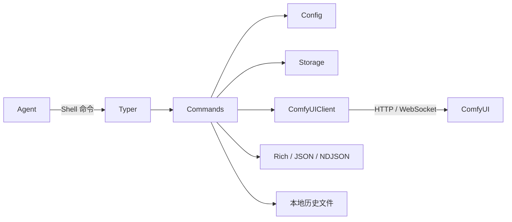
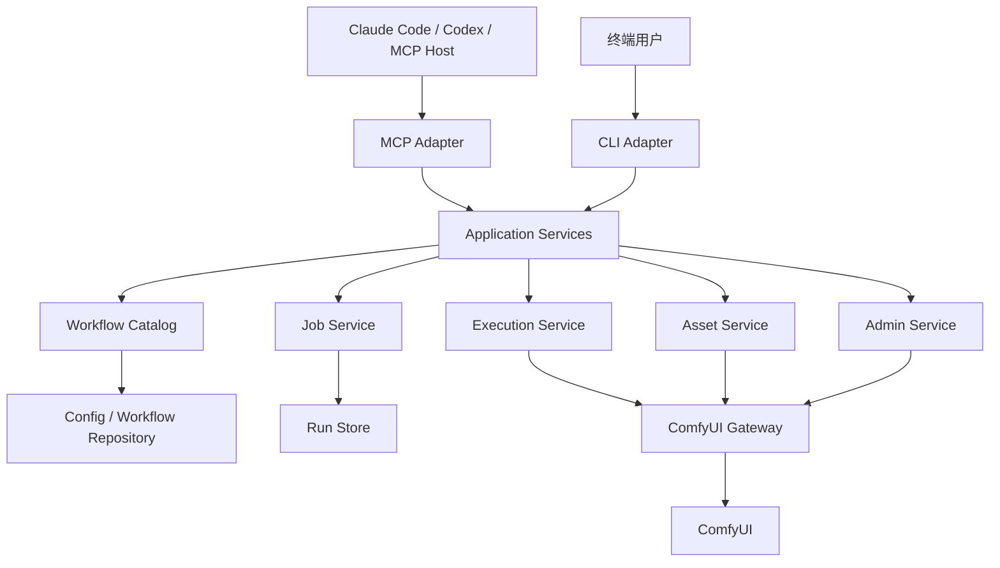

# ComfyUI Skill CLI → MCP 2026-07-28 迁移方案与架构审查

> 状态：已实施（v1.1.0 Beta）
> 目标读者：项目维护者、MCP 服务实现者、安全审查者  
> 迁移输入基线：`comfyui-skill-cli` 0.2.13
> 协议目标：MCP `2026-07-28`，MCP Python SDK v2

## 1. 摘要

将当前面向 Agent 的 ComfyUI CLI 改造成 MCP 服务是合理的。MCP 可以消除 Shell 参数转义、退出码解析、stdout/stderr 混合、工作流 schema 二次发现等问题，并把工作流变成 Agent 可直接发现、校验和调用的原生工具。

不建议删除 CLI 后直接重写 MCP，也不建议在 MCP handler 内调用 CLI 子进程。推荐方案是：

1. 先提取与 Typer、Rich、stdout 无关的业务核心。
2. CLI 和 MCP 作为两个薄适配器，共用业务服务、ComfyUI 客户端和持久化层。
3. MCP 成为 Agent 的主要调用入口。
4. CLI 保留为人工运维、诊断、CI 和兼容入口。
5. 默认 MCP 只提供发现、执行、上传、查询和取消能力。
6. 依赖安装、配置修改、删除和清队列放入独立管理面。
7. 文件上传属于图生图、局部重绘、ControlNet、音视频输入等工作流的核心能力，**不能因为安全问题而关闭**。正确做法是针对 stdio 和远程 HTTP 设计不同、安全且完整的上传路径。

## 2. 名词和版本说明

“MCP 2.0”容易混淆三个概念：

- MCP 消息基于 JSON-RPC 2.0。
- 当前目标协议版本是 MCP `2026-07-28`。
- 官方 Python SDK 当前稳定主版本是 v2。

项目文档和依赖说明建议统一写为：

> 基于 MCP 2026-07-28，使用 MCP Python SDK v2。

## 3. 当前仓库结构与调用链

当前主要调用链如下：



关键模块：

| 模块 | 当前职责 |
|---|---|
| `comfyui_skills_cli/main.py` | Typer 入口、全局选项和命令注册 |
| `comfyui_skills_cli/commands/*.py` | 命令参数、业务逻辑、输出和异常处理 |
| `comfyui_skills_cli/utils.py` | 通过 `comfyui_mcp_skills.infrastructure.comfyui` 复用 ComfyUI HTTP/WebSocket 客户端 |
| `comfyui_skills_cli/storage.py` | 工作流和 schema 文件读取 |
| `comfyui_skills_cli/config.py` | `config.json` 读取和写入 |
| `comfyui_skills_cli/output.py` | Text、JSON、NDJSON 输出 |
| `comfyui_skills_cli/history_writer.py` | 执行记录和幂等缓存 |
| `comfyui_skills_cli/commands/workflow.py` | 工作流转换和参数 schema 生成 |
| `comfyui_skills_cli/commands/run.py` | 参数注入、自动上传、提交、等待、下载结果 |

### 3.1 应保留的现有能力

1. 工作流导入和参数自动暴露。
2. ComfyUI editor workflow → API workflow 转换。
3. 重复字段名和节点标题消歧。
4. WebSocket 实时事件和 HTTP 轮询降级。
5. JSON 与 NDJSON 机器输出。
6. `job_id` 幂等调用语义。
7. 多服务器配置、工作流存储和本地历史。
8. 图片、音频、视频输出识别和下载。
9. ComfyUI userdata 新旧 API 兼容。
10. 已积累的工作流转换回归测试。

## 4. MCP 化合理性审查

### 4.1 当前 CLI 模式的限制

Agent 的典型调用需要执行：

```text
server status
→ list
→ info
→ run --args JSON
```

该模式存在以下固有限制：

- Agent 需要处理 Bash、PowerShell 和 Windows 路径的不同转义规则。
- 参数 schema 只是命令输出，不是调用入口的原生约束。
- Agent 需要同时解释 stdout、stderr 和进程退出码。
- NDJSON 进度需要 Agent 自行解析。
- 文件路径的语义取决于 CLI 所在机器和当前工作目录。
- 取消、超时、连接断开与 ComfyUI 作业生命周期相互分离。

### 4.2 MCP 带来的改进

| CLI 问题 | MCP 改进 |
|---|---|
| Shell 引号和 JSON 转义 | 原生结构化参数 |
| `list/info/run` 多步发现 | 工作流直接成为带 schema 的工具 |
| stderr + exit code | Tool error / JSON-RPC error |
| NDJSON 进度 | MCP progress notification |
| 文件名和路径字符串 | 明确的上传输入类型或 Resource URI |
| 输出文件路径 | Resource link |
| Agent 不知道参数约束 | `inputSchema` |
| 返回结构不稳定 | `outputSchema` + `structuredContent` |

### 4.3 不建议的实现方式

1. 不要把每一条 CLI 命令机械映射成一个 MCP 工具。
2. 不要在 MCP handler 中调用 `subprocess.run(["comfyui-skill", ...])`。
3. 不要直接复用会调用 `typer.Exit`、`sys.exit()` 或打印 stdout 的 command 函数。
4. 不要为了减少攻击面关闭工作流所需的文件上传。
5. 不要让执行型 MCP 默认暴露依赖安装、服务配置和删除操作。
6. 不要默认把大图片或视频编码成 base64 塞入模型上下文。

## 5. 当前必须修复的问题

### 5.1 P0：MCP 发布前阻断项

#### 5.1.1 配置导入目录穿越

`commands/config.py` 使用 bundle 中的 `server_id/workflow_id` 直接拼接路径，没有经过 `storage._safe_path()`。恶意 bundle 可能利用 `../` 写出 `data/` 目录。

处理要求：

- 所有工作流目录由统一的 `WorkflowId` 校验器和安全路径函数创建。
- 导入前完整验证 bundle；验证全部通过后才允许写入。
- import、history、output 和 workflow 管理不能各自实现路径拼接。

#### 5.1.2 `job_id` 直接进入历史文件名

`history_writer.py` 把外部 `job_id` 直接用作文件名，存在路径穿越和非法文件名风险。

处理要求：

- 外部幂等键只作为数据，不作为路径。
- 文件索引使用规范化后的 SHA-256 键。
- 写入使用临时文件和原子替换。
- 并发调用必须原子占用幂等键，不能使用“先检查文件、再提交”的竞态流程。

#### 5.1.3 输出下载目录穿越

ComfyUI 返回的 `subfolder` 和 `filename` 当前会直接拼接到本地输出目录。受攻击的 ComfyUI 服务可能构造异常路径覆盖任意文件。

处理要求：

- 拒绝绝对路径、驱动器路径、空文件名和 `..`。
- 对目标路径 `resolve()` 后校验其仍位于输出根目录。
- 限制单文件大小和一次作业的总下载量。

#### 5.1.4 凭据泄露

`server add` 的成功结果可能包含 `auth` 和 `comfy_api_key`。`config export` 默认也可能导出凭据。

处理要求：

- 返回 DTO 永远不得包含 token 或 API key。
- 配置导出默认排除凭据。
- MCP 不提供密钥导出工具。
- 优先使用环境变量或系统密钥存储。
- 日志、错误和历史记录统一脱敏。

#### 5.1.5 管理能力默认暴露

以下能力不应出现在默认执行型 MCP 中：

- `deps install`
- `workflow delete`
- `config import`
- `server add/remove`
- `queue clear`
- 完整日志读取

依赖安装可能导致 ComfyUI 加载和执行第三方代码，应放入独立的 `comfyui-admin-mcp`，并要求显式授权、用户确认及 allowlist。

#### 5.1.6 任意服务器 URL 和 SSRF

远程 MCP 如果允许 Agent 添加任意 ComfyUI URL，会形成 SSRF 能力。

处理要求：

- 默认执行型 MCP 不允许修改服务器地址。
- 管理型 MCP 只接受 allowlist 中的目标。
- 只允许 `http` 和 `https`。
- 禁止带用户信息的 URL，限制重定向，并校验解析后的 IP。

### 5.2 P1：架构重构时处理

#### 5.2.1 命令层和业务层耦合

当前 command 函数同时读取 Typer Context、配置、业务数据，调用 ComfyUI，并打印结果或抛 `typer.Exit`。MCP 无法安全复用这种函数。

业务核心必须：

- 不导入 Typer、Rich。
- 不写 stdout/stderr。
- 不调用 `sys.exit()`。
- 返回 DTO。
- 抛出明确的领域异常。
- 通过事件接口报告进度。

#### 5.2.2 错误历史保存不可达

部分错误路径先调用会抛 `typer.Exit` 的 `output_error()`，后保存历史，导致错误历史保存语句不可达。

应改为：先落状态，再抛领域异常，最后由 CLI/MCP adapter 映射错误。

#### 5.2.3 成功和错误判断顺序

当前部分状态查询先根据 `outputs` 判断成功，再检查错误状态。错误任务存在部分输出时可能被误报为成功。

统一优先级应为：

```text
error/interrupted/cancelled
→ completed
→ running
→ queued
→ not_found
```

#### 5.2.4 工作流参数校验不足

当前只执行 JSON 解析，未知参数可能被静默忽略，也没有统一校验 required、类型、枚举和范围。

MCP 工具 schema 应使用 JSON Schema 2020-12，并设置：

- `type: object`
- `additionalProperties: false`
- 明确的 `required`
- COMBO 对应 `enum`
- 数值的 `minimum`/`maximum`
- 参数 `default`

#### 5.2.5 无限等待和取消语义

WebSocket 可能无限等待，轮询也没有总 deadline。MCP 请求断开不能直接等同于取消 GPU 作业。

建议：

- MCP 取消默认只终止当前等待。
- ComfyUI 作业继续运行并可通过 `prompt_id` 恢复查询。
- 只有显式 `job.cancel` 才中断 ComfyUI。
- 等待超时后返回 `submitted`，而不是丢失作业身份。

#### 5.2.6 WebSocket 认证未统一

HTTP 请求会带 Bearer token，但 WebSocket 当前没有同步认证头。必须通过统一认证提供器构建 HTTP 和 WebSocket 连接。

### 5.3 P2：同步优化项

1. 使用持久 HTTP 客户端和连接池，避免模块级 `requests.get/post`。
2. 文件上传使用流式 multipart，避免完整文件复制到内存。
3. 用统一 `ClientFactory` 处理 auth、API key、timeout 和 TLS。
4. schema、配置和运行记录采用明确版本号。
5. 单一来源管理包版本，避免 `pyproject.toml` 和 `__version__` 再次漂移。

## 6. 目标架构



建议最终依赖方向：

```text
CLI / MCP adapters
        ↓
Application services
        ↓
Domain interfaces
        ↑
Infrastructure implementations
```

建议目录：

```text
comfyui_skills_cli/
  domain/
    ids.py
    errors.py
    models.py
    workflow_schema.py

  application/
    workflow_catalog.py
    execution_service.py
    job_service.py
    asset_service.py
    admin_service.py
    events.py

  infrastructure/
    comfyui/
      gateway.py
      http_client.py
      websocket_events.py
    persistence/
      config_repository.py
      workflow_repository.py
      run_repository.py
    security/
      paths.py
      secrets.py
      url_policy.py

  adapters/
    cli/
      app.py
      commands/
    mcp/
      server.py
      tools.py
      resources.py
      uploads.py
      naming.py
      errors.py

  __main__.py
```

## 7. MCP 工具设计

### 7.1 工作流作为动态工具

> 实现说明：单个 MCP 端点默认投影 8 个动态工作流工具，可通过 `COMFYUI_MCP_MAX_DYNAMIC_TOOLS` 在 1–128 范围调整。

每个启用的工作流优先暴露为原生 MCP 工具：

```text
comfyui.run.local.txt2img
comfyui.run.local.img2img
comfyui.run.local.inpaint
comfyui.run.gpu2.video-generate
```

工作流参数直接成为工具的 `inputSchema`。例如图生图工具：

```json
{
  "type": "object",
  "properties": {
    "prompt": {
      "type": "string",
      "description": "正向提示词"
    },
    "image": {
      "type": "string",
      "description": "由 comfyui.asset.upload 返回的资产引用"
    },
    "denoise": {
      "type": "number",
      "minimum": 0,
      "maximum": 1
    },
    "seed": {
      "type": "integer"
    }
  },
  "required": ["prompt", "image"],
  "additionalProperties": false
}
```

动态工具比单一 `run_workflow(workflow_id, args)` 更适合 Agent，因为：

- Agent 无需先读取工作流详情再构造参数。
- MCP host 可以在执行前校验参数。
- 工作流描述可以直接参与工具选择。
- 每个工作流用途明确，减少工具选择歧义。

若工作流 ID 含 Unicode 或特殊字符，应生成稳定 ASCII 工具名，并在冲突时附加短 hash。原始 ID 保存在 title、description 和资源元数据中。

### 7.2 固定执行类工具

默认执行型 MCP 建议只提供：

| 工具 | 作用 |
|---|---|
| 动态 `comfyui.run.*` | 运行具体工作流 |
| `comfyui.job.get` | 查询作业状态和结果 |
| `comfyui.job.cancel` | 显式取消作业 |
| `comfyui.asset.upload` | 上传图像、蒙版、音频或视频输入 |

> 实现说明：`comfyui.server.health`、`node.list/describe`、`model.list` 等只读发现要求 `comfyui:observe` scope，实际位于 Operations/Authoring Toolset（默认执行型 stdio 仅 `comfyui:execute`，看不到这些工具）。

不要再提供与动态工具功能重叠的泛化 `run_workflow`。

### 7.3 Resources

建议资源 URI（实现状态：`comfyui://servers*`、`comfyui://models*`、`comfyui://nodes*` 未投影，节点/模型信息改由 `comfyui.node.list/describe`、`comfyui.model.list` 工具提供）：

```text
comfyui://servers
comfyui://servers/{server_id}
comfyui://workflows/{server_id}/{workflow_id}
comfyui://jobs/{server_id}/{prompt_id}
comfyui://outputs/{server_id}/{prompt_id}/{output_id}
comfyui://assets/{server_id}/{asset_id}
comfyui://models/{server_id}/{folder}
comfyui://nodes/{server_id}/{class_type}
```

Resources 用于完整工作流描述、作业结果、输入资产、输出媒体、节点和模型信息。

## 8. 文件上传设计

### 8.1 设计结论

文件上传不能关闭。图生图、局部重绘、ControlNet、参考图、图像放大、音频驱动和视频工作流都依赖输入媒体。

需要限制的是：

- Agent 任意读取 MCP 服务机器上的文件。
- 远程 HTTP 调用把客户端路径误当作服务端路径。
- 超大文件占满内存或磁盘。
- 非预期 URL 下载导致 SSRF。
- 文件名和 ComfyUI subfolder 引发路径穿越。

因此应保留完整上传能力，同时按传输方式拆分输入协议。

### 8.2 统一资产模型

上传成功后，不再只返回模糊的文件名，而是返回一个标准资产对象：

```json
{
  "asset_id": "asset_01K...",
  "server_id": "local",
  "comfyui_ref": "input/agent/asset_01K/cat.png",
  "name": "cat.png",
  "subfolder": "agent/asset_01K",
  "media_type": "image",
  "mime_type": "image/png",
  "size_bytes": 183420,
  "sha256": "...",
  "resource_uri": "comfyui://assets/local/asset_01K"
}
```

动态工作流工具中的 image 参数接受：

1. `asset_id`；或
2. 上传返回的 `comfyui_ref`。

优先使用 `asset_id`，由 `AssetService` 在执行前解析成真实 ComfyUI 引用。这样 Agent 不需要理解 ComfyUI 的 subfolder 规则。

### 8.3 stdio 本地上传

stdio 场景下，MCP 服务通常与 Agent host 位于同一台机器，可以支持本地文件路径：

```json
{
  "source": {
    "type": "local_path",
    "path": "D:/images/cat.png"
  },
  "server_id": "local",
  "purpose": "image"
}
```

安全要求：

- 默认只允许配置的上传根目录。
- 可选允许 host 显式授予的单个路径。
- 路径必须 `resolve()`，并校验位于允许根目录。
- 禁止设备文件、命名管道、目录和符号链接逃逸。
- 读取前后校验文件元数据，降低替换竞态风险。
- 限制文件大小。
- MIME 类型不能只相信扩展名，应检查文件签名。
- 上传使用流式 multipart，不把整个文件读入内存。

允许根目录示例：

```json
{
  "upload_roots": [
    "D:/ComfyUI/inputs",
    "D:/agent-shared"
  ]
}
```

如果要保持现有“显式绝对路径、`./`、`../`、`~/` 自动上传”的体验，可以在 CLI adapter 中保留；MCP adapter 应要求路径处于授权根目录，不能默认允许整个文件系统。

### 8.4 Streamable HTTP 远程上传

远程 MCP 服务看不到客户端本地路径。以下输入没有正确语义：

```json
{"path": "/home/user/cat.png"}
```

因为该路径属于客户端，不属于 MCP 服务所在机器。

远程模式应支持以下方式。

#### 方式 A：受控 HTTPS URL

```json
{
  "source": {
    "type": "https_url",
    "url": "https://files.example.com/cat.png"
  }
}
```

要求：

- 只允许 HTTPS。
- 域名 allowlist 或对象存储 allowlist。
- DNS 解析后禁止环回、私网、链路本地和云 metadata 地址。
- 每次重定向都重新校验。
- 限制重定向次数、响应大小和下载时间。
- 不转发 MCP Authorization 到资源站点。

#### 方式 B：独立受认证上传端点

大文件推荐使用 MCP 服务旁的上传端点：

```text
POST /assets
Content-Type: multipart/form-data
Authorization: Bearer ...
```

上传端点返回 `asset_id`，随后 Agent 调用 MCP 工作流工具：

```json
{
  "prompt": "a cat in watercolor style",
  "image": "asset_01K..."
}
```

这个端点是媒体传输面，不是新的 Agent 工具面。它解决：

- MCP JSON 请求体不适合大型媒体。
- base64 体积膨胀。
- 断点续传、上传进度和大文件限制。
- 对象存储或预签名上传集成。

#### 方式 C：已有 Resource URI

如果输入来自另一个 MCP 资源或本服务器历史输出，可以直接传 Resource URI：

```json
{
  "source": {
    "type": "resource_uri",
    "uri": "comfyui://outputs/local/prompt-123/0"
  }
}
```

对同一 ComfyUI 服务器的历史输出，优先复用服务端文件或执行服务端复制，不应先下载到 MCP 主机再重新上传。

### 8.5 小文件内联上传

可以为小图片提供 base64/data 输入作为兼容能力，但不应作为默认路径：

```json
{
  "source": {
    "type": "inline",
    "mime_type": "image/png",
    "data_base64": "..."
  }
}
```

建议：

- 只允许图片或小型蒙版。
- 设置严格的解码后大小上限。
- 解码前根据 base64 长度预估大小。
- 不对视频和大型音频开放内联模式。
- 失败时返回明确的 `PAYLOAD_TOO_LARGE`。

### 8.6 蒙版和局部重绘

现有 `upload --mask --original` 应保留为资产上传参数：

```json
{
  "source": {
    "type": "local_path",
    "path": "D:/images/mask.png"
  },
  "server_id": "local",
  "purpose": "mask",
  "original_asset_id": "asset_original"
}
```

`original_asset_id` 由服务端解析成 ComfyUI 所需的 `original_ref`，避免 Agent 手工拼内部引用。

### 8.7 工作流自动上传兼容

现有 CLI 会识别 image 参数中的显式本地路径并自动上传。迁移后建议：

- CLI adapter 继续支持现有自动上传行为。
- MCP 工具优先接受 `asset_id`。
- stdio profile 可选支持工作流参数直接传授权本地路径，并由 `AssetService` 自动上传。
- 远程 HTTP profile 禁止把裸路径解释为客户端文件。
- 裸文件名和 `clipspace/foo.png` 继续视为 ComfyUI 服务端引用，不能被当前工作目录中的同名文件替换。

### 8.8 上传生命周期

资产状态建议：

```text
created
→ uploading
→ ready
→ referenced
→ expired/deleted
```

资产记录至少包含：

- 创建时间和过期时间。
- 来源类型。
- 文件大小和 SHA-256。
- MIME 类型。
- 目标 ComfyUI server ID。
- ComfyUI 文件引用。
- 是否为用户上传、工作流输出或服务端复制。

临时资产应提供 TTL 和清理任务；正在运行的工作流引用资产时不得清理。

## 9. 输出媒体设计

大图片、音频和视频不应默认作为 base64 写入 `structuredContent`。工作流结果返回 Resource Link：

```json
{
  "status": "completed",
  "prompt_id": "...",
  "outputs": [
    {
      "type": "resource_link",
      "uri": "comfyui://outputs/local/prompt-123/0",
      "name": "result.png",
      "mimeType": "image/png"
    }
  ]
}
```

需要预览时，可由 resource handler 返回缩略图或受限大小的媒体内容。完整视频优先返回 URI 或受认证下载地址。

## 10. 长任务、进度和幂等

ComfyUI 原生是异步作业系统。理想模型是 MCP Tasks 扩展，但当前官方 Python SDK v2 尚未实现新版 Tasks 扩展，因此第一版不能依赖它。

当前工具返回判别联合：

```json
{
  "status": "completed",
  "prompt_id": "...",
  "outputs": []
}
```

或：

```json
{
  "status": "submitted",
  "prompt_id": "...",
  "job_uri": "comfyui://jobs/local/prompt-123"
}
```

工作流工具可包含通用执行参数：

```json
{
  "wait": true,
  "wait_timeout_seconds": 120,
  "idempotency_key": "agent-call-..."
}
```

规则：

- `wait=true` 时等待完成并报告 MCP progress。
- 到达等待上限后返回 `submitted`，不自动取消 GPU 作业。
- Agent 使用 `comfyui.job.get` 恢复查询。
- MCP 请求断开只停止等待，不默认终止 ComfyUI。
- 只有显式 `comfyui.job.cancel` 才取消作业。
- `idempotency_key` 防止 Agent 重试导致重复 GPU 计算。
- `prompt_id` 是 ComfyUI 作业身份，不能与幂等键混用。

等 SDK 正式支持 `io.modelcontextprotocol/tasks` 后，在 MCP adapter 中把现有 `JobService` 包装为 Tasks，不修改业务核心。

### 10.1 进度事件

统一领域事件（实现状态：未按此 dataclass 实现；MCP 侧以内部 dict 事件经 `report_progress` 转换进度通知，CLI 侧保留原有 NDJSON 输出）：

```python
@dataclass(frozen=True)
class ExecutionProgress:
    prompt_id: str
    phase: str
    node_id: str | None
    completed: float | None
    total: float | None
    message: str
```

CLI adapter 将其转换为 NDJSON；MCP adapter 将其转换为 progress notification。

## 11. 错误模型

建议领域异常（实现状态：`WorkflowNotFound`/`JobNotFound`/`AssetNotFound`/`UnsafePath` 等已落地于 `domain/errors.py`；`InvalidWorkflowArguments` 以 `WorkflowArgumentsError` 实现，`ExecutionInterrupted`/`Unauthorized`/`DependencyMissing` 未单独实现）：

```text
WorkflowNotFound
ServerNotFound
ServerOffline
InvalidWorkflowArguments
AssetNotFound
UploadFailed
ExecutionFailed
ExecutionInterrupted
JobNotFound
Unauthorized
DependencyMissing
UnsafePath
PayloadTooLarge
UnsupportedMediaType
```

映射规则：

- Agent 可以修正的错误返回 `isError=true` ToolResult。
- 协议版本、能力缺失和 MCP 服务未配置等主机级问题使用 JSON-RPC / `MCPError`。
- 不要把失败文本作为普通成功字符串返回。

错误结构应包含稳定 code、可操作 message、retryable 和 details。

## 12. 传输方案

### 12.1 第一入口：stdio

优先提供：

```text
comfyui-mcp
```

stdio 最符合当前本地 Agent 调用方式，不需要额外端口和 OAuth，也能安全支持经授权的本地文件上传。

注意：stdio 的 stdout 是协议线路。

- MCP 进程中禁用 CLI 自动更新检查。
- 日志只能进入 stderr。
- 不能复用 `output_result()`。
- import 阶段不能打印。

### 12.2 第二入口：Streamable HTTP

stdio 稳定后再支持：

```text
POST /mcp
```

要求：

- 只实现 Streamable HTTP，不新增旧式 HTTP+SSE。
- 默认绑定 `127.0.0.1`。
- 校验 Origin，防止 DNS rebinding。
- 非本地部署必须认证。
- 执行和管理使用不同 scope。
- 限制请求体、并发和执行速率。
- 记录 OpenTelemetry trace。
- 不依赖连接级 session state。

## 13. 执行面与管理面拆分

### 13.1 默认执行型 MCP

允许：

- 工作流发现和执行。
- 安全文件上传。
- 作业查询和取消（`job.list` 历史分页需 SQLite run cutover）。
- 输出资源读取。

> 实现说明：服务器健康状态与节点/模型只读发现需要 `comfyui:observe`，位于 Operations/Authoring Toolset，不在默认执行面。

### 13.2 管理型 MCP

单独部署或通过独立 profile 启用：

- 工作流导入、图变更、发布与回滚（SQLite workflow cutover 后；file-backed 启停/删除在 cutover 后隐藏）。
- 服务器配置。
- 依赖安装。
- 审批、审计与 Provisioning。

> 实现说明：队列清理（`queue.clear/remove` 需 `comfyui:operate`）与完整日志（`log.read` 需 `comfyui:observe`）位于 Operations Toolset，不在独立 Admin 面；Admin 面除 `comfyui.admin.*` 外还挂载只读目录工具 `comfyui.node.list`、`comfyui.node.describe`、`comfyui.model.list`、`comfyui.local.plugins`。

管理工具需要：

- 独立权限。
- 用户确认。
- 文件、URL 和 repo allowlist。
- 审计日志。
- 默认关闭。

文件上传属于执行面，不归入管理面，也不能因管理面默认关闭而不可用。

## 14. 迁移阶段

> v1.1.x 已完成阶段 A–Q 的代码落地。远程认证支持静态 Bearer Token 和受众绑定的 RFC 7662 Token Introspection；多 worker 仍仅允许在部署方声明已有外部全局限流时启动。

### 阶段 A：修复安全和正确性阻断项

完成：

1. config import 全量路径校验。
2. job ID 安全索引和原子幂等占用。
3. 输出下载路径校验。
4. 返回值、日志和历史凭据脱敏。
5. 配置导出默认不带凭据。
6. 修复错误历史不可达。
7. 修正状态判断顺序。
8. 参数 object、required、类型和未知字段校验。
9. WebSocket 认证。
10. 执行总 deadline。
11. 上传根目录、文件类型和大小策略。

验收：

- 任意 `../` 不能写出允许目录。
- token 不出现在任何输出和记录中。
- 部分输出 + error 必须返回 error。
- 相同幂等键并发提交只产生一个 ComfyUI prompt。
- 图生图所需图片可以安全上传并作为工作流参数使用。

### 阶段 B：提取业务核心

提取：

```text
WorkflowCatalog
ExecutionService
JobService
AssetService
ServerRegistry
WorkflowRepository
RunRepository
ComfyUIGateway
```

验收：

- 现有 CLI 命令仍可使用。
- application/domain 不导入 Typer 或 Rich。
- 业务层不存在 `print()` 和 `sys.exit()`。
- CLI 自动上传、裸文件名和服务器引用语义保持不变。

### 阶段 C：实现 MCP stdio MVP

依赖建议：

```toml
mcp = ">=2,<3"
```

初始能力：

- 动态工作流工具。
- `asset.upload`。
- `job.get` 和 `job.cancel`。
- workflow、asset、job 和 output resources。
- structuredContent 和 outputSchema。
- MCP progress。

验收：

- MCP Inspector 可以列出和调用工具。
- 图生图工作流可以完成“上传图片 → 获得 asset ID → 执行工作流 → 返回输出资源”。
- 非法参数在提交 ComfyUI 前被拒绝。
- stdout 中只有 MCP 协议消息。

### 阶段 D：长任务、恢复和幂等

完成：

- 等待超时返回 submitted。
- 作业可恢复查询。
- 请求断开不重复提交。
- 幂等键持久化。
- 进度与 ComfyUI 节点事件一致。

### 阶段 E：管理面拆分

完成独立 admin profile/server，并确保默认执行型 MCP 不注册危险工具。

### 阶段 F：Streamable HTTP 和远程上传

完成：

- `/mcp`。
- Origin 校验。
- 认证和 scopes。
- 独立媒体上传端点或预签名上传。
- HTTPS URL 安全下载。
- 限流、请求体限制和追踪。

### 阶段 G–Q：持久控制面与生产加固

已完成：

- **G**：SQLite 控制面迁移、主体与 scope 授权、执行 plan/commit、能力目录和评估基线。
- **H**：作业分页、队列、日志、模板、子图、能力探测、订阅和有界可观测性。
- **I**：API/Editor 工作流导入预览、不可变 Revision、语义图及依赖覆盖。
- **J**：actor 绑定的工作流变更计划、精确 diff、发布、回滚和载荷完整性保护。
- **K**：多服务器路由、候选兼容性、策略评估、Server Revision pin 和双层幂等。
- **L**：资产库、Artifact、集合、元数据、删除计划及跨服务器传输。
- **M**：持久化 Experiment、参数扫描、预算、评分和 Revision 固化。
- **N**：确定性诊断、脱敏证据、修复计划及可恢复重试 lineage。
- **O**：owner-bound Server 配置、Config Bundle、审批和依赖供应编排。
- **P**：队列删除/清理、服务中断和重启影响预览；即时 `server.free` 暴露但强制 intent-first 审计与 `request_id` 幂等（重复执行被拒绝）。
- **Q**：OAuth introspection 主体/受众绑定、预认证限流、owner-aware Server 连接、Revision 隔离、路由 commit fencing 和发布安全收口。
- 后续切片（2026-08-07 已交付）：引擎历史 `engine.history`（有界 + 扁平投影）、节点感知 `node.blueprint`/`model.guidance`/`job.history.suggest`、可视化 `workflow.visualize` 与 `revision.diff` mermaid 视图、第三方整合包兼容 `local.plugins`（server 条目 `local_root`）、`change.plan` 校验失败定位与 hint、admin portable 工具名（`COMFYUI_MCP_PORTABLE_TOOL_NAMES` 对 admin 面同样生效）、node/model/插件目录工具在 AUTHORING 与 ADMIN 面可见（授权对齐）。

阶段 G–Q 的验收覆盖 owner 隔离、并发幂等、迁移升级、MCP schema、HTTP 安全边界、真实 ComfyUI 推理及输出校验。

## 15. 必须保留和新增的回归用例

### 15.1 现有兼容回归

1. connected widget 仍消耗 `widgets_values` 下标。
2. ComfyUI 新旧 editor 序列化格式。
3. COMBO 的 list 和字符串表示。
4. 多种 COMBO 混合。
5. `control_after_generate` 占位。
6. Windows 路径分隔符。
7. `/v2/userdata` 的 `path` 参数和 dict list 返回。
8. `/userdata/{file}` 全路径百分号编码。
9. 视频位于 history 的 `images` 字段。
10. bare filename 按 ComfyUI 服务端引用处理。
11. `./`、`../`、绝对路径才视为 CLI 本地上传候选。
12. `submit + status` 同样下载结果。
13. WebSocket 不可用时轮询降级。
14. 幂等重试不重复提交。

### 15.2 上传和 MCP 新增回归

1. stdio 授权路径上传成功。
2. stdio 非授权路径被拒绝。
3. 符号链接不能逃逸上传根目录。
4. 远程 HTTP 不解释客户端本地路径。
5. HTTPS URL 不能访问 metadata、环回或私网地址。
6. 每次 URL 重定向都重新执行安全校验。
7. 超大文件在完整读取前被拒绝。
8. MIME 扩展名和文件签名不匹配时被拒绝。
9. mask 上传正确解析 `original_asset_id`。
10. 历史输出可服务端复用，不做无意义的下载再上传。
11. 同一资产可安全用于多个工作流调用。
12. 工作流运行期间资产不会被 TTL 清理。
13. ComfyUI 返回的恶意文件名不能逃逸输出目录。
14. MCP 结果不包含本地敏感绝对路径。

## 16. 当前验证基线

v1.1.x 已执行：

```text
uv run ruff check src/comfyui_mcp_skills tests
uv run mypy src/comfyui_mcp_skills
uv run python -m pytest --cov --cov-report=term-missing -q
uvx pip-audit
uv build
```

当前结果：

- 938 个测试通过、1 个跳过、2 个 subtest 通过（含 `otel` extra；未安装 `otel` extra 的环境为 932 通过、7 跳过）；语句覆盖率超过 80% 门禁。
- Ruff 与 Mypy 通过。
- `pip-audit` 未发现第三方依赖已知漏洞。
- sdist 与 wheel 构建成功；wheel 包含 MCP 和兼容 CLI 两套入口。
- CI 覆盖 Ubuntu / Windows 与 Python 3.10–3.13，并复验 wheel 导入和版本。
- 独立代码复审与安全复审确认无当前范围内的发布阻断项。
- 真实 ComfyUI `0.28.3` 完成 30 步工作流：36.66 秒生成 2048×2048 PNG，输出 SHA-256 为 `666db7559bc8e2e8735ec1fbdfb5b9df162c7fd3ca0637421a6fb9e2048f2d5a`。
- 相同 Job ID 在 0.72 秒内恢复同一 `prompt_id`，未重复提交；验收后运行和等待队列均为空。
- ComfyUI `0.28.3` 不提供可选 `/api/jobs` 端点；服务端历史查询按能力矩阵降级，本地持久历史可用。

机器相关的完整发布证据记录在 `artifacts/qa-review.json`；仓库不包含模型和工作流资产，因此该 GPU 验收不能作为公开环境中的确定性复现 fixture。

## 17. 最终决策

批准 MCP 化，但附带以下条件：

1. MCP handler 不得调用 CLI 子进程。
2. CLI 和 MCP 必须共用同一业务核心。
3. 先修复路径、凭据、幂等和状态判断问题。
4. 默认 MCP 只提供执行面。
5. 管理面独立且默认关闭。
6. 文件上传保留在执行面，并作为图生图等工作流的核心能力。
7. 第一版使用 stdio，并完整支持受控本地上传。
8. 第二版使用 Streamable HTTP，并增加独立远程媒体上传路径。
9. 工作流优先作为动态原生工具。
10. 大媒体结果使用 Resource Link。
11. 暂不依赖 Python SDK 尚未实现的新版 Tasks 扩展。
12. 暂不依赖仍处于评审阶段的 Skills over MCP 扩展。

## 18. 参考资料

- [MCP 2026-07-28 规范](https://modelcontextprotocol.io/specification/2026-07-28)
- [MCP 2026-07-28 变更说明](https://modelcontextprotocol.io/specification/2026-07-28/changelog)
- [MCP Tools 规范](https://modelcontextprotocol.io/specification/2026-07-28/server/tools)
- [MCP Resources 规范](https://modelcontextprotocol.io/specification/2026-07-28/server/resources)
- [MCP Streamable HTTP 规范](https://modelcontextprotocol.io/specification/2026-07-28/basic/transports/streamable-http)
- [MCP Tasks 扩展](https://modelcontextprotocol.io/extensions/tasks/overview)
- [MCP Python SDK v2](https://github.com/modelcontextprotocol/python-sdk)
- [MCP Python SDK v2 变更](https://py.sdk.modelcontextprotocol.io/whats-new/)
- [Skills over MCP 工作组](https://modelcontextprotocol.io/community/working-groups/skills-over-mcp)
