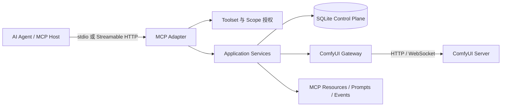

# ComfyUI MCP Skills

**让 AI Agent 以原生 MCP 工具安全地理解、执行和管理 ComfyUI。**

ComfyUI MCP Skills 把 ComfyUI 工作流、作业、资产和控制平面投影为结构化 MCP Tools、Resources 与 Prompts。Agent 无需拼接 Shell 命令，也无需直接修改工作流 JSON，即可完成工作流发现、参数校验、执行、结果复用、诊断、实验和受控运维。

项目当前版本为 `1.1.0 Beta`。包元数据要求 Python `>=3.10`；CI 已验证 3.10–3.13，更新版本尚未纳入验证矩阵。

> 本项目不是 ComfyUI 自定义节点。它是独立运行的 MCP 服务，通过 HTTP 和 WebSocket 连接一个或多个 ComfyUI 实例。

## 文档

- [安装与客户端配置](docs/INSTALLATION.zh-CN.md)
- [功能与使用模型](docs/FEATURES.zh-CN.md)
- [CLI → MCP 迁移方案](MCP_MIGRATION_PLAN.zh-CN.md)
- [Agent 原生控制平面设计](MCP_AGENT_NATIVE_CONTROL_PLANE.zh-CN.md)

## 核心能力

| 领域 | 能力 |
|---|---|
| 工作流执行 | 每个已启用工作流参与动态工具目录；默认暴露 8 个，可通过 `COMFYUI_MCP_MAX_DYNAMIC_TOOLS` 调整到 1–128，超出部分仍可通过目录/Resource 管理 |
| 工作流理解 | 提供有界的节点、边、参数、输出和依赖语义视图，不向 Agent 暴露无界原始图 |
| 版本与编辑 | 不可变 Revision、结构化 diff、变更 plan/commit、发布、回滚和损失感知导入 |
| 作业与队列 | Job 查询、分页、取消、诊断、安全重试、队列查看与受控清理 |
| 资产与产物 | 上传、Asset/Artifact 目录、输出复用、跨服务器传输、内容摘要和完整血缘 |
| 批量实验 | Experiment plan/commit、矩阵与采样 Variant、预算约束、恢复、评分和结果固化 |
| 多服务器路由 | 根据 Deployment、依赖、队列、显存和 Policy 生成不可变执行计划，并以摘要绑定提交 |
| 管理与供应 | Server/Config 管理、依赖检查、审批、ComfyUI Manager 安装计划、Provisioning 恢复和审计闭环（append-only 事件 + `admin.audit.get/retry/export` 有界导出） |
| 运行时控制 | 明确区分单作业取消、队列操作、全局 interrupt 和 restart 影响预览 |
| MCP 原生交互 | Tools、Resources、Prompts、参数补全、资源订阅以及 provider-safe 工具名兼容模式 |
| 远程部署 | Streamable HTTP、静态 Bearer Token、RFC 7662 Token Introspection、Host/Origin/大小/并发边界 |

工作流、Revision、Plan、Job 和 Asset 的高级能力依赖对应 SQLite aggregate cutover。全新目录默认先使用兼容文件仓库；执行本教程只保证基础工作流发现、动态执行、上传和 `job.get` 查询，不能把高级控制平面能力当作已自动启用。`job.list`（历史分页）只在 SQLite run cutover 后挂载。

完整工具面和使用流程见[功能文档](docs/FEATURES.zh-CN.md)。

## 架构



依赖方向固定为：

```text
MCP / HTTP / CLI adapters
            ↓
    Application services
            ↓
      Domain contracts
            ↑
 Infrastructure implementations
```

CLI 与 MCP 共用业务服务、ComfyUI Gateway 和持久化层；MCP handler 不启动 CLI 子进程。

## 快速安装
当前 PyPI 尚未发布 `comfyui-mcp-skills`，请从 GitHub 安装或使用源码运行。

### 方式一：从 GitHub 安装

```bash
python -m pip install "git+https://github.com/ShiroEirin/ComfyUI_MCP_Skills.git@main"
```

### 方式二：源码开发安装

```bash
git clone https://github.com/ShiroEirin/ComfyUI_MCP_Skills.git
cd ComfyUI_MCP_Skills
uv sync --locked --extra dev
```

安装后主要入口：

| 命令 | 用途 |
|---|---|
| `comfyui-mcp` | 本地 stdio MCP 服务 |
| `comfyui-mcp-http` | Streamable HTTP 服务 |
| `comfyui-mcp-admin` | 独立高风险管理面 |
| `comfyui-mcp-maintain` | 保留策略与元数据清理 |
| `comfyui-mcp-migration-dry-run` | 旧文件数据迁移演练 |
| `comfyui-mcp-migrate` | 生产 aggregate 切换（需精确确认短语与备份） |
| `comfyui-mcp-eval` | 工具选择 Eval 基线 |
| `comfyui-mcp-eval-deepseek` | 使用 OMP 配置的 `deepseek-v4-flash` 的 Eval |
| `comfyui-skill` | 兼容原 CLI |

## 最小项目配置

MCP 数据目录至少需要 `config.json` 和工作流目录：

```text
my-comfyui-mcp/
├── config.json
├── data/
│   └── local/
│       └── txt2img/
│           ├── schema.json
│           └── workflow.json
└── uploads/
```

`config.json` 示例：

```json
{
  "default_server": "local",
  "servers": [
    {
      "id": "local",
      "name": "Local ComfyUI",
      "url": "http://127.0.0.1:8188",
      "enabled": true
    }
  ]
}
```

## 最小 MCP 客户端配置

源码运行配置：

```json
{
  "mcpServers": {
    "comfyui": {
      "command": "uv",
      "args": [
        "run",
        "--project",
        "D:/github/ComfyUI_MCP_Skills",
        "comfyui-mcp"
      ],
      "env": {
        "COMFYUI_MCP_DIR": "D:/path/to/my-comfyui-mcp"
      }
    }
  }
}
```

已安装命令时，可改为：

```json
{
  "mcpServers": {
    "comfyui": {
      "command": "comfyui-mcp",
      "env": {
        "COMFYUI_MCP_DIR": "D:/path/to/my-comfyui-mcp"
      }
    }
  }
}
```

Snow、Claude Code 或部分 OpenAI/Anthropic 兼容网关只接受 `[A-Za-z0-9_-]+` 工具名。遇到 `Invalid tools[n].name` 时启用兼容模式：

```json
{
  "env": {
    "COMFYUI_MCP_DIR": "D:/path/to/my-comfyui-mcp",
    "COMFYUI_MCP_PORTABLE_TOOL_NAMES": "1"
  }
}
```

启用后，外部名称从 `comfyui.job.get` 变为 `comfyui_job_get`，服务内部仍按 canonical 名称分发。OMP 等支持点号名称的 Host 无需启用。

完整的 Windows、Linux、Snow、Claude Code、权限和 HTTP 配置见[安装教程](docs/INSTALLATION.zh-CN.md)。

## 默认安全模型

stdio 默认使用：

```text
principal: local-stdio
toolset: execution
scope: comfyui:execute
```

因此默认只暴露执行所需能力。Authoring、Operations 和 Admin 必须显式配置 Toolset、Scope，并为高风险 Toolset 设置 `COMFYUI_MCP_ENABLE_HIGH_RISK=1`。

危险写操作遵循以下约束：

- 普通执行面与 Admin 管理面分离。
- 变更、安装、删除和全局操作优先采用 plan/commit。
- plan digest、幂等键、主体和对象所有权共同约束 commit。
- 作业取消不会调用 ComfyUI 的全局 `/interrupt`。
- `runtime.restart.plan` 只返回操作要求，不执行宿主 Shell；systemd 控制器适配器已接线并报告可用性，但重启执行闭环（审批 + drain/fence）未交付，本版本不执行重启。
- 远程上传、抓取、Host、Origin、正文大小、并发和速率均有边界。

## 基本使用流程

1. MCP Host 调用 `comfyui.capability.search` 查找当前授权能力。
2. Agent 选择 `comfyui.run.<server>.<workflow>`，参数由工作流 JSON Schema 校验。
3. 服务返回完成结果，或返回持久化 Job 标识供 `comfyui.job.get` 恢复查询。
4. 输出以 Resource Link 暴露，可作为后续 image、mask、audio 或 video 输入。
5. 失败时调用诊断与 retry plan/commit，而不是猜测并重复提交。

动态工具的 `_execution` 示例：

```json
{
  "prompt": "a cinematic portrait",
  "_execution": {
    "idempotency_key": "portrait-2026-08-05-01",
    "wait": true,
    "wait_timeout_seconds": 120
  }
}
```

超时不代表作业失败，也不会丢失作业。继续使用返回的 Job 或 `prompt_id` 查询即可。

## Streamable HTTP

远程模式拒绝匿名启动，支持：

- `static`：部署方配置的静态 Bearer Token。
- `introspection`：受众绑定的 RFC 7662 Token Introspection；端点必须为 HTTPS。

公网部署必须由反向代理终止 TLS。默认 `process` 限流模式拒绝 `workers > 1`；设置 `COMFYUI_MCP_LIMIT_MODE=external` 后使用 SQLite 共享限流后端，支持多 worker 的全局请求、并发与订阅配额。跨主机事件 fan-out 仍未交付。

详细环境变量和部署示例见[安装教程](docs/INSTALLATION.zh-CN.md#9-streamable-http-部署)。

## 开发与验证

```bash
uv sync --locked --extra dev
uv run ruff check src/comfyui_mcp_skills tests
uv run mypy src/comfyui_mcp_skills
uv run pytest -q
uv build
```

当前本地交付验证：`856 passed, 1 skipped, 2 subtests passed`（含 `otel` extra 下的 OpenTelemetry 集成测试；未安装 `otel` extra 的环境对应为 `850 passed, 7 skipped`——6 个 SDK 集成测试与 1 个 Windows 符号链接用例跳过）。这表示代码与 contract harness 通过，不等于任意新数据目录已经完成所有 aggregate cutover。CI 在 Windows 与 Ubuntu 上覆盖 Python 3.10–3.13。

## 项目状态与边界

已实现可靠执行、版本化工作流、资产血缘、Experiment、诊断恢复、供应编排、多服务器路由、显式运行时控制、RFC 7662 introspection、审计闭环（append-only 事件 + 有界导出）与可选 OpenTelemetry traces/metrics（工具调用 span、计数与耗时直方图，`COMFYUI_MCP_OTEL_ENDPOINT` base URL 配置，`otel` extra 安装，见[安装文档](docs/INSTALLATION.zh-CN.md)第 11 章）。workflow aggregate cutover 后，file-backed 的 `comfyui.admin.workflow.set_enabled`/`delete` 不再挂载（审计工具仍可用）。以下能力尚未作为正式产品能力交付：

- Redis/NATS 多副本订阅总线。
- 多主机共享租约与跨主机配额（SQLite 共享限流仅限同主机多进程）。
- Dependency Provisioning 需要维护者提供 `dependency-catalog.json`，否则只可检查而不能解析安装来源。
- MCP Tasks 扩展映射。
- MCP Elicitation 审批。
- Windows Service 的内置 RuntimeController 适配器（Linux systemd 与 Docker 适配器已实现并接线，执行闭环未交付）。
- 高层分支 recipe（LoRA/ControlNet/Upscaler/Save 等插入；节点生命周期与 subgraph 提取/按名复用闭环已交付）。

Beta 阶段不保证持久化 schema 永久兼容；升级前应备份 `config.json`、`data/` 和控制平面数据库。

## License

[MIT](LICENSE)
