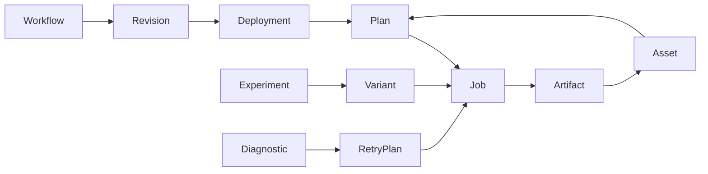

# 功能与使用模型

本文说明 ComfyUI MCP Skills 1.1.0 Beta 的代码能力、启用条件和安全边界。这里的“已实现”不等于默认 Agent 全部可见：Toolset/Scope 决定授权面，SQLite aggregate cutover 决定高级持久化服务是否启用。安装配置见[安装教程](INSTALLATION.zh-CN.md)。

## 可用性分层

| 层级 | 新项目状态 | 示例 |
|---|---|---|
| 默认可用 | execution Toolset + 文件仓库 | 动态执行、上传、Job get/cancel、基础发现（`job.list` 需 run cutover） |
| 显式授权且无需 aggregate cutover | Operations 或独立 Admin，并满足各自安全配置 | 队列、日志、运行时、服务器/配置管理、Dependency/Provisioning |
| 显式授权且完成对应 cutover | Authoring 或 Execution + 对应 SQLite aggregate | 工作流理解、Revision、Artifact/Lineage、Plan、Experiment、Diagnostic、Routing |
| 尚未交付 | 当前版本无正式实现 | 多副本总线、跨主机租约、Tasks、Elicitation、Windows Service RuntimeController |

当前发行版提供只读 `comfyui-mcp-migration-dry-run` 演练和显式 `comfyui-mcp-migrate` 生产切换命令（需精确确认短语与备份证据）。全新安装默认仍保留文件仓库，第三层能力在对应 aggregate 切换前不会启用；不要手工伪造切换证据。

## 1. 产品模型

ComfyUI MCP Skills 将 ComfyUI 从“只能调用 HTTP API 的图形工作流引擎”提升为 Agent 可发现、可解释、可恢复、可审计的 MCP 控制平面。

核心对象：



| 对象 | 含义 |
|---|---|
| Workflow | 稳定的业务工作流身份 |
| Revision | 不可变工作流图、参数 schema 和输出契约 |
| Deployment | Revision 在某台 ComfyUI Server 上的已发布绑定 |
| Plan | 参数、资产、Policy、Deployment 和 Server 的不可变执行决定 |
| Job | 一次可恢复的 ComfyUI 执行 |
| Asset | 可作为工作流输入的受所有者约束媒体 |
| Artifact | Job 产生的输出及其内容事实 |
| Experiment / Variant | 有预算边界的批量参数实验及单个组合 |
| Diagnostic / RetryPlan | 基于持久化证据的确定性诊断和受约束重试 |

## 2. MCP 表面

服务原生提供：

- **Tools**：执行、查询、计划和受控写操作。
- **Resources**：Workflow、Revision、Deployment、Job、Asset、Artifact、Experiment 等对象视图。
- **Prompts**：有界的作业操作、失败诊断、依赖检查、工作流选择与实验比较流程。
- **Completion**：为 Prompt 和 Resource Template 参数补全 Server、Workflow 等标识。
- **Subscriptions**：对象或工作流目录变化时通知 Host 重新读取当前状态。

普通请求是无状态的。Job、Plan、审批、幂等和恢复状态保存在领域存储中，不依赖 MCP 连接存活。

## 3. 能力发现与上下文控制

固定工具：

```text
comfyui.capability.search
comfyui.capability.describe
```

它们只返回当前主体、Scope 和 Toolset 可见的能力。能力搜索不会动态改变 `tools/list`，避免工具面随查询抖动。

推荐流程：

1. 用自然语言关键词搜索能力。
2. describe 目标工具，读取风险、输入与输出 schema。
3. 调用工具。
4. 对大型结果读取 Resource，不要求 ToolResult 内联全部数据。

单端点工具数量有硬上限；动态工作流也有数量边界。工具排序确定，便于 MCP Host 缓存。

## 4. 动态工作流工具

每个已启用工作流参与动态目录。单个 MCP 端点默认投影 8 个动态工作流工具；部署者可通过 `COMFYUI_MCP_MAX_DYNAMIC_TOOLS` 在 1–128 范围内提高预算，服务仍按稳定排序选择。该配置只改变已授权动态工作流的可见数量，不扩大 Toolset/Scope 权限；其他工作流仍可通过目录和 Resource 管理。输入 schema 来自工作流 `schema.json`。Agent 只能提交声明过的参数，服务在注入节点输入前执行类型、必填项和额外字段校验。


通用执行控制位于 `_execution`：

```json
{
  "prompt": "a blue-haired character",
  "steps": 30,
  "_execution": {
    "idempotency_key": "character-001",
    "wait": true,
    "wait_timeout_seconds": 120
  }
}
```

行为：

- `idempotency_key` 在同一所有者内防止重复提交。
- `wait=false` 立即返回已提交 Job。
- `wait=true` 在上限内等待，并报告节点进度。
- 等待超时不取消 Job；调用方可继续查询。
- 同一键携带不同参数会返回冲突，而不是复用错误结果。

## 5. Job 生命周期与恢复

典型状态：

```text
submitted → running → completed
                    ↘ error
                    ↘ interrupted
                    ↘ lost
submitted → cancelled
```

关键工具：

```text
comfyui.job.get
comfyui.job.list
comfyui.job.cancel
```

`comfyui.job.list` 只在 SQLite run aggregate cutover 后暴露（文件仓库下 `job.get`/`job.cancel` 可用，历史分页列表不可用）。

约束：

- Job 绑定稳定 `owner_id`。
- 分页使用有界 keyset cursor，不扫描无界历史文件。
- 排队 Job 可安全取消。
- 运行中 Job 不调用 ComfyUI 全局 `/interrupt`。
- ComfyUI 重启且上游状态消失时，非终态 Job 可对账为 `lost`，不会伪报完成或自动重复提交。

输出以 Resource Link 返回，避免把大图片、音频或视频编码进 `structuredContent`。

## 6. Asset、Artifact 与媒体复用

Asset 是输入媒体；Artifact 是 Job 输出。二者拥有独立身份和血缘。

主要能力：

```text
comfyui.asset.upload
comfyui.asset.list
comfyui.asset.describe
comfyui.asset.import_output
comfyui.asset.transfer.plan
comfyui.asset.transfer.commit
comfyui.asset.delete.plan
comfyui.asset.delete.commit
```

服务记录：

- 媒体类型与 MIME。
- 字节数与 SHA-256。
- 所有者与目标 Server。
- 来源 Job、Revision、Plan 和输入关系。
- ComfyUI 引用和存储类型。

复用策略不是简单的“同服务器零复制”：

- 消费节点支持 output 引用时可 direct reuse。
- `LoadImage` 等只接受 input 的节点必须复制或上传。
- 跨服务器使用 transfer plan/commit，并在写入后校验摘要、大小和 MIME。
- 删除前重新计算引用影响，拒绝产生悬空血缘。

## 7. Workflow、Revision 与图级变更

只读能力：

```text
comfyui.workflow.describe
comfyui.workflow.dependencies.check
comfyui.revision.list
comfyui.revision.diff
```

Admin 变更能力：

```text
comfyui.admin.workflow.import
comfyui.admin.workflow.change.plan
comfyui.admin.workflow.change.commit
comfyui.admin.workflow.publish
comfyui.admin.workflow.rollback
```

核心不变量：

- Revision 不可变。
- 导入先验证、再创建未发布 Revision。
- 变更先 plan，返回结构化 diff、依赖和输出契约影响。
- commit 绑定 base Revision 与 plan digest。
- publish 原子切换 Deployment。
- rollback 创建新 Revision，不删除历史。
- 已运行 Job 始终保留原 Revision 和 Deployment 绑定。

当前已交付的图操作（经 `comfyui.admin.workflow.change.plan` 提交后随 Revision commit 生效）：

- 节点生命周期：`add_node`、`remove_node`、`replace_node`（带连接与参数目标校验）。
- 连接与输入：`connect`、`disconnect`、`set_input`、`expose_parameter`。
- 内联子图：`insert_subgraph`（1–100 节点、前缀重命名、内部引用重写；可传显式 `nodes`，或 `subgraph` 按名引用已提取定义）。
- 子图提取与 recipe 应用：`extract_subgraph` 把选定节点连同边界端口契约（`boundary_inputs`/`boundary_outputs`）存入 Revision 元数据并计入内容摘要；`apply_recipe` 按注册表分发（当前注册 `set_scalar_input.v1`）。

子图提取→复用闭环：提取定义随 Revision 持久化，同一 plan 内或已发布 Revision 均可按名实例化；按名实例化会断开定义中指向宿主图外部的连接输入（外部引用在宿主图中无效），由后续 `connect` 显式接线。`nodes` 与 `subgraph` 互斥，未提取名字在 plan 阶段被拒绝。

仍属后续范围：`extract_subgraph` 只登记不剪除图节点（图内容不变，子图作为可复用单元登记）；recipe 注册表只有单一标量 setter。高层分支 recipe（LoRA/ControlNet/Upscaler/Save 等插入）未交付，文档不应暗示其可用。

## 8. 多服务器路由与 Policy

执行计划工具：

```text
comfyui.execution.plan
comfyui.execution.commit
comfyui.route.explain
comfyui.policy.evaluate
```

plan 评估：

- 参数 schema 兼容性。
- 已发布 Revision 与 Deployment。
- Server 健康状态。
- 缺失依赖。
- 可用显存与需求。
- 队列压力与执行槽。
- 调用方锁定 Server。
- Policy 限制。
- Asset 复用模式和 submission window。

返回所有候选、排除理由、选择理由和不可变 `plan_digest`。commit 只能提交已审阅的 Plan，不能替换参数、Revision、Deployment 或 Server。

没有历史样本时，耗时估计明确返回不可用，不伪造数值。

## 9. Experiment 与参数扫描

主要工具：

```text
comfyui.experiment.plan
comfyui.experiment.commit
comfyui.experiment.get
comfyui.experiment.cancel
comfyui.experiment.variant.list
comfyui.experiment.variant.rate
comfyui.experiment.variant.promote
```

支持：

- matrix、zip、sample 和 explicit variants。
- 运行数、并发、像素、输出和时间预算。
- 执行槽与 submission window。
- worker checkpoint、租约恢复和部分失败继续。
- 版本化评分 rubric。
- 将选中 Variant 固化为 preset 或 Revision。

大量 Variant 不会全部内联到一个 ToolResult。调用方通过分页工具和 Resource 查询。

## 10. 确定性诊断与安全重试

主要工具：

```text
comfyui.job.diagnose
comfyui.server.diagnose
comfyui.job.retry.plan
comfyui.job.retry.commit
```

诊断依据持久化 Job、事件、失败节点和脱敏日志窗口，不调用隐藏 LLM。规则覆盖：

- 缺失节点或模型。
- 输入和类型错误。
- OOM。
- 中断与上游状态丢失。
- 可重试性和建议工具动作。

retry plan 保留原参数快照，所有变化都出现在 diff 中。commit 受原 Job、Revision、Deployment、Plan 和摘要约束，并创建带 `retry_of` 血缘的新 Job。

## 11. Server、配置与依赖供应

独立 Admin 工具覆盖：

- Server list、inspect、upsert、启停、默认设置和删除。
- Config Bundle 导入导出与 revision conflict。
- Dependency inspect、plan 和 install。
- Approval 查询与 decision plan/commit。
- Provisioning 查询、取消和 worker 恢复。
- 审计导出：`comfyui.admin.audit.export` 按 actor/action/outcome/时间下界有界导出 append-only 审计轨迹（JSONL，追加序），`next_cursor` 分页；损坏行显式报错不静默跳过。

供应链安全边界：

- 不可解析依赖只报告，不猜测仓库。
- 来源 Host 和 Manager Origin 必须白名单授权。
- 安装计划固定来源、版本、摘要和重启要求。
- commit 绑定计划摘要与审批。
- 重试不重复安装，超时后可恢复查询。
- 拒绝恶意重定向、浮动来源、超大载荷和未知校验和策略。

## 12. 队列与运行时控制

Operations 工具：

```text
comfyui.queue.list
comfyui.queue.remove
comfyui.queue.clear
comfyui.server.interrupt
comfyui.runtime.restart.plan
```

语义严格分开：

- `job.cancel`：所有者安全的单 Job 取消。
- `queue.remove`：预览并移除明确 prompt 集合。
- `queue.clear`：全局队列操作，先返回影响。
- `server.interrupt`：显式全局中断，不伪装成单 Job 取消。
- `runtime.restart.plan`：返回调用方所有者影响范围内的运行中 Job（`impact_coverage` 如实标注枚举范围，非全局枚举），以及审批与操作要求，不执行宿主命令。

重启执行闭环（approve/commit）未交付：安全执行要求服务端持久化的影响快照、单次审批与按服务器的 drain/fence 协调（所有提交路径在入队前检查、原子启用与解除），这些基础设施尚未实现，因此本版本不暴露执行工具。systemd 与 Docker `RuntimeController` 适配器已实现并接线（`config.json` 服务器记录配置 `runtime: {"adapter": "systemd", "unit": "comfyui-local.service"}` 或 `runtime: {"adapter": "docker", "container": "comfyui-local"}`，只执行固定的 `systemctl restart <unit>` / `docker restart <container>`，无 shell、有超时、非法配置 fail-closed），但仅在 `restart.plan` 中报告可用性，不执行重启。Windows Service 控制器未内置。

## 13. Resources、Prompts 与订阅

Canonical Resource URI 包括：

```text
comfyui://workflows/{workflow_id}
comfyui://revisions/{revision_id}
comfyui://deployments/{deployment_id}
comfyui://jobs/{job_id}
comfyui://assets/{asset_id}
comfyui://artifacts/{artifact_id}
comfyui://experiments/{experiment_id}
```

服务器绑定的旧 URI 继续作为兼容视图。Workflow graph、nodes、edges、parameters 和 outputs 只返回有界语义投影。

内置 Prompt 包括：

- `operate-job`
- `diagnose-failure`
- `inspect-dependencies`
- `select-or-import-workflow`
- Experiment 比较流程（服务可用时）

订阅通知是即时变化信号，不是历史 replay。断线后 Host 应重新订阅并 refetch 当前 Resource。

## 14. Toolset 与 Scope

| Toolset | Scope | 典型能力 |
|---|---|---|
| execution | `comfyui:execute` | Workflow run、Job、Asset、Experiment、Routing |
| authoring | `comfyui:observe`, `comfyui:author` | Workflow 语义、Revision、依赖 |
| operations | `comfyui:observe`, `comfyui:operate` | Server、Node、Model、Queue、Log、Runtime |
| admin | `comfyui:configure`, `comfyui:provision`, `comfyui:audit` | 配置、供应、审批和审计 |

工具是否出现在 `tools/list` 由 Toolset 与 granted scopes 共同决定。隐藏工具不能通过直接构造名称绕过授权。

## 15. 远程安全边界

Streamable HTTP 支持：

- 静态 Bearer Token。
- RFC 7662 Token Introspection。
- principal-bound 对象所有权。
- Host 与 Origin 白名单。
- HTTPS 远程抓取白名单与 SSRF 防护。
- JSON、上传、下载、响应、并发和速率边界。
- 日志字段白名单和敏感内容清理。

已知部署边界：

- TLS 由反向代理终止。
- 默认 `process` 限流拒绝多 worker；`COMFYUI_MCP_LIMIT_MODE=external` 启用 SQLite 共享限流后可多 worker 同主机部署。
- Introspection 已实现，但不等于完整 OAuth Authorization Server 或动态客户端注册。
- MCP Apps：已提供只读 Job 状态查看器（`ui://comfyui/job.html`），仅对声明 UI 扩展与 app MIME 的客户端注入工具元数据；文本/结构化输出与 Resource Link 保留为降级路径。
- 多副本 SubscriptionBus、跨主机租约、OpenTelemetry logs 和更完整 MCP App 界面尚未交付；可选 OpenTelemetry traces 与 metrics（工具调用 span、调用/错误计数与耗时直方图）已交付：安装 `comfyui-mcp-skills[otel]` 并设置 `COMFYUI_MCP_OTEL_ENDPOINT`（OTLP/HTTP base URL，自动按信号追加 `/v1/traces`、`/v1/metrics`）后启用，未设置端点时零依赖零开销；logs 信号不提供。

## 16. 推荐 Agent 操作方式

### 执行已有工作流

```text
capability.search
→ 选择动态 run tool
→ 提交带幂等键的参数
→ Job/Resource 查询
→ 复用 Artifact
```

### 修改并发布工作流

```text
workflow.describe
→ dependencies.check
→ admin.workflow.change.plan
→ 审查 diff
→ change.commit
→ publish
```

### 运行批量实验

```text
experiment.plan
→ 审查 Variant 数和预算
→ experiment.commit
→ experiment.get / variant.list
→ variant.rate
→ variant.promote
```

### 处理失败

```text
job.diagnose
→ retry.plan
→ 审查修复 diff
→ retry.commit
→ 查询新 Job 与 retry_of 血缘
```

### 供应缺失依赖

```text
dependency.inspect
→ dependency.plan
→ approval decision
→ dependency.install
→ provisioning.get
```

## 17. 当前未交付能力

以下内容不应被文档或 Agent 当成现有能力：

- Redis/NATS 多副本订阅 fan-out。
- 跨主机共享租约与配额（同主机多 worker 共享限流已可用）。
- MCP Tasks 扩展映射。
- MCP Elicitation 审批。
- Windows Service RuntimeController（systemd 与 Docker 适配器已实现并接线，执行闭环未交付）。
- 高层分支 recipe（LoRA/ControlNet/Upscaler/Save 等插入；subgraph 提取/按名复用闭环已交付）。
